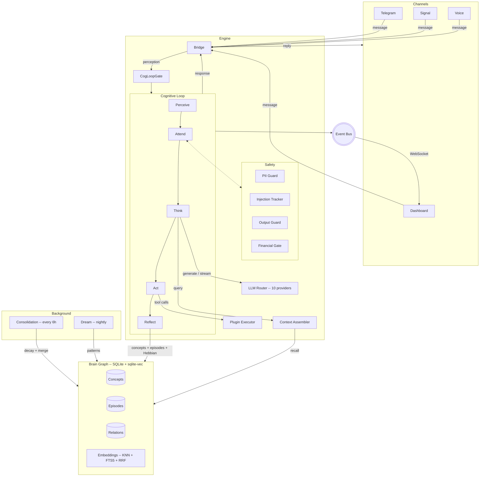

<p align="center">
  <picture>
    <source media="(prefers-color-scheme: dark)" srcset="docs/_assets/sovyx-wordmark-accent.svg">
    <source media="(prefers-color-scheme: light)" srcset="docs/_assets/sovyx-wordmark-bw.svg">
    
  </picture>
</p>

<p align="center">
  Self-hosted AI companion with a brain graph, a 7-phase cognitive loop, and 10 LLM providers.<br>
  Local-first. AGPL. Your hardware. Your data.
</p>

<p align="center">
  <a href="https://github.com/sovyx-ai/sovyx/actions/workflows/ci.yml"></a>
  <a href="https://pypi.org/project/sovyx/"></a>
  <a href="https://pypi.org/project/sovyx/"></a>
  <a href="https://github.com/sovyx-ai/sovyx/blob/main/LICENSE"></a>
  
</p>

---

## Why Sovyx

Sovyx is an application, not a framework. Install it, point it at an API key, and talk to it from Telegram, Signal, the dashboard, or a microphone.

- **10 LLM providers, your keys.** Anthropic, OpenAI, Google, Ollama, xAI, DeepSeek, Mistral, Together, Groq, Fireworks. Complexity-based routing picks the right model per message. Streaming end-to-end.
- **Runs on a Raspberry Pi 5 or a rack server.** Auto-detected hardware tier selects ONNX models that fit in 4 GB RAM. Same codebase, same config, any scale.
- **Memory that persists and consolidates.** Brain graph in SQLite with hybrid vector + keyword retrieval, Hebbian learning, nightly dream cycles, and a PAD 3D emotional model. Not a vector dump -- a cognitive architecture.
- **No telemetry. No phone-home. AGPL-3.0.** Your data stays in a SQLite file on your disk. The daemon never calls anywhere you didn't configure.

## Quick Start

```bash
pip install sovyx
export ANTHROPIC_API_KEY=sk-ant-...   # or any of the 10 supported providers
sovyx init my-mind
sovyx start
```

```
[info] dashboard_listening       url=http://localhost:7777
[info] bridge_started            channels=3
[info] brain_loaded              concepts=1842 episodes=317
[info] cognitive_loop_ready      mind=my-mind
```

Open `http://localhost:7777` and run `sovyx token` to get the auth token. Full setup in [Getting Started](docs/getting-started.md).

## What's Inside

Every inbound message -- Telegram, Signal, voice, or the dashboard -- enters the same cognitive loop. The loop assembles context from the brain graph, calls the LLM, executes tool calls if needed, and reflects the outcome back into memory. Consolidation and dream cycles run in the background to maintain the graph.



## Features

| Category | What it does |
|----------|-------------|
| **Cognition** | 7-phase loop: Perceive, Attend, Think, Act, Reflect + periodic Consolidate + nightly Dream. PAD 3D emotional model (pleasure / arousal / dominance). Spreading activation across the concept graph. |
| **LLM routing** | 10 providers with complexity-based tier selection (simple / moderate / complex). Per-provider circuit breaker. Daily and per-conversation cost caps. Cross-provider failover. Token-level streaming. |
| **Voice** | Local STT (Moonshine ONNX) + TTS (Piper / Kokoro). SileroVAD. Wake word detection. Barge-in. Filler injection for perceived latency under 300 ms. Wyoming protocol. Streaming LLM chunks direct to TTS. |
| **Channels** | Telegram, Signal, dashboard chat, CLI REPL (`sovyx chat`). Home Assistant plugin (4 domains, 8 tools). CalDAV plugin (6 read-only tools, Nextcloud / iCloud / Fastmail / Radicale). |
| **Import** | Bring existing conversations from ChatGPT, Claude, Gemini, Grok. Import Obsidian vaults (frontmatter, wiki links, nested tags). Summary-first encoding with SHA-256 dedup. |
| **Plugins** | 7 official plugins. `@tool` decorator SDK. 5-layer sandbox: AST scan, import guard, sandboxed HTTP (domain allowlist, rate limit, size cap), sandboxed filesystem, capability-based permissions. Hot reload. |
| **Dashboard** | React 19 + TypeScript + Zustand. Real-time WebSocket. Brain graph visualization (force-graph-2d). Virtualized log viewer. Zod runtime response validation. Token auth. Dark mode. i18n. |
| **Privacy** | Local-first. One SQLite file per mind. Zero telemetry by default. AGPL-3.0. No cloud requirement. Optional [Sovyx Cloud](#sovyx-cloud) for teams. |

## Plugin Example

```python
from sovyx.plugins.sdk import ISovyxPlugin, tool


class WeatherPlugin(ISovyxPlugin):
    name = "weather"
    version = "1.0.0"
    description = "Current weather and forecasts via Open-Meteo."

    @tool(description="Get current weather for a city.")
    async def get_weather(self, city: str) -> str:
        from sovyx.plugins.sandbox_http import SandboxedHttpClient
        async with SandboxedHttpClient(
            plugin_name="weather",
            allowed_domains=["api.open-meteo.com"],
        ) as client:
            resp = await client.get(
                "https://api.open-meteo.com/v1/forecast",
                params={"latitude": "...", "longitude": "..."},
            )
        return resp.text
```

```bash
sovyx plugin list                 # installed plugins
sovyx plugin create my-plugin     # scaffold
sovyx plugin validate ./my-plugin # manifest + AST + permissions check
sovyx plugin install ./my-plugin  # hot-load into running daemon
```

## Configuration

Three sources in priority order: environment variables (`SOVYX_*`), YAML files (`system.yaml` + `mind.yaml`), built-in defaults.

```yaml
# ~/.sovyx/my-mind/mind.yaml
name: my-mind
language: en

personality:
  tone: warm
  humor: 0.4
  empathy: 0.8

llm:
  budget_daily_usd: 2.0

channels:
  telegram:
    enabled: true
    token_env: SOVYX_TELEGRAM_TOKEN
```

Full reference in [Configuration](docs/configuration.md).

## Sovyx Cloud

Hosted offering for teams and power users. Encrypted relay, managed backup, orchestrated models, plugin marketplace. Runs on top of the same open-source engine.

Details at [sovyx.dev](https://sovyx.dev).

## Documentation

- [Getting Started](docs/getting-started.md) -- install, configure, first run
- [Architecture](docs/architecture.md) -- data flow, cognitive loop, brain graph
- [LLM Router](docs/llm-router.md) -- routing tiers, budgets, failover
- [Configuration](docs/configuration.md) -- all config keys and env vars
- [API Reference](docs/api-reference.md) -- REST + WebSocket endpoints
- [Security](docs/security.md) -- sandbox, auth, data handling
- [Plugin Development](docs/modules/plugins.md) -- SDK, permissions, sandbox
- [FAQ](docs/faq.md) -- comparisons, offline mode, data portability

## Development

```bash
git clone https://github.com/sovyx-ai/sovyx.git && cd sovyx
uv sync --dev
uv run python -m pytest tests/ --ignore=tests/smoke --timeout=30  # 7671 backend tests
cd dashboard && npx vitest run                                     # 792 frontend tests
```

Read [CLAUDE.md](CLAUDE.md) before your first PR -- it covers stack, conventions, anti-patterns, and the quality gates CI enforces (ruff, mypy strict, bandit, pytest 3.11 + 3.12, vitest, tsc).

## Contributing

Issues and pull requests welcome. Please read [CONTRIBUTING.md](CONTRIBUTING.md) and the [Code of Conduct](CODE_OF_CONDUCT.md) first.

## License

[AGPL-3.0-or-later](LICENSE)
