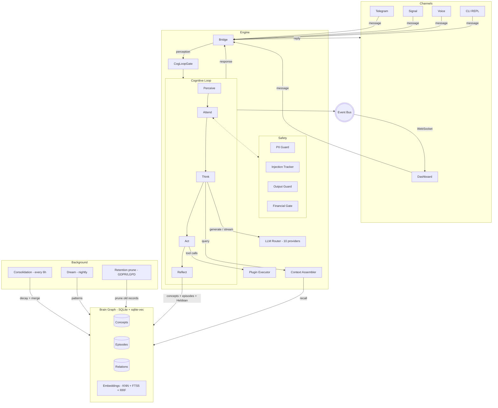

<p align="center">
  <picture>
    <source media="(prefers-color-scheme: dark)" srcset="docs/_assets/sovyx-wordmark-accent.svg">
    <source media="(prefers-color-scheme: light)" srcset="docs/_assets/sovyx-wordmark-bw.svg">
    
  </picture>
</p>

<p align="center">
  <strong>Self-hosted AI companion with persistent memory, multi-mind voice routing, and a 7-phase cognitive loop.</strong><br>
  Local-first. AGPL-3.0. Your hardware. Your data. Zero telemetry by default.
</p>

<p align="center">
  <a href="https://github.com/sovyx-ai/sovyx/actions/workflows/ci.yml"></a>
  <a href="https://pypi.org/project/sovyx/"></a>
  <a href="https://pypi.org/project/sovyx/"></a>
  <a href="https://github.com/sovyx-ai/sovyx/blob/main/LICENSE"></a>
  
  
</p>

---

## Why Sovyx

Sovyx is an application, not a framework. Install it, point it at an API key, and talk to it from Telegram, Signal, the dashboard, the CLI, or a microphone.

- **10 LLM providers, your keys.** Anthropic, OpenAI, Google, Ollama, xAI, DeepSeek, Mistral, Together, Groq, Fireworks. Complexity-based routing picks the right model per message. Per-provider circuit breakers, daily and per-conversation cost caps, cross-provider failover. Token-level streaming end-to-end.
- **Memory that persists and consolidates.** Brain graph in SQLite + sqlite-vec. Hybrid vector + keyword retrieval (KNN + FTS5 + Reciprocal Rank Fusion). Hebbian learning, nightly dream cycles, PAD 3D emotional model (pleasure / arousal / dominance), spreading activation across the concept graph. Not a vector dump - a cognitive architecture.
- **Local voice from Pi 5 to rack server.** Wake word, VAD, STT, TTS, barge-in, multi-mind routing - all ONNX, all on your machine. Auto-selector probes the host at boot and picks a model combination that fits the tier (Pi 5 / N100 / desktop CPU / desktop GPU). Wyoming protocol for Home Assistant. Voice Clarity APO bypass tier system for Windows hardware regressions.
- **Multi-mind aware.** Per-mind wake-word, voice, accent, language, retention policy, memory pool. Cross-mind isolation enforced by Hypothesis property tests. GDPR Art. 17 / LGPD Art. 18 right-to-erasure surfaces (CLI + RPC + dashboard).
- **No telemetry. No phone-home.** Your data stays in SQLite files on your disk. The daemon never calls anywhere you didn't configure. AGPL-3.0 source available.

## Quick Start

```bash
pip install sovyx                          # core
pip install "sovyx[voice]"                 # +Wyoming, +Piper, +Kokoro, +Moonshine, +SileroVAD
export ANTHROPIC_API_KEY=sk-ant-...        # or any of the 10 supported providers
sovyx init my-mind
sovyx start
```

```
[info] dashboard_listening       url=http://localhost:7777
[info] bridge_started            channels=3
[info] brain_loaded              concepts=1842 episodes=317
[info] voice_pipeline_ready      stt=moonshine tts=kokoro vad=silero
[info] cognitive_loop_ready      mind=my-mind
```

Open `http://localhost:7777`, run `sovyx token` for the auth token, and start chatting. Full setup in [Getting Started](docs/getting-started.md).

## What's Inside

Every inbound message - Telegram, Signal, voice, dashboard, or CLI - enters the same cognitive loop. The loop assembles context from the brain graph, calls the LLM, executes tool calls if needed, and reflects the outcome back into memory. Consolidation and dream cycles run in the background to maintain the graph.



## Features

| Category | What it does |
|----------|--------------|
| **Cognition** | 7-phase loop (Perceive, Attend, Think, Act, Reflect + periodic Consolidate + nightly Dream). PAD 3D emotional model. Spreading activation, Hebbian learning, Ebbinghaus forgetting. |
| **LLM routing** | 10 providers with complexity-based tier selection (simple / moderate / complex). Per-provider circuit breaker + daily / per-conversation cost caps + cross-provider failover. Token-level streaming. |
| **Voice (single-mind)** | Local STT (Moonshine ONNX) + TTS (Piper / Kokoro). SileroVAD v5. Wake word detection (ONNX + STT fallback). Barge-in detection. Filler injection for perceived latency under 300 ms. Wyoming protocol for Home Assistant Voice Assist. |
| **Voice (multi-mind)** | Per-mind wake-word + voice ID + accent + language + cadence in `MindConfig`. Concurrent `WakeWordRouter` (N detectors in parallel; first hit wins; ≤ 50 ms dispatch). STT-fallback for minds without trained ONNX (~500 ms latency vs ~80 ms ONNX). Diacritic + accent variant matching ("Lúcia" / "Joaquín" / "François" / "Müller"). Hot-reload of trained models without daemon restart. |
| **Voice (Windows hardening)** | Voice Clarity APO detector + 3-tier bypass coordinator (RAW / host-API rotate / WASAPI exclusive). IMM notification listener for default-device changes + driver-update events. Cold-probe signal validation (rejects callbacks-fire-but-PCM-zero). 14 forensic Furos (W-1 ... W-14) catalogued + resolved or strict-deferred. |
| **Voice (cross-platform)** | Linux: ALSA mixer KB profiles + Pipewire / session-manager bypass. macOS: CoreAudio detection + bypass tier infrastructure. Auto-cascade with persisted Combo store + R14 silent-combo eviction. |
| **Channels** | Telegram, Signal, dashboard chat, CLI REPL (`sovyx chat`). Home Assistant plugin (4 domains, 8 tools). CalDAV plugin (6 read-only tools, Nextcloud / iCloud / Fastmail / Radicale). Web Intelligence plugin (search + fetch + extract). |
| **Import** | Bring existing conversations from ChatGPT, Claude, Gemini, Grok. Import Obsidian vaults (frontmatter, wiki links, nested tags). Summary-first encoding with SHA-256 dedup; idempotent re-import. |
| **Plugins** | 7 official plugins (`calculator`, `caldav`, `financial_math`, `home_assistant`, `knowledge`, `weather`, `web_intelligence`). `@tool` decorator SDK. 5-layer sandbox: AST scan + import guard + sandboxed HTTP (domain allowlist, rate limit, size cap) + sandboxed filesystem + capability-based permissions. Hot reload. |
| **Dashboard** | React 19 + TypeScript + Zustand. Real-time WebSocket. Brain graph visualization (force-graph-2d). Virtualized log viewer (TanStack Virtual). Voice health panels (capture diagnostics, frame history, restart history, bypass tier status). Zod runtime response validation. Token auth (sessionStorage, never localStorage). Dark mode. i18n. |
| **Compliance & privacy** | Local-first. One SQLite file per mind. Zero telemetry by default. GDPR Art. 5(1)(e) "storage limitation" + Art. 17 right-to-erasure. LGPD Art. 16 + Art. 18 VI. CCPA / CPRA / BIPA pass-through with operator obligations. HIPAA forward-compat flag (active wiring deferred to v0.31.x). Per-mind retention prune with `RETENTION_PURGE` tombstones in the consent ledger. |
| **CLI** | `sovyx start / stop / init / logs / doctor / chat / token`. Brain: `sovyx brain search / stats`. Mind: `sovyx mind list / status / forget / retention prune / retention status`. Voice: `sovyx voice forget / history / train-wake-word`. Plugins: `sovyx plugin list / create / validate / install`. |

## Voice Subsystem - the deep dive

The voice subsystem is the most heavily-developed area of the codebase (79 000 LOC, ~5 500 tests). Here is what ships:

### Pipeline

```
mic input
  -> capture (PortAudio / WASAPI / ALSA / CoreAudio, with bypass tiers)
  -> ring buffer (epoch-versioned for consumer atomicity)
  -> SileroVAD v5 (32 ms frames @ 16 kHz)
  -> WakeWordRouter (N concurrent detectors per mind; first hit wins)
  -> mind dispatch (loads memory + personality + voice config in <= 50 ms)
  -> Moonshine STT (or operator-pluggable backend)
  -> CognitiveLoop (Perceive -> Attend -> Think -> Act -> Reflect)
  -> Piper / Kokoro TTS (with phonetic filler injection for perceived <300 ms)
  -> output queue with barge-in detection
  -> mic ducking + half-duplex gate (TTS leak suppression)
```

### Wake-word training pipeline

```bash
# Train a custom wake word from your operator-recorded negative samples.
# 30-60 minutes per word on a modern laptop CPU; faster with a registered
# ML backend (custom enterprise platforms, OpenWakeWord-Colab-derived,
# lgpearson1771/openwakeword-trainer fork).
sovyx voice train-wake-word "Lucia" \
    --mind-id lucia \
    --language pt-BR \
    --target-samples 200 \
    --negatives-dir ~/voice-corpus/negatives

# After training, hot-reload into the running daemon (no restart needed).
# The CLI auto-calls the wake_word.register_mind RPC if the daemon is up.
```

The `TrainerBackend` is a runtime-checkable Protocol; operators bring their own ML platform and `register_default_backend(MyBackend())` at boot. No default ML backend ships - by verified design (PyPI / GitHub research 2026-05-02 confirmed every candidate's incompatibilities). Three operator paths documented in `NoBackendRegisteredError`'s message: external-train + drop into pretrained pool, custom Backend impl, or STT-fallback (no training, ~500 ms latency).

### Cross-platform parity

| Feature | Win | Linux | macOS |
|---------|-----|-------|-------|
| APO/HAL detection (Voice Clarity / Krisp / Loopback) | shipped | shipped (PipeWire / session manager) | partial (forward-compat) |
| Bypass Tier 1 (no exclusive lock) | flag-gated stub (T27 deferred per ADR) | N/A | partial |
| Bypass Tier 2 (host-API rotate) | shipped | N/A | N/A |
| Bypass Tier 3 (WASAPI exclusive / HAL exclusive) | shipped, autofix=True default | N/A | partial |
| Bypass: Mixer reset | N/A | shipped (KB profile system) | N/A |
| Hot-plug detection | WM_DEVICECHANGE wired | udev wired | partial |
| IMM notification listener | shipped (default-OFF awaiting telemetry validation) | (uses udev) | partial |
| Driver-update detection | WMI subscription shipped (default-OFF) | partial | N/A |

Detail in [`docs/modules/voice-platform-parity.md`](docs/modules/voice-platform-parity.md).

### Voice docs

7 voice-specific public docs:
- [`voice.md`](docs/modules/voice.md) - architecture overview
- [`voice-capture-health.md`](docs/modules/voice-capture-health.md) - probe + cascade + bypass coordinator
- [`voice-device-test.md`](docs/modules/voice-device-test.md) - first-run device wizard
- [`voice-otel-semconv.md`](docs/modules/voice-otel-semconv.md) - OpenTelemetry semantic conventions
- [`voice-platform-parity.md`](docs/modules/voice-platform-parity.md) - cross-platform feature matrix
- [`voice-privacy.md`](docs/modules/voice-privacy.md) - retention + audit chain + consent
- [`voice-troubleshooting-windows.md`](docs/modules/voice-troubleshooting-windows.md) - operator runbook for Voice Clarity APO + Razer + Win11 hardware regressions

## Multi-mind architecture

Sovyx supports running multiple distinct AI personalities (minds) on one daemon, each with:

- **Separate memory pool** - one SQLite database per mind for brain (concepts + episodes + relations) + one for conversations + a shared system pool. Property tests pin "no leak from mind A to mind B".
- **Separate wake word** - operator-set in `mind.yaml`. Defaults to `mind.name`; falls back to "Sovyx" via `effective_wake_word` for backward-compat.
- **Separate voice** - TTS voice ID, accent, language, cadence per mind.
- **Separate retention** - `MindConfig.retention.{episodes,conversations,consolidation_log,daily_stats,consent_ledger}_days` overrides the global default.
- **Separate compliance** - GDPR / LGPD right-to-erasure (`sovyx mind forget <mind_id>`) and time-based retention (`sovyx mind retention prune <mind_id>`) operate per-mind.

```yaml
# ~/.sovyx/lucia/mind.yaml
name: Lucia
language: pt
wake_word: "Lúcia"             # auto-derives variants ["Lucia", "Hey Lúcia", "Hey Lucia"]
voice_id: kokoro:pt_br_female_natural
voice_language: pt-BR
voice_accent: pt-BR-southeast
voice_cadence_wpm: 165

retention:
  auto_prune_enabled: true     # default-OFF; opt-in per mind
  episodes_days: 365
  conversations_days: 90
```

```yaml
# ~/.sovyx/jonny/mind.yaml
name: Jonny
language: en
wake_word: "Jonny"
voice_id: kokoro:en_us_male_calm
voice_language: en-US
voice_cadence_wpm: 150
```

Both run concurrently. The `WakeWordRouter` instantiates one detector per enabled mind; first-hit wins; matched mind context loads in `<= 50 ms`.

## Compliance & privacy

| Regime | Status | Notes |
|--------|--------|-------|
| **GDPR** | Pass with operator obligations | Art. 5(1)(e) storage limitation via per-mind retention; Art. 17 right-to-erasure via `sovyx mind forget` + `sovyx voice forget`. |
| **LGPD** | Pass with operator obligations | Art. 16 + Art. 18 VI surfaces same as GDPR. |
| **CCPA / CPRA** | Pass for self-hosted | Operator is the business; data never leaves operator infrastructure. |
| **BIPA** | Pass with explicit opt-in | Voice biometric processing is opt-in via `voice_biometric_processing_enabled` (default False). |
| **HIPAA** | Forward-compat flag only | `compliance.hipaa_mode: bool = False` shipped as schema field; active wiring deferred to v0.31.x healthcare deployments. |

Privacy primitives:
- **Consent ledger** at `<data_dir>/voice/consent.jsonl` - append-only, hash-chain integrity, per-mind. Records `LISTEN`, `TRANSCRIBE`, `STORE`, `SHARE`, `DELETE`, `RETENTION_PURGE` tombstones.
- **`sovyx voice forget --user-id=...`** wipes everything for a user; writes a `DELETE` tombstone (the only surviving record).
- **`sovyx voice history --user-id=...`** dumps the privacy-relevant audit trail as JSONL (right of access).
- **`sovyx mind forget <mind_id>`** wipes a whole mind end-to-end (brain + conversations + system pools + ledger). Defense-in-depth `confirm: <mind_id>` field on the dashboard endpoint.
- **`sovyx mind retention prune <mind_id>`** time-based prune per `MindConfig.retention.*` horizons. Idempotent. Default-OFF; opt-in per mind via `auto_prune_enabled=True`.

Detail in [`docs/compliance.md`](docs/compliance.md) and [`docs/modules/voice-privacy.md`](docs/modules/voice-privacy.md).

## Plugin Example

```python
from sovyx.plugins.sdk import ISovyxPlugin, tool


class WeatherPlugin(ISovyxPlugin):
    name = "weather"
    version = "1.0.0"
    description = "Current weather and forecasts via Open-Meteo."

    @tool(description="Get current weather for a city.")
    async def get_weather(self, city: str) -> str:
        # Sandboxed HTTP client - allowed_domains is enforced;
        # raw httpx in plugin code is blocked by the AST scanner.
        from sovyx.plugins.sandbox_http import SandboxedHttpClient
        async with SandboxedHttpClient(
            plugin_name="weather",
            allowed_domains=["api.open-meteo.com"],
        ) as client:
            resp = await client.get(
                "https://api.open-meteo.com/v1/forecast",
                params={"latitude": "...", "longitude": "..."},
            )
        return resp.text
```

```bash
sovyx plugin list                  # installed plugins
sovyx plugin create my-plugin      # scaffold
sovyx plugin validate ./my-plugin  # manifest + AST + permissions check
sovyx plugin install ./my-plugin   # hot-load into running daemon
```

## Configuration

Three sources in priority order: environment variables (`SOVYX_*`), YAML files (`system.yaml` + `mind.yaml`), built-in defaults.

```yaml
# ~/.sovyx/my-mind/mind.yaml
name: my-mind
language: en

personality:
  tone: warm
  humor: 0.4
  empathy: 0.8

llm:
  budget_daily_usd: 2.0

channels:
  telegram:
    enabled: true
    token_env: SOVYX_TELEGRAM_TOKEN
```

Tuning constants live under `EngineConfig.tuning.{safety,brain,voice,retention}` and accept env overrides:

```bash
export SOVYX_TUNING__VOICE__VOICE_CLARITY_AUTOFIX=true
export SOVYX_TUNING__BRAIN__CONSOLIDATION_HORIZON_HOURS=12
export SOVYX_LOG__LEVEL=DEBUG
```

Full reference in [Configuration](docs/configuration.md).

## CLI commands

```
# Lifecycle
sovyx init <mind-id>              Create a new mind
sovyx start                       Run the daemon
sovyx stop                        Graceful shutdown
sovyx logs --tail                 Stream the structured log
sovyx doctor                      Health probe (also: doctor voice_capture_apo)
sovyx token                       Print the dashboard auth token
sovyx chat                        REPL chat with the active mind

# Brain + memory
sovyx brain search "query"        Vector + keyword + RRF
sovyx brain stats                 Concept / episode / relation counts

# Mind management
sovyx mind list                   All registered minds + which is active
sovyx mind status <mind-id>       Per-mind state report
sovyx mind forget <mind-id>       GDPR Art. 17 - wipe everything for a mind
sovyx mind retention prune <mind-id>      Time-based prune per MindConfig.retention
sovyx mind retention status <mind-id>     Preview without writing

# Voice
sovyx voice forget --user-id=USR  GDPR Art. 17 - wipe consent ledger for user
sovyx voice history --user-id=USR Right-of-access audit dump (JSONL)
sovyx voice train-wake-word "Name" --mind-id=...   Custom wake-word training

# Plugins
sovyx plugin list / create / validate / install
```

## Quality & engineering discipline

Sovyx ships with strict quality gates enforced on every commit and on CI:

| Gate | Posture |
|------|---------|
| **Lint** | `ruff check` + `ruff format` clean across `src/` + `tests/` (994+ files) |
| **Type checking** | `mypy --strict` clean across 432 source files (zero issues) |
| **Security scan** | `bandit -r src/sovyx/` clean (0 issues across all severities) |
| **Backend tests** | 13 500+ pytest cases across unit, integration, dashboard, plugin, property (Hypothesis), security, stress |
| **Frontend tests** | 1 000+ vitest cases for the React dashboard + zod schema runtime validation |
| **Type compilation** | `tsc -b` clean for the TypeScript dashboard |
| **CI matrix** | Self-hosted runner; Python 3.11 + 3.12; ruff + mypy + bandit + pytest + vitest + tsc + Docker + PyPI publish on tag |

Engineering practices:
- **Anti-patterns documented** - 34 numbered anti-patterns in [`CLAUDE.md`](CLAUDE.md), each carrying the bug history that produced it (e.g. AP #21 Voice Clarity APO corrupts mic upstream of user-space; AP #28 cold probe must validate signal energy not just callback count; AP #32 mixin method-via-MRO stubs silently shadow real methods).
- **ADR trail** - 8 active ADRs in `docs-internal/`, cited from production code. Decisions never delete - they supersede.
- **Mission lifecycle** - long-running structured missions in `docs-internal/missions/MISSION-*.md`. Completed missions archive to `docs-internal/archive/missions-completed/` with footers naming code references and successor missions. Predecessor / superseded missions never delete; reference value > workspace cleanliness.
- **Defense-in-depth** - 6 rings (capture / pipeline / cognition / safety / observability / persistence). See [`docs-internal/architecture/defense_in_depth_6_rings.md`](docs-internal/architecture/defense_in_depth_6_rings.md) (gitignored, local-only).
- **Two-tier GA strategy** - v0.30.0 ships single-mind production GA (Phase 1-7 complete); v0.31.0 ships multi-mind FINAL GA (Phase 8 + 100-name pretrained pool). Operators may ship v0.30.0 without waiting for Phase 8.

## Sovyx Cloud

Hosted offering for teams and power users. Encrypted relay, managed backup, orchestrated models, plugin marketplace. Runs on top of the same open-source engine - your existing local data is portable.

Details at [sovyx.ai](https://sovyx.ai).

## Documentation

**For users:**
- [Getting Started](docs/getting-started.md) - install, configure, first run
- [Architecture](docs/architecture.md) - data flow, cognitive loop, brain graph
- [Configuration](docs/configuration.md) - all config keys and env vars
- [LLM Router](docs/llm-router.md) - routing tiers, budgets, failover
- [API Reference](docs/api-reference.md) - REST + WebSocket endpoints
- [FAQ](docs/faq.md) - comparisons, offline mode, data portability

**For operators:**
- [Audio Quality](docs/audio-quality.md) - DSP / SNR / AEC / NS reference
- [Compliance](docs/compliance.md) - GDPR / LGPD / CCPA / CPRA / BIPA / HIPAA self-assessment
- [Security](docs/security.md) - sandbox, auth, data handling, plugin permissions
- [Voice troubleshooting (Windows)](docs/modules/voice-troubleshooting-windows.md) - Voice Clarity APO + Razer + Win11 runbook
- [Voice platform parity](docs/modules/voice-platform-parity.md) - cross-platform feature matrix

**For contributors:**
- [Plugin Development](docs/modules/plugins.md) - SDK, permissions, sandbox
- [Voice KB profile authoring](docs/contributing/voice-mixer-kb-profiles.md) - Linux mixer profile contribution
- [Voice KB key rotation](docs/contributing/voice-kb-rotation.md) - signing key rotation procedure
- [Mixer band-aid removal migration](docs/migration/voice-mixer-band-aid-removal.md) - the v0.27.0 deprecation timeline

**Module-level docs** at [`docs/modules/`](docs/modules/) - one per top-level package: `brain`, `bridge`, `cognitive`, `context`, `dashboard`, `engine`, `llm`, `mind`, `observability`, `persistence`, `plugins`, `upgrade`, `voice` (+ 6 voice-specific deep-dives).

## Development

```bash
git clone https://github.com/sovyx-ai/sovyx.git && cd sovyx
uv sync --dev

# Backend (full quality gate)
uv lock --check
uv run ruff check src/ tests/
uv run ruff format --check src/ tests/
uv run mypy src/                    # strict; ~432 files
uv run bandit -r src/sovyx/ --configfile pyproject.toml
uv run python -m pytest tests/ --ignore=tests/smoke --timeout=30  # ~13,690 tests

# Frontend
cd dashboard
npx tsc -b tsconfig.app.json       # zero errors
npx vitest run                     # ~1,009 tests
```

Read [CLAUDE.md](CLAUDE.md) before your first PR - it covers stack, conventions, the 34 numbered anti-patterns, and the quality gates CI enforces.

## Roadmap

Phase 8 (multi-mind voice) is at 21/22 - only the v0.31.0 GA tag remains. After that, future features are catalogued in `docs-internal/ROADMAP-POST-V0.31.0.md` (gitignored, local-only) across four tiers:

- **Tier A** - adjacent-mission features (cascade re-run, MM listener restart wire-up, hotplug + watchdog wire-up, Linux + macOS listener equivalents, T27 Tier 1 RAW resolution, Sprint 4 spectral self-cancel, T8.11 100-model pretrained pool).
- **Tier B** - quality / enhancement (phoneme-level streaming TTS, hardware-accelerated ONNX via CoreML / DirectML / ROCm, LiveKit V2 EOU model bundling, macOS Krisp HAL detection).
- **Tier C** - v1.0 product expansion (multi-user speaker diarization, voice authentication, federated learning of KB profile defaults, per-call RL of `target_dbfs`).
- **Tier D** - commercial / business (pricing tier strategy, license issuance flow, self-service portal).

## Contributing

Issues and pull requests welcome. Please read [CONTRIBUTING.md](CONTRIBUTING.md) and the [Code of Conduct](CODE_OF_CONDUCT.md) first.

## License

[AGPL-3.0-or-later](LICENSE)
