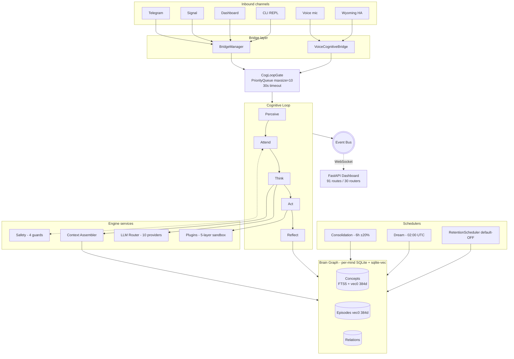
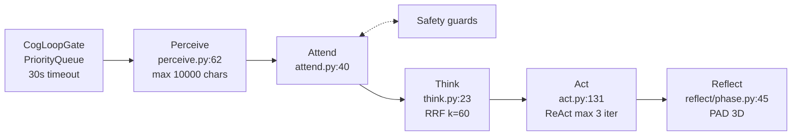
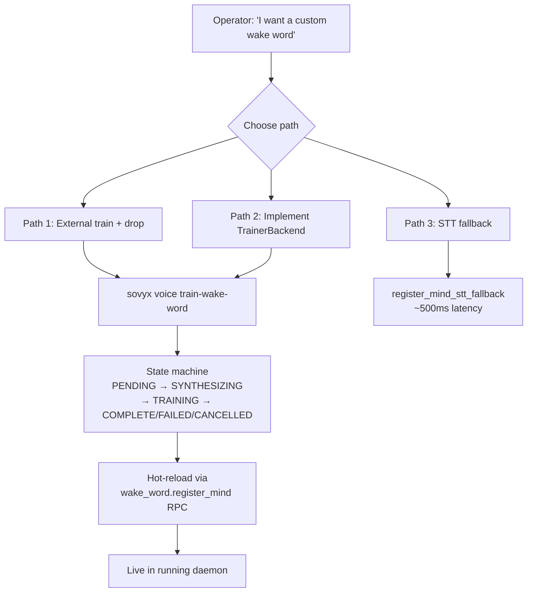
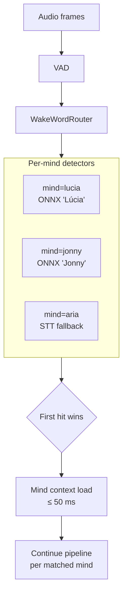
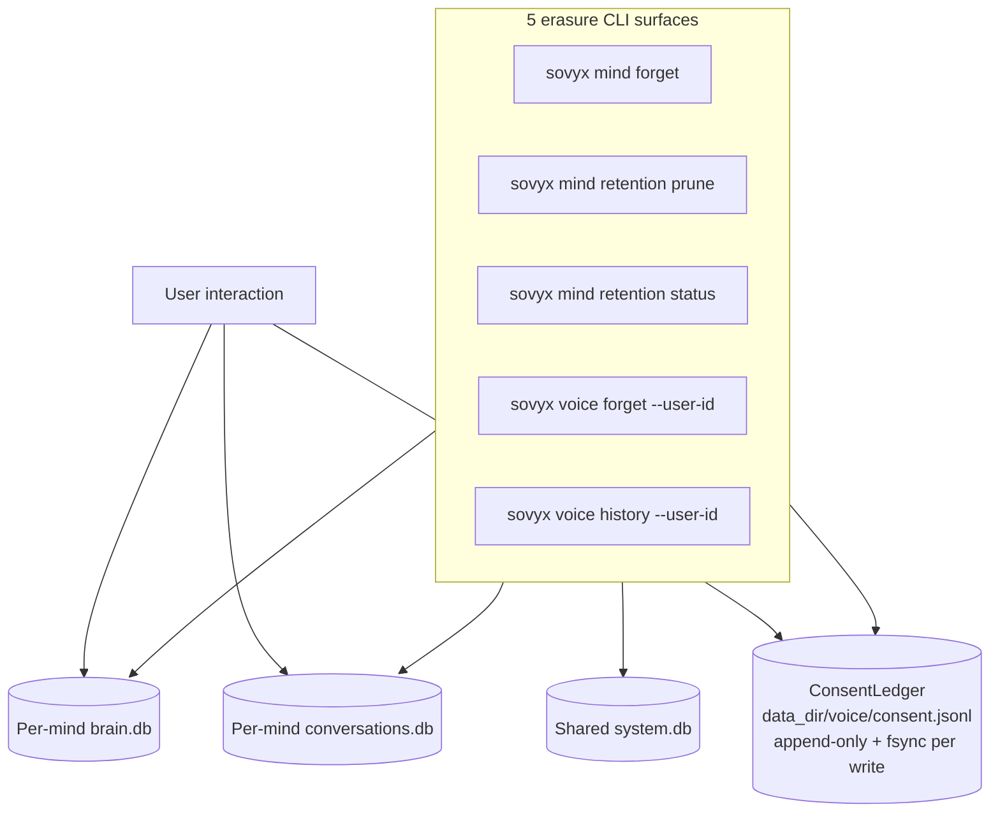

<p align="center">
  <picture>
    <source media="(prefers-color-scheme: dark)" srcset="docs/_assets/sovyx-wordmark-accent.svg">
    <source media="(prefers-color-scheme: light)" srcset="docs/_assets/sovyx-wordmark-bw.svg">
    
  </picture>
</p>

<p align="center">
  <strong>Self-hosted AI companion with persistent memory, multi-mind voice routing, and a 7-phase cognitive loop.</strong><br>
  Local-first. AGPL-3.0. Your hardware. Your data. Zero telemetry by default.
</p>

<p align="center">
  <a href="https://github.com/sovyx-ai/sovyx/actions/workflows/ci.yml"></a>
  <a href="https://pypi.org/project/sovyx/"></a>
  <a href="https://pypi.org/project/sovyx/"></a>
  <a href="https://github.com/sovyx-ai/sovyx/blob/main/LICENSE"></a>
  
  
  
</p>

<p align="center">
  <a href="#-2-why-sovyx">Why</a> &middot;
  <a href="#-3-quick-start">Quick Start</a> &middot;
  <a href="#-4-installation-guide">Install</a> &middot;
  <a href="#-5-system-architecture">Architecture</a> &middot;
  <a href="#-9-voice-subsystem">Voice</a> &middot;
  <a href="#-10-wake-word-training-step-by-step">Training</a> &middot;
  <a href="#-11-multi-mind-architecture">Multi-Mind</a> &middot;
  <a href="#-15-cli-reference">CLI</a> &middot;
  <a href="#-22-roadmap">Roadmap</a>
</p>

---

## 2. Why Sovyx

Sovyx is an **application**, not a framework. It runs as a daemon on your hardware, talks to 10 LLM providers using your own API keys, and persists conversations into a brain graph that consolidates while you sleep. No cloud requirement. No telemetry. AGPL-3.0 source.

### What makes it different

- **Real persistent memory.** A brain graph in SQLite + sqlite-vec with hybrid retrieval (KNN + FTS5 + Reciprocal Rank Fusion, k=60), Hebbian co-activation strengthening (`new_w = min(1.0, old + lr × (1 − old) × co)`), Ebbinghaus forgetting (`new_imp = imp × (1 − decay × 1/(1 + access × 0.1))`), and a PAD 3D emotional model (Pleasure, Arousal, Dominance). Not a vector dump - a cognitive architecture.
- **Multi-mind voice routing.** Per-mind wake word, voice ID, accent, language, retention policy, memory pool. The `WakeWordRouter` runs N concurrent ONNX detectors (one per enabled mind); first hit wins; mind context loads in `<= 50 ms`. Cross-mind isolation pinned by Hypothesis property tests at `tests/property/test_cross_mind_isolation_t820.py`.
- **Voice that survives Voice Clarity APO and Krisp.** A 3-tier Windows bypass coordinator (RAW / host-API rotate / WASAPI exclusive), Linux mixer KB profiles, cold-probe signal validation that rejects "callbacks fire but PCM is exact zero", IMM notification listener for default-device changes. Documented in 14 forensic Furos.
- **Zero phone-home.** `voice_telemetry: bool = True` is the **internal observability gate** (logs + metrics for the operator's dashboard). Community telemetry requires BOTH `voice_community_telemetry_enabled=True` AND a non-empty `voice_community_telemetry_endpoint` to fire (`engine/config.py:418, 430`). Default-off contract verified.
- **Pi 5 to rack server.** Auto-selector probes the host at boot (`voice/auto_select.py`) and picks an ONNX combination that fits the tier (Pi 5 / N100 / desktop CPU / desktop GPU). Same codebase, same config.

### Trust model

| Surface | Trust | Enforcement |
|---------|-------|-------------|
| Daemon ↔ CLI RPC | Local UDS (Linux/macOS, `0o600` perms) or TCP loopback (Windows, ephemeral port) | File permissions + loopback only - no transport-level token |
| Dashboard HTTP | Bearer token in `sessionStorage` (never `localStorage`, anti-pattern #19) | `verify_token` constant-time compare per request |
| WebSockets (`/ws`, `/api/voice/test/input`) | Token in query param + `secrets.compare_digest` | Browsers can't set `Authorization` on WS upgrades |
| Plugin sandbox | 5 layers (AST scan + import guard + sandboxed HTTP + sandboxed FS + capability permissions) | Auto-disable after 10 denials per plugin |
| LLM provider keys | `os.environ` only, never persisted | Operator owns the secrets file |
| Wyoming (HA Voice Assist) | Optional HMAC token; refuses non-loopback bind without token | LAN-trusted by default, configurable |

---

## 3. Quick Start

### 60-second hello world (text only)

```bash
pip install sovyx
export ANTHROPIC_API_KEY=sk-ant-...   # or any of the 10 supported providers
sovyx init my-mind
sovyx start
```

```
[info] dashboard_listening       url=http://localhost:7777
[info] bridge_started            channels=1
[info] brain_loaded              concepts=0 episodes=0
[info] cognitive_loop_ready      mind=my-mind
```

Open `http://localhost:7777`, run `sovyx token --copy` for the auth token, paste, chat.

### 5-minute voice (single mind)

```bash
# 1. Install with the voice extra
sudo apt-get install -y libportaudio2     # Linux only - macOS: brew install portaudio; Windows: bundled
pip install "sovyx[voice]"

# 2. Set keys + start
export ANTHROPIC_API_KEY=sk-ant-...
sovyx init my-mind
sovyx start

# 3. In the dashboard, click "Enable Voice" — the daemon probes hardware,
#    selects an ONNX tier, and starts capturing. Talk to it.
```

The auto-selector picks Moonshine STT + Piper TTS + SileroVAD + an ONNX wake-word model that fits your hardware. Default wake word is `"Sovyx"`.

### 30-minute multi-mind (the full surface)

```bash
# 1. Train a custom wake word for a second mind
sovyx voice train-wake-word "Lúcia" \
    --mind-id lucia --language pt-BR \
    --target-samples 200 \
    --negatives-dir ~/voice-corpus/negatives

# 2. Configure per-mind voice in ~/.sovyx/lucia/mind.yaml
# (see §11 Multi-Mind for the full schema)

# 3. Hot-reload happens automatically when training completes
#    (the CLI calls the wake_word.register_mind RPC).
```

Now both `"Sovyx"` and `"Lúcia"` work concurrently. The `WakeWordRouter` runs both detectors in parallel; first hit wins; matched mind context loads in `<= 50 ms`.

---

## 4. Installation Guide

### Optional dependency groups (`pyproject.toml [project.optional-dependencies]`)

| Extra | Pulls | Why |
|-------|-------|-----|
| `voice` | `moonshine-voice>=0.0.50`, `piper-tts>=1.4`, `sounddevice>=0.5`, `kokoro-onnx>=0.4`, `scipy>=1.11`, `comtypes>=1.4` (Windows only), `pyaec>=1.0` | STT + TTS + audio I/O + DSP + Windows IMM listener + Speex AEC fallback |
| `voice-quality` | `speechmos>=0.0.1.1`, `librosa>=0.11` | Opt-in DNSMOS / AEC-MOS / PLC-MOS perceptual quality estimators (~100 MB transitive) |
| `plugins` | `watchdog>=4.0` | Filesystem hot-reload of plugin modules |
| `search` | `trafilatura>=2.0` | Re-exposes the core trafilatura under an extras name |
| `otel` | `opentelemetry-exporter-otlp>=1.20`, `opentelemetry-instrumentation-httpx>=0.41b0` | OTLP exporter + httpx auto-instrumentation |
| `dev` | `pytest`, `pytest-asyncio`, `pytest-cov`, `pytest-timeout`, `hypothesis`, `mypy`, `ruff>=0.15,<0.16`, `bandit`, type stubs | Test/lint/typecheck toolchain |

### Native dependencies (per OS)

| Library | Used by | Ubuntu/Debian | Fedora / Arch / Alpine | macOS | Windows |
|---------|---------|---------------|------------------------|-------|---------|
| PortAudio | `sounddevice` (voice) | `apt-get install libportaudio2` (verified by CI) | upstream | `brew install portaudio` (verified by CI) | bundled in `sounddevice` wheel - no install |
| espeak-ng (optional) | `voice/_phonetic_matcher.py` for wake-word phonetic matching (T8.12) | `apt-get install espeak-ng` | upstream | `brew install espeak-ng` | upstream Windows installer |

`espeak-ng` is **optional** - absence falls through to STT detector (`_phonetic_matcher.py:10-18`). PortAudio is required for voice on Linux/macOS.

### Python + CI

- `requires-python = ">=3.11"` (`pyproject.toml:11`)
- CI matrix: Linux `{3.11, 3.12}`, Windows `3.12`, macOS `3.12` (asymmetric per `.github/workflows/ci.yml:92-104`)
- Trove classifiers: `Python :: 3.11`, `Python :: 3.12` only

### Recommended install paths

```bash
# Tier 1 - core only (no voice, no plugins hot-reload)
pip install sovyx

# Tier 2 - core + voice
sudo apt-get install -y libportaudio2          # Linux only
pip install "sovyx[voice]"

# Tier 3 - full ops install
pip install "sovyx[voice,voice-quality,otel,plugins,search]"

# uv (recommended for development)
uv tool install sovyx --with "sovyx[voice]"

# pipx (isolated)
pipx install "sovyx[voice]"

# Docker (CORE ONLY - the official image does NOT bundle voice extras)
docker pull sovyxai/sovyx:latest
# Operators wanting voice must extend the image.
```

### Test the install

```bash
sovyx doctor                         # generic install health
sovyx doctor voice --json            # voice subsystem deep probe
sovyx doctor cascade                 # startup self-diagnosis
sovyx doctor platform                # cross-OS feature matrix
```

---

## 5. System Architecture



### Module map (top-level packages)

| Package | LOC range | Purpose |
|---------|-----------|---------|
| `engine/` | medium | Bootstrap, lifecycle, registry, JSON-RPC server, errors, events, types, config |
| `cognitive/` | medium | 7-phase loop (5 request-driven + 2 schedulers), 4 safety guards, gate |
| `brain/` | medium | Concepts/Episodes/Relations + retrieval + Hebbian + consolidation |
| `voice/` | ~80 000 LOC | Capture, pipeline, wake-word, multi-mind router, training, bypass tiers |
| `llm/` | small | Router + 10 providers + circuit breaker + cost cap |
| `bridge/` | small | BridgeManager + Telegram/Signal/Wyoming/dashboard chat adapters |
| `plugins/` | medium | SDK + 5-layer sandbox + 7 official plugins + hot-reload |
| `dashboard/` | medium | FastAPI server + 30 router modules + 91 endpoints |
| `mind/` | small | MindConfig + per-mind retention + per-mind forget |
| `observability/` | medium | structlog + OTel (78 instruments) + ringbuffer + 5 SLOs + 10 health checks |
| `persistence/` | small | SQLite pool manager + WAL + per-mind isolation |
| `upgrade/` | small | Doctor + importer + blue-green + backup |
| `cli/` | small | Typer CLI - 31 commands across 9 sub-apps |

Total: **432 source files**, `mypy --strict` clean, zero `bandit` issues across all severities.

---

## 6. Cognitive Loop



### The 5 request-driven phases

| Phase | Module | Budget |
|-------|--------|--------|
| **Perceive** (`perceive.py:62`) | Normalize input, bind channel context, build `Perception` | max 10 000 chars per input |
| **Attend** (`attend.py:40`) | Salience scoring, safety pre-check | - |
| **Think** (`think.py:23`) | Context assembly via RRF retrieval (k=60), LLM call, streaming | LLM safety classifier 2 s |
| **Act** (`act.py:131`) | ReAct loop, plugin tool calls, financial confirmation | max 3 ReAct iterations; financial 300 s |
| **Reflect** (`reflect/phase.py:45`) | Concept extraction (PAD 3D emotional), episode encoding, Hebbian co-activation, brain write-back | - |

### Safety guards (cognitive/safety/)

| Guard | File | What it does |
|-------|------|--------------|
| **PIIGuard** (`pii_guard.py:277`) | Output redaction with `[REDACTED-<TYPE>]` |
| **InjectionContextTracker** (`injection_tracker.py:294`) | Multi-turn injection detection (window=5, threshold=1.5) |
| **OutputGuard** (`output_guard.py:72`) | Regex + LLM cascade with tier-based redact/replace |
| **FinancialGate** (`financial_gate.py:263`) | Intercepts `tool_calls` inside ReAct loop with inline-button confirmation |

Pattern catalogs split per language (`safety/patterns_en.py`, `patterns_pt.py`, `patterns_es.py`, `patterns_child_safe.py`).

### Background schedulers

| Scheduler | Cadence | What it does |
|-----------|---------|--------------|
| **Consolidation** (`brain/consolidation.py:533`) | Every 6 h ±20 % jitter | Decay + merge concepts, refresh centroids, prune low-importance |
| **Dream** (`brain/dream.py:420`) | 02:00 UTC nightly | Pattern extraction across episodes |
| **RetentionScheduler** (`mind/retention.py:549`) | Configurable (default-OFF per mind) | Time-based prune per `MindConfig.retention.*_days` |

### Per-phase observability

Only `sovyx.cognitive.latency` (full-loop) and `sovyx.safety.filter.latency` (direction-tagged) histograms exist (`observability/metrics.py:346, 356`). Per-phase Perceive/Think/Act/Reflect are **untimed at HEAD** despite having tracing spans. Operator-tunable budgets live in `EngineConfig.tuning`.

---

## 7. Brain Graph

### Schema (per `persistence/schemas/brain.py:15-125`)

| Entity | Storage | Vector? | FTS5? | Per-mind? |
|--------|---------|---------|-------|-----------|
| Concept | `concepts` table | yes (sqlite-vec `vec0(... FLOAT[384])`) | yes | yes (`mind_id` column) |
| Episode | `episodes` table | yes (vec0 384d) | no | yes (`mind_id` column) |
| Relation | `relations` table | no | no | yes (rides via FK to `concepts.mind_id`) |

### Retrieval algorithm

`brain/retrieval.py` implements hybrid retrieval:

1. **KNN via sqlite-vec** - top-K candidates by vector similarity
2. **FTS5 keyword** - top-K candidates by BM25
3. **Reciprocal Rank Fusion** - `Σ 1.0 / (k + rank_pos + 1)` with `k=60` at `retrieval.py:47, 264, 270`
4. **Quality boost** - `0.60 * importance + 0.40 * confidence` at `retrieval.py:276-279`

When sqlite-vec is unavailable, the retriever falls back to FTS5-only.

### Embedding model

- **Model:** E5-small-v2 (384 dimensions)
- **SHA256:** `4b8205be...4fdcba` (`brain/_model_downloader.py:42-45`)
- **Mirrors:** HuggingFace primary, GitHub Releases fallback

### Memory dynamics

| Mechanism | Formula | File |
|-----------|---------|------|
| Hebbian | `new_weight = min(1.0, old + lr × (1 − old) × co_activation)` | `learning.py:36-37` |
| Hebbian topology | Star (cross-turn co-activation) | `learning.py:103` |
| Ebbinghaus forgetting | `new_imp = imp × (1 − decay × 1/(1 + access × 0.1))` | `learning.py:321-322` |
| Decay knobs | `forgetting_enabled: bool = True`, `decay_rate: float = 0.1`, `min_strength: float = 0.01` | `mind/config.py:226-228` |

### Cross-mind isolation

Every repository query carries `WHERE mind_id = ?`. Property tests at `tests/property/test_cross_mind_isolation_t820.py` pin the contract:

```python
forall (mind_a, mind_b, action) ⇒ no leak from a to b
```

for `ConceptRepository.get_by_mind`, `EpisodeRepository.get_recent`/`get_since`, `ConsentLedger.history`/`forget`.

---

## 8. LLM Router

### 10 providers

| Provider | Module | Env var | Tools | Streaming | OpenAI-compat |
|----------|--------|---------|-------|-----------|---------------|
| Anthropic | `providers/anthropic.py` | `ANTHROPIC_API_KEY` | yes (native) | yes | no (bespoke) |
| OpenAI | `providers/openai.py` | `OPENAI_API_KEY` | yes (native) | yes | yes (canonical) |
| Google | `providers/google.py` | `GOOGLE_API_KEY` | yes (native) | yes | no (bespoke) |
| xAI | `providers/xai.py` | `XGROK_API_KEY` (note: not `XAI_API_KEY`) | via OpenAI-compat | yes | yes |
| DeepSeek | `providers/deepseek.py` | `DEEPSEEK_API_KEY` | via OpenAI-compat | yes | yes |
| Mistral | `providers/mistral.py` | `MISTRAL_API_KEY` | via OpenAI-compat | yes | yes |
| Together | `providers/together.py` | `TOGETHER_API_KEY` | via OpenAI-compat (requires `org/` prefix in model id) | yes | yes |
| Groq | `providers/groq.py` | `GROQ_API_KEY` | via OpenAI-compat | yes | yes |
| Fireworks | `providers/fireworks.py` | `FIREWORKS_API_KEY` | via OpenAI-compat | yes | yes |
| Ollama | `providers/ollama.py` | `OLLAMA_HOST` (URL) | yes (Ollama-native) | yes | no (bespoke) |

**Vision:** zero providers expose image input at HEAD. `grep -i "vision\|image\|multimodal"` in `src/sovyx/llm/` returns no matches.

### Complexity-tier router (`llm/router.py`)

| Tier | Trigger (default) | Operator-tunable |
|------|-------------------|------------------|
| Simple | `len ≤ 500 chars` AND `turns ≤ 3` | `tuning.llm.simple_max_length`, `simple_max_turns` |
| Complex | `len ≥ 2000 chars` OR `turns ≥ 8` | `tuning.llm.complex_min_length`, `complex_min_turns` |
| Moderate | (otherwise) | - |

### Cost caps

| Cap | Default | Source |
|-----|---------|--------|
| Daily | $2.00 | `MindConfig.llm.budget_daily_usd` (`mind/config.py:67`) |
| Per-conversation | $0.50 | `MindConfig.llm.budget_per_conversation_usd` (`mind/config.py:68`) |

State persisted to SQLite `engine_state` key `cost_guard_state` (`llm/cost.py:28`). Pre-flight enforcement in both `generate` and `stream` paths (`router.py:301-307, 552-558`).

### Circuit breaker

Default failure threshold 3, half-open success threshold 1, reset 60 s. **Note (drift):** `LLMProviderConfig.circuit_breaker_reset_seconds=300` is defined but NOT consumed by the router (`engine/bootstrap.py:550-554` calls with default 60 s).

### Cross-provider failover

Provider rotation order at boot: anthropic → openai → google → xai → deepseek → mistral → groq → together → fireworks → ollama (`engine/bootstrap.py:441-485`).

**Documented limit:** streaming has **no mid-stream failover**. Provider rotation only triggers before the first chunk (`router.py:526-529`). After the first chunk, errors propagate to the caller.

---

## 9. Voice Subsystem

```mermaid
flowchart LR
    MIC[Mic] --> CAP[AudioCaptureTask<br/>5-mixin composition]
    CAP --> BYP[Bypass coordinator<br/>3 Win tiers + 3 Linux strategies]
    BYP --> RING[Ring buffer<br/>epoch-versioned]
    RING --> VAD[SileroVAD v5<br/>32ms @ 16kHz]
    VAD --> ROUTER[WakeWordRouter<br/>N detectors]
    ROUTER --> DISP[Mind dispatch<br/>≤ 50 ms]
    DISP --> STT[Moonshine STT]
    STT --> LOOP[Cognitive Loop]
    LOOP --> TTS[Piper / Kokoro TTS<br/>filler 800ms]
    TTS --> OUT[Output queue<br/>+ mic ducking -18dB]
```



### Capture path

`AudioCaptureTask` at `voice/_capture_task.py:214` composes 5 mixins per anti-pattern #16 (god-file split, 2785 → 830 LOC):

| Mixin | LOC | Responsibility | File |
|-------|-----|----------------|------|
| `EpochMixin` | 66 | 40-bit packed ring epoch + atomic mark | `_epoch.py` |
| `RingMixin` | 256 | Ring buffer state + tap helpers | `_ring.py` |
| `LifecycleMixin` | 160 | Stream open / close / shutdown | `_lifecycle_mixin.py` |
| `LoopMixin` | 450 | Audio thread + consume loop | `_loop_mixin.py` |
| `RestartMixin` | 1549 | 5 restart strategies (exclusive, shared, ALSA hw direct, session manager, host-API rotate, device change) | `_restart_mixin.py` |

Frame format: 16-bit PCM, 16 kHz, 512 samples per frame (32 ms).

### Voice Clarity APO bypass tiers (Windows)

Voice Clarity (`VocaEffectPack`, CLSID `{96BEDF2C-18CB-4A15-B821-5E95ED0FEA61}`, shipped via Win11 25H2 cumulative updates) registers as a per-endpoint capture APO and destroys Silero VAD input on affected hardware. The 3-tier bypass coordinator handles it:

| Tier | Strategy | File | Default | Status |
|------|----------|------|---------|--------|
| **1 RAW** | `IAudioClient3::SetClientProperties` with RAW + Communications | `_win_raw_communications.py:126` | `False` | Flag-gated stub - T27 deferred per ADR pending operator decision |
| **2 host-API rotate** | Rotate MME/DirectSound/WDM-KS → WASAPI → engage exclusive | `_win_host_api_rotate_then_exclusive.py:177` | `False` | Shipped, awaits operator telemetry validation |
| **3 WASAPI exclusive** | Direct WASAPI exclusive bypass | `_win_wasapi_exclusive.py:85` | `True` (`voice_clarity_autofix=True`) | **Default-on**, the durable fix |

APO detection is `winreg`-based (`voice/_apo_detector.py:230`), NOT WMI. Operator-facing diagnostic: `sovyx doctor voice_capture_apo` + `GET /api/voice/capture-diagnostics`.

### Cold probe signal validation (anti-pattern #28, Furo W-1)

`voice/health/probe/_cold.py:296` validates `rms_db` against `probe_rms_db_no_signal` threshold. Without this, callbacks-fire-but-PCM-zero scenarios (e.g. Voice Clarity destroying signal upstream of PortAudio) used to pass as `HEALTHY`. Strict-mode flag: `probe_cold_strict_validation_enabled` (default lenient at v0.27.0; flip planned post-telemetry).

### Linux bypass strategies

| Strategy | File | Default |
|----------|------|---------|
| ALSA mixer reset | `_linux_alsa_mixer.py` | default-on (no stream restart) |
| PipeWire direct | `_linux_pipewire_direct.py` | opt-in |
| Session manager escape | `_linux_session_manager_escape.py` | runtime-only |

### Pipeline state machine (6 states)

`voice/pipeline/_state.py:18-23`:

```
IDLE → WAKE_DETECTED → RECORDING → TRANSCRIBING → THINKING → SPEAKING → IDLE
```

10 typed frames in `_frame_types.py` (per anti-pattern #25): `PipelineFrame` (base) + `UserStartedSpeaking`, `UserStoppedSpeaking`, `Transcription`, `LLMFullResponseStart`, `LLMFullResponseEnd`, `OutputAudioRaw`, `BargeInInterruption`, `CaptureRestart`, `End`. Bounded ring buffer of 256 frames at `PipelineStateMachine.record_frame` (`_state_machine.py:220, 298-305`).

### Self-feedback isolation (3 layers)

`voice/_self_feedback.py:6-25`:

1. **Half-duplex gate** - wake-word inference only in IDLE (always on)
2. **Mic ducking** - `-18 dB` default during TTS playback (`engine/config.py:905`)
3. **Spectral self-cancel** - **deferred to Sprint 4** (subtract TTS reference from mic spectrum)

### Cross-platform parity

| Feature | Win | Linux | macOS |
|---------|-----|-------|-------|
| APO/HAL detection | ✅ winreg | ✅ PipeWire/session manager | partial (forward-compat) |
| Bypass Tier 1 RAW | flag-gated stub (T27 deferred) | N/A | partial |
| Bypass Tier 2 host-API rotate | shipped, opt-in | N/A | N/A |
| Bypass Tier 3 exclusive | shipped, default-on | N/A | partial |
| Mixer reset | N/A | shipped (KB profile system) | N/A |
| Hot-plug detection | WM_DEVICECHANGE wired | udev wired | partial |
| IMM notification listener | shipped (default-OFF awaiting telemetry) | (uses udev) | partial |
| Driver-update detection | WMI subscription shipped (default-OFF) | partial | N/A |
| Krisp HAL detection | (Win Krisp not shipped) | (no Krisp on Linux) | **gap - B4 deferred** |

### Voice docs

7 voice-specific public docs at `docs/modules/voice*.md`: architecture overview, capture-health, device-test, OTel semconv, platform-parity, privacy, troubleshooting-windows.

---

## 10. Wake-Word Training (step-by-step)



### The 3 operator paths (verified by design 2026-05-02)

Sovyx ships the **orchestrator**, not a default ML training backend. PyPI/GitHub research confirmed every candidate fails enterprise criteria (OpenWakeWord 0.6.0 requires `tensorflow-cpu==2.8.1` + `protobuf<4` + `onnx==1.14.0` - incompatible with Sovyx's modern stack and dormant since Feb 2024). Three operator paths are documented in `NoBackendRegisteredError`'s message at `voice/wake_word_training/_trainer_protocol.py:206-233`:

#### Path 1 - Train externally + drop into pretrained pool

1. Train via OpenWakeWord Colab notebook OR the `lgpearson1771/openwakeword-trainer` MIT-licensed fork (modern compatibility patches for torchaudio 2.10+, Piper TTS, speechbrain).
2. Drop the resulting `.onnx` into `<data_dir>/wake_word_models/pretrained/<id>.onnx`.
3. The daemon's `PretrainedModelRegistry` (`voice/_wake_word_resolver.py:74-138`) picks it up at boot.
4. Or, hot-reload into a running daemon via the `wake_word.register_mind` RPC.

#### Path 2 - Implement `TrainerBackend` for your in-house ML platform

```python
from sovyx.voice.wake_word_training import (
    TrainerBackend, TrainingCancelledError, register_default_backend,
)

class MyMLBackend:
    @property
    def name(self) -> str: return "my_company_ml_v1"

    def train(self, *, wake_word, language, positive_samples, negative_samples,
              output_path, on_progress, cancel_check) -> Path:
        for epoch in range(self.epochs):
            if cancel_check():
                raise TrainingCancelledError()
            on_progress(epoch / self.epochs, f"epoch {epoch}")
            # ... your ML loop ...
        return output_path

# In your bootstrap module
register_default_backend(MyMLBackend())
```

The Protocol is 2 methods (`name` + `train`) + 1 cancellation marker (`TrainingCancelledError`).

#### Path 3 - STT fallback (no training required)

Use `register_mind_stt_fallback` instead of `register_mind`. Moonshine STT matches transcription against the mind's wake-word variants. Latency ~500 ms (vs ~80 ms for ONNX), but zero training friction. Telemetry: `voice.wake_word.detection_method{onnx|stt_fallback}`.

### Running the CLI

```bash
sovyx voice train-wake-word "Lúcia" \
    --mind-id lucia \
    --language pt-BR \
    --target-samples 200 \         # range 10..2000
    --negatives-dir ~/voice-corpus/negatives \   # required, non-empty
    --output ./lucia.onnx \         # default: <data_dir>/wake_word_models/pretrained/<job_id>.onnx
    --voices "af_heart,am_adam" \   # default: 8-voice catalog
    --variants "Lucia,hey Lucia"    # default: [wake_word, "hey "+wake_word]
```

**Defined at:** `cli/commands/voice.py:277`. Exit codes:

| Code | Meaning |
|------|---------|
| 0 | Training complete |
| 1 | Backend unavailable, training cancelled, training failed, unexpected non-terminal state |
| 2 | Empty `wake_word`, empty `--negatives-dir`, all-non-ASCII wake word |
| 130 | Ctrl+C (translated to filesystem `.cancel` signal) |

### State machine

`voice/wake_word_training/_state.py:24-65` defines `TrainingStatus` (6 values: PENDING, SYNTHESIZING, TRAINING, COMPLETE, FAILED, CANCELLED). Transitions enforced by `is_legal_transition` (`_state.py:288-307`); terminal states reject every outgoing transition. The orchestrator drives 7 transition outcomes including 3 distinct FAILED reasons (synthesis raised, zero samples, missing/empty negatives dir).

### Cancellation paths

1. **Ctrl+C in CLI** → `KeyboardInterrupt` → `touch <job_dir>/.cancel` → `Exit(130)`
2. **Filesystem signal** (cross-process) → `touch <data_dir>/wake_word_training/<job_id>/.cancel`
3. **Dashboard endpoint** → `POST /api/voice/training/jobs/<id>/cancel` → idempotent, response includes `already_terminal` flag

### Hot-reload (T8.15 wire-up end-to-end)

After training completes, the CLI's `_attempt_hot_reload` (`cli/commands/voice.py:205-274`) probes the daemon via `DaemonClient.is_daemon_running()` and calls the `wake_word.register_mind` RPC. The chain:

```
CLI on_complete → _attempt_hot_reload
  → DaemonClient.is_daemon_running (probe)
  → wake_word.register_mind RPC (5-step defense-in-depth: non-empty mind_id, file exists, .onnx suffix case-insensitive, voice subsystem enabled, multi-mind router configured)
  → VoicePipeline.register_mind_wake_word (public delegate)
  → WakeWordRouter.register_mind (idempotent live swap)
```

**Best-effort contract:** the CLI exits 0 (training succeeded) regardless of hot-reload outcome. Hot-reload is convenience, never a correctness gate. 4 outcome paths: daemon-down → restart hint, success → green confirmation, `ChannelConnectionError` → surface daemon's error, generic `Exception` → fall through with warning.

### Dashboard surface (3 endpoints)

| Endpoint | Method | Purpose |
|----------|--------|---------|
| `/api/voice/training/jobs` | GET | List all training jobs in `<data_dir>/wake_word_training/` |
| `/api/voice/training/jobs/{job_id}` | GET | Detail + history (default 200 events, clamped `[1, 1000]`) |
| `/api/voice/training/jobs/{job_id}/cancel` | POST | Touch `.cancel` signal file |

**Note:** there is intentionally no `POST /jobs` (start-from-dashboard). Training takes 30-60 minutes and would exceed any reasonable HTTP timeout. The CLI is the canonical job-creation surface.

---

## 11. Multi-Mind Architecture

Sovyx supports running multiple distinct AI personalities (minds) concurrently on one daemon. Each mind has its own wake word, voice, language, retention policy, and isolated memory pool.



### Per-mind config (`mind/config.py`)

```yaml
# ~/.sovyx/lucia/mind.yaml
name: Lucia
language: pt
wake_word: "Lúcia"           # auto-derives variants ["Lucia", "Hey Lúcia", "Hey Lucia"]
                             # plus per-language mishears (pt: "Luiza", "Luciana", etc.)
wake_word_variants: []       # operator-extensible

voice_id: kokoro:pt_br_female_natural
voice_language: pt-BR
voice_accent: pt-BR-southeast
voice_cadence_wpm: 165       # TTS pacing target

retention:
  auto_prune_enabled: true   # default-OFF; opt-in per mind
  episodes_days: 365
  conversations_days: 90
  consolidation_log_days: 365
  daily_stats_days: 90
  consent_ledger_days: 0     # 0 = unlimited
```

### Per-mind isolation guarantees

| Surface | Guarantee | Where pinned |
|---------|-----------|--------------|
| Memory pool | One SQLite `brain.db` + `conversations.db` per mind | `persistence/manager.py` |
| Cross-mind retrieval | `WHERE mind_id = ?` on every query | `brain/repositories.py` (3 repos) |
| Property-test contract | `forall (mind_a, mind_b, action) ⇒ no leak` | `tests/property/test_cross_mind_isolation_t820.py` |
| Cooldown | Independent per mind (router holds N detector instances) | `voice/_wake_word_router.py:121` |
| False-fire counter | `voice.wake_word.false_fire_count{mind_id}` | `voice/health/_metrics.py:682` |
| Dispatch latency | ≤ 50 ms target (T8.10) | logged at `_orchestrator.py:1454-1463` (note: histogram is documented but not implemented as OTel; only structured log) |

### Diacritic + accent variant matching (T8.16)

Two-layer strategy:

1. **Layer 1** - `MindConfig.effective_wake_word_variants` builds the 4-variant matrix `(original × ASCII-fold) × (bare × "hey "-prefix)` at `mind/config.py:633-682`.
2. **Layer 2** - `expand_wake_word_variants` appends per-language mishears keyed by BCP-47 primary subtag at `voice/_wake_word_variants.py:60-86, 104-181`. Tables for pt/es/fr/de.

Worked examples: Lúcia, Joaquín, François, Müller (each gets 4-6 variants).

### Phonetic similarity matching (T8.12)

`voice/_phonetic_matcher.py` shells out to `espeak-ng` (optional dep). `WakeWordModelResolver` (`voice/_wake_word_resolver.py`) has 3 strategies:

- **EXACT** - exact match against pretrained pool
- **PHONETIC** - Levenshtein-on-phonemes (max distance tunable, default 3)
- **NONE** - STT fallback

Telemetry: `voice.wake_word.resolution_strategy`.

### Backward-compat (T8.22)

`MindConfig.wake_word=""` (empty string) falls back to `"Sovyx"` via the `effective_wake_word` property. Existing minds without explicit wake words keep working.

---

## 12. Channels

| Channel | Adapter | Auth | File | Notes |
|---------|---------|------|------|-------|
| Telegram | `bridge/channels/telegram.py` | `aiogram` bot token | env-var injection | Per-conversation lock |
| Signal | `bridge/channels/signal.py` | `signal-cli-rest-api` phone number | env-var | Per-conversation lock |
| Dashboard chat | `dashboard/routes/chat.py` | `sessionStorage` Bearer (via `verify_token`) | `_deps.py:22-44` | Constant-time compare |
| CLI REPL | `cli/chat.py` | UDS (`0o600`) - no transport token | local-only | `sovyx chat` |
| Voice (mic) | `voice/cognitive_bridge.py` | local pipeline - no auth | hardware-bound | Source `"voice"` literal |
| Wyoming (HA Voice Assist) | `voice/wyoming.py` | optional HMAC token | refuses non-loopback bind without token | TCP 10700 + Zeroconf `_wyoming._tcp.local.`, max 600 events/min, idle 300 s, payload cap 32 MiB |

### How a message becomes a Perception

`bridge/manager.py:102` orchestrates the inbound pipeline:

```
Inbound message
  → financial-callback short-circuit (button confirm)
  → person resolution (PersonResolver)
  → conversation resolution (per channel)
  → per-conversation lock acquired
  → Perception built (with source=channel.value)
  → CogLoopGate.submit(timeout=30s)
  → response via adapter
```

### Wyoming protocol

`info` event lists supported services: `asr`, `tts`, `wake`, `handle`, `satellite` (`voice/wyoming.py:921-946`). HA's intent dispatch hooks into the `transcript` event; cognitive loop is wired at `wyoming.py:533-535, 681-710`.

---

## 13. Plugins

7 official plugins ship in `src/sovyx/plugins/official/`:

| Plugin | Tools | Permissions | What it does |
|--------|-------|-------------|--------------|
| `calculator` | 1 | none | Wrapper around financial-math arithmetic |
| `caldav` | 6 | NETWORK_INTERNET | Read calendars from Nextcloud / iCloud / Fastmail / Radicale |
| `financial_math` | 8 | none (sandbox-via-isolation) | Loan / NPV / IRR / amortization computations |
| `home_assistant` | 8 | NETWORK_LOCAL | 4 HA domains: light, switch, cover, climate |
| `knowledge` | 5 | BRAIN_READ + BRAIN_WRITE | Operator-editable knowledge base |
| `weather` | 3 | none (sandbox-via-allowlist) | Open-Meteo current conditions + forecast |
| `web_intelligence` | 6 | NETWORK_INTERNET + BRAIN_READ + BRAIN_WRITE | Search + fetch + extract |

### 5-layer sandbox (verified at `src/sovyx/plugins/`)

1. **AST scan** (`security.py:54-285`) - blocklists 29 imports + 6 calls (`eval`, `exec`, `open`, `__import__`, `compile`, `getattr`-via-string) + 16 dunders.
2. **Runtime ImportGuard** (`security.py:291-398`) - `MetaPathFinder` rejects blocked imports at runtime even if AST scan was bypassed.
3. **SandboxedHttpClient** (`sandbox_http.py:211-489`) - domain allowlist (line 293), DNS-rebinding/local-IP block (`:300-320`), 10 req/min rate limit (`:119-159`), 5 MB response cap (`:437-456`), 10 s timeout. `allow_any_domain=True` escape hatch used by `web_intelligence.fetch`.
4. **SandboxedFsAccess** (`sandbox_fs.py:39-377`) - 50 MB/file, 500 MB/plugin, symlink-resolved path containment.
5. **PermissionEnforcer** - 13-value `Permission` StrEnum + auto-disable after 10 denials per plugin.

### Plugin SDK

```python
from sovyx.plugins.sdk import ISovyxPlugin, tool


class WeatherPlugin(ISovyxPlugin):
    name = "weather"
    version = "1.0.0"
    description = "Current weather and forecasts via Open-Meteo."

    @tool(description="Get current weather for a city.")
    async def get_weather(self, city: str) -> str:
        from sovyx.plugins.sandbox_http import SandboxedHttpClient
        async with SandboxedHttpClient(
            plugin_name="weather",
            allowed_domains=["api.open-meteo.com"],
        ) as client:
            resp = await client.get(
                "https://api.open-meteo.com/v1/forecast",
                params={"latitude": "...", "longitude": "..."},
            )
        return resp.text
```

`@tool` at `sdk.py:123`. `ISovyxPlugin` ABC at `sdk.py:363` (3 abstract members + 5 concrete defaults). Manifest is `plugin.yaml` parsed by Pydantic in `manifest.py:118-206`.

### Lifecycle

```bash
sovyx plugin list                  # installed plugins
sovyx plugin info <name>           # detailed info
sovyx plugin install <source>      # local dir / pip pkg / git URL
sovyx plugin enable <name>
sovyx plugin disable <name>
sovyx plugin remove <name>
sovyx plugin validate ./my-plugin  # AST + manifest + permissions check
sovyx plugin create my-plugin      # scaffold from template
```

Hot reload via `watchdog` (1 s debounce, max 3 attempts) at `plugins/hot_reload.py`. 4 lifecycle event emitters at `_event_emitter.py`: `tool_executed`, `loaded`, `unloaded`, `auto_disabled`.

Discovery sources: builtins + `entry_points(group="sovyx.plugins")` + `~/.sovyx/plugins/` (`plugins/manager.py:124-128, 359-373`).

---

## 14. Compliance & Privacy



### 6-regime self-assessment

| Regime | Status | Notes |
|--------|--------|-------|
| **GDPR** | Pass with operator obligations | Art. 5(1)(e) storage limitation via per-mind retention; Art. 17 right-to-erasure via `sovyx mind forget` + `sovyx voice forget` |
| **LGPD** | Pass with operator obligations | Art. 16 + Art. 18 VI |
| **CCPA / CPRA** | Pass for self-hosted | Operator is the business; data never leaves operator infrastructure |
| **BIPA** | Pass with explicit opt-in | `voice_biometric_processing_enabled: bool = False` default |
| **HIPAA** | Forward-compat flag only | `compliance.hipaa_mode: bool = False` schema field; active wiring deferred to v0.31.x |

Detail in [`docs/compliance.md`](docs/compliance.md).

### ConsentLedger

`voice/_consent_ledger.py:78-112` defines the **7 ConsentAction values**: `WAKE`, `LISTEN`, `TRANSCRIBE`, `STORE`, `SHARE`, `DELETE` (operator erasure), `RETENTION_PURGE` (time-based, distinct tombstone). The ledger is JSONL append-only with cross-process file locking + fsync per write. HMAC chain integrity is reserved for future HIPAA wiring (`engine/config.py:2392-2393`).

### 5 erasure surfaces

| CLI | RPC | Dashboard endpoint | What it does |
|-----|-----|--------------------|--------------|
| `sovyx mind forget <id>` | `mind.forget` | `POST /api/mind/<id>/forget` (defense-in-depth: requires `confirm: <id>` field) | Wipe entire mind: brain (concepts/relations/episodes/embeddings) + conversations (turns + imports) + system (consolidation_log + daily_stats + consent_ledger) |
| `sovyx mind retention prune <id>` | `mind.retention.prune` | `POST /api/mind/<id>/retention/prune` | Time-based prune per `MindConfig.retention.<surface>_days` |
| `sovyx mind retention status <id>` | `mind.retention.prune` (dry_run=True) | (same dry-run) | Preview without writing |
| `sovyx voice forget --user-id=<id>` | (no RPC, in-process) | (no dashboard) | Wipe `ConsentLedger` for user, write `DELETE` tombstone |
| `sovyx voice history --user-id=<id>` | (no RPC) | (no dashboard) | Right-of-access JSONL dump |

### Default retention horizons (`engine/config.py:187-203`)

```yaml
tuning:
  retention:
    episodes_days: 30
    conversations_days: 30
    consolidation_log_days: 365
    daily_stats_days: 90
    consent_ledger_days: 0     # 0 = unlimited
```

### RetentionScheduler (default-OFF, anti-pattern #34)

`mind/retention.py:549`. Bootstrap (`engine/bootstrap.py:587`) skips `RetentionScheduler` instantiation entirely when `auto_prune_enabled=False` - zero runtime cost when disabled. Operators opt in per mind via `MindConfig.retention.auto_prune_enabled=True`.

---

## 15. CLI Reference

**31 commands** across **9 sub-apps**. All commands run against the local daemon via JSON-RPC over UDS (Linux/macOS) or TCP loopback (Windows).

### Lifecycle

| Command | What it does |
|---------|--------------|
| `sovyx init <name>` | Scaffold a new mind config + data directory |
| `sovyx start` | Run the daemon (foreground or detached) |
| `sovyx stop` | Graceful shutdown via RPC |
| `sovyx status` | Daemon liveness + version |
| `sovyx token --copy` | Print (and copy) the dashboard auth token |
| `sovyx logs` | Tail the structured log |

### Brain + memory

| Command | What it does |
|---------|--------------|
| `sovyx brain search "query" --mind <id>` | Vector + keyword + RRF retrieval |
| `sovyx brain stats --mind <id>` | Concept / episode / relation counts |
| `sovyx brain analyze scores <mind>` | Importance + confidence distribution analysis |

### Mind management

| Command | What it does |
|---------|--------------|
| `sovyx mind list` | All registered minds + which is active |
| `sovyx mind status <name>` | Per-mind state report |
| `sovyx mind forget <id> [--dry-run] [--yes]` | GDPR Art. 17 - wipe entire mind |
| `sovyx mind retention prune <id> [--dry-run] [--yes]` | Time-based prune |
| `sovyx mind retention status <id>` | Preview retention horizons |

### Voice

| Command | What it does |
|---------|--------------|
| `sovyx voice forget --user-id=<id>` | Wipe ConsentLedger for user (GDPR Art. 17) |
| `sovyx voice history --user-id=<id>` | Right-of-access audit dump (JSONL) |
| `sovyx voice train-wake-word "Name" --mind-id=<id> ...` | Custom wake-word training (8 flags - see §10) |

### Plugins

| Command | What it does |
|---------|--------------|
| `sovyx plugin list / info / install / enable / disable / remove / validate / create` | Lifecycle + scaffolding |

### Diagnostics

| Command | What it does |
|---------|--------------|
| `sovyx doctor` | General installation health |
| `sovyx doctor voice [--device <id>] [--fix] [--yes]` | Voice subsystem deep probe (6 exit codes: 0/1/2/3/4/5) |
| `sovyx doctor cascade` | Startup self-diagnosis cascade |
| `sovyx doctor linux_session_manager_grab` | Detect another audio client holding capture hardware |
| `sovyx doctor platform` | Cross-OS platform-diagnostics report |

### Other

| Command | What it does |
|---------|--------------|
| `sovyx chat` | Interactive REPL chat with the active mind |
| `sovyx audit verify-chain` | Verify the audit log hash-chain |
| `sovyx kb list / inspect / validate / fixtures` | Voice mixer KB profile contributions |

---

## 16. Configuration Reference

Three sources in priority order: **environment variables (`SOVYX_*`)** > **YAML files** (`system.yaml` + `mind.yaml`) > **built-in defaults** (`engine/config.py`).

### Env vars

```bash
# Top-level config
export SOVYX_DATA_DIR=/var/lib/sovyx
export SOVYX_LOG__LEVEL=DEBUG          # __ separates nested config keys
export SOVYX_LOG__CONSOLE_FORMAT=text   # not "format" - renamed in v0.5.24

# Tuning (under EngineConfig.tuning.*)
export SOVYX_TUNING__VOICE__VOICE_CLARITY_AUTOFIX=true
export SOVYX_TUNING__VOICE__BYPASS_TIER2_HOST_API_ROTATE_ENABLED=true
export SOVYX_TUNING__BRAIN__CONSOLIDATION_HORIZON_HOURS=12
export SOVYX_TUNING__SAFETY__INJECTION_THRESHOLD=1.5
export SOVYX_TUNING__RETENTION__EPISODES_DAYS=30
export SOVYX_TUNING__LLM__SIMPLE_MAX_LENGTH=500

# Provider keys (read from os.environ; never persisted by Sovyx)
export ANTHROPIC_API_KEY=sk-ant-...
export OPENAI_API_KEY=sk-...
export XGROK_API_KEY=...        # note: xAI uses XGROK_API_KEY, not XAI_API_KEY
```

### Mind YAML

```yaml
# ~/.sovyx/<mind-id>/mind.yaml
name: my-mind
language: en

personality:
  tone: warm
  humor: 0.4
  empathy: 0.8

llm:
  budget_daily_usd: 2.0
  budget_per_conversation_usd: 0.5

brain:
  forgetting_enabled: true
  decay_rate: 0.1
  min_strength: 0.01

# Phase 8 multi-mind voice
wake_word: "Sovyx"
voice_id: kokoro:af_heart
voice_language: en-US
voice_cadence_wpm: 150

# Phase 8 retention
retention:
  auto_prune_enabled: false      # default-OFF; opt-in per mind
  episodes_days: 30
  conversations_days: 30

channels:
  telegram:
    enabled: true
    token_env: SOVYX_TELEGRAM_TOKEN
```

Full schema in [`docs/configuration.md`](docs/configuration.md).

---

## 17. Dashboard Tour

The dashboard is a React 19 + TypeScript + Zustand SPA served by the same FastAPI daemon. **30 router modules** expose **91 routes** (89 HTTP + 2 WebSocket).

### Pages and what they do

| Page | Pulls from | Purpose |
|------|------------|---------|
| **Overview** | `/api/status`, `/api/activity` | Daemon liveness, channel state, recent activity |
| **Chat** | `/api/chat`, `/ws` | Live conversation with streaming |
| **Brain** | `/api/brain/concepts`, `/api/brain/episodes`, `/api/brain/relations` | Force-graph-2d visualization |
| **Conversations** | `/api/conversations`, `/api/conversation_import` | History + ChatGPT/Claude import |
| **Plugins** | `/api/plugins/*` | List, install, enable/disable, info |
| **Voice** | `/api/voice/*` (19 endpoints in `voice.py`) | Status, models, capture diagnostics, frame history, restart history, bypass tier status, quality snapshot |
| **Voice Health** | `/api/voice/health/*` (`voice_health.py`) | Cascade diagnostics, combo store inspection, KB profile lookup |
| **Voice Wizard** | `/api/voice/wizard/*` (`voice_wizard.py`) | First-run device setup (4 endpoints) |
| **Voice Platform Diagnostics** | `/api/voice/platform-diagnostics` | Cross-OS platform feature matrix |
| **Voice Training** | `/api/voice/training/*` (3 endpoints) | List jobs, detail+history, cancel |
| **Voice KB** | `/api/voice/kb/*` (`voice_kb.py` + `voice_kb_contribute.py`) | Mixer profile inspection + community contribution |
| **Logs** | `/api/logs/*`, `/ws` | Virtualized log viewer (TanStack Virtual) |
| **Settings** | `/api/settings`, `/api/providers`, `/api/safety`, `/api/channels` | Operator-tuneable knobs |
| **Onboarding** | `/api/onboarding`, `/api/setup` | First-run wizard |
| **Emotions** | `/api/emotions` | PAD 3D visualization |
| **Telemetry** | `/api/telemetry` | Operator-facing OTel snapshot |

### Auth model

3 patterns coexist:

1. **Router-level dependency** - `dependencies=[Depends(verify_token)]` at `APIRouter(...)` (24 of 30 routers). Default.
2. **Per-endpoint inline** - `status.py` (5 endpoints), `observability.py` (1), `voice_test.py` (3 HTTP).
3. **Query-param token + `secrets.compare_digest`** - both WebSocket endpoints (`/ws` and `/api/voice/test/input`). Browsers can't set `Authorization` on WS upgrades.

`verify_token` reads `request.app.state.auth_token` (single source of truth at `dashboard/routes/_deps.py:22-44`), constant-time compares, returns 401 on mismatch.

### Frontend types

`dashboard/src/types/api.ts` (compile-time TypeScript) + `dashboard/src/types/schemas.ts` (1372 LOC, 130+ Zod schemas for runtime validation). Pass `{ schema }` to `api.get/post/put/patch/delete` to validate the response (safeParse - logs mismatch, returns payload).

---

## 18. Observability

### Logging (structlog)

`observability/logging.py::setup_logging()`. The schema envelope is contract v1.0.0 at `schema.py`. Required fields per anti-pattern #7:

| Field | Type | Notes |
|-------|------|-------|
| `timestamp` | ISO 8601 | normalized from `ts` |
| `level` | INFO/WARN/ERROR/DEBUG | normalized from `severity` |
| `logger` | dotted module name | normalized from `module` |
| `event` | structured event name | normalized from `message` |

Console handler: emoji-aware, severity-coloured. File handler: ALWAYS JSON. `httpx` logs suppressed to WARNING per anti-pattern #6.

Async logging via `AsyncQueueHandler` + `BackgroundLogWriter` (`observability/async_handler.py`) - producer thread never blocks on disk I/O. Perf gate at `scripts/check_perf_regression.py` (anti-pattern #31).

### Metrics (OpenTelemetry)

**78 instruments** registered on `MetricsRegistry` at `observability/metrics.py:289-1057`. Distribution:

| Domain | Count | Examples |
|--------|-------|----------|
| Voice | ~60 | `voice.wake_word.detection_method{onnx\|stt_fallback}`, `voice.wake_word.false_fire_count{mind_id}`, `voice.health.bypass_strategy.verdicts`, `voice.health.deaf.warnings_total`, `voice.probe.cold_silence_rejected{mode}`, `voice.aec.erle_db`, `voice.codec.{sbc,aac,aptx,ldac}` |
| Brain | 3 | retrieval latency, recall hit rate, dream patterns extracted |
| Cognitive | 2 | `sovyx.cognitive.latency` (full-loop), `sovyx.safety.filter.latency` |
| Safety | 5 | PII, injection, output-guard, financial-gate counters |
| LLM | 4 | per-provider latency, cost-cap-hit, circuit-open, failover-engaged |
| Bridge | 2 | per-channel ingress, response-sent |
| Errors | 1 | structured error counter |
| Plugins | 0 | log-event-only (no structured metrics) |

`metrics.py` is the **sole instrument-creation site** - all call sites use `get_metrics().<attr>.add()` or `record_*` helpers in `voice/health/_metrics.py`.

### Tracing

OTel tracing wired at `observability/tracing.py`. **Default exporter is NONE** (`tracing.py:265-277`). Spans created but unexported until operator wires OTLP via `pip install "sovyx[otel]"` + env vars. Batch processor knobs: queue 2048, flush 5000 ms, export batch 512.

### SLOs (5 default, `slo.py:170-205`)

`brain_search`, `response_time`, `availability`, `error_rate`, `cost_per_message`.

### Health checks (10 default, `health.py:174-567`)

Operator queries via `sovyx doctor` or `GET /api/observability/health`.

### Telemetry contract

| Flag | Default | Effect |
|------|---------|--------|
| `voice_telemetry` | `True` | Internal observability (logs + metrics for the operator's dashboard) |
| `voice_community_telemetry_enabled` | `False` | Phone-home requires this AND a non-empty endpoint |
| `voice_community_telemetry_endpoint` | empty | Set this to opt in |

**Zero phone-home by default.** Verified at `engine/config.py:418, 430, 2122`.

---

## 19. Quality & Engineering Discipline

### Quality gates (every commit, every CI run)

| Gate | Posture |
|------|---------|
| `ruff check` + `ruff format --check` | Clean across 994+ files |
| `mypy --strict` | 0 issues across 432 source files |
| `bandit -r src/sovyx/` | 0 issues across all severities |
| Backend tests | 13 690+ pytest cases (unit, integration, dashboard, plugin, property/Hypothesis, security, stress) |
| Frontend tests | 1 009+ vitest cases + Zod schema runtime validation |
| TypeScript compile | `tsc -b` clean |
| CI matrix | Linux `{3.11, 3.12}`, Windows + macOS `3.12` only |

### 34 numbered anti-patterns

Each carries the bug history that produced it. Highlights:

| # | Anti-pattern | Example bug |
|---|--------------|-------------|
| 1 | Circular imports in `observability/__init__.py` | Use lazy `__getattr__` |
| 14 | Sync CPU-bound in `async def` blocks event loop | Wrap ONNX inference in `asyncio.to_thread()` |
| 15 | Unbounded `defaultdict(asyncio.Lock)` leaks memory | Use `LRULockDict(maxsize=N)` |
| 16 | God files >500 LOC | Split into subpackage with re-exports |
| 19 | `localStorage` for auth tokens | XSS-exposed; use `sessionStorage` |
| 20 | Test patches must follow module splits | Else become silent no-ops |
| 21 | Windows capture APOs corrupt mic upstream of PortAudio | Tier 3 WASAPI exclusive bypass |
| 25 | Frame-typed pipeline as observability layer, NOT state-machine rewrite | Hybrid Option C |
| 28 | Cold probe MUST validate signal energy, not just callback count | Furo W-1 fix |
| 29 | `CaptureRestartFrame` is observability, NOT state-machine rewrite | Same hybrid pattern |
| 30 | `psutil.open_files()` hangs during async teardown on Windows | `skip_expensive=True` on shutdown |
| 32 | Mixin method-via-MRO stubs silently shadow real methods | Use `if TYPE_CHECKING:` blocks |
| 33 | Per-mind config resolution from RPC handlers - best-effort YAML load | `_load_mind_config_best_effort` returns `None` on any failure |
| 34 | Schedulers with kill-switch flags must default OFF + skip instantiation | Zero runtime cost when disabled |

Full catalogue in [CLAUDE.md](CLAUDE.md).

### ADR trail (8 active, gitignored under `docs-internal/`)

`ADR-combo-store-schema`, `ADR-voice-bypass-tier-system`, `ADR-voice-capture-health-lifecycle`, `ADR-voice-cascade-runtime-alignment`, `ADR-voice-imm-notification-recovery`, `ADR-voice-linux-cascade-candidate-set`, `ADR-voice-mixer-sanity-l2.5-bidirectional`, `ADR-voice-tier1-raw-architectural-gap-2026-04-29`.

ADRs are CANONICAL - referenced from code docstrings. Decisions never delete; superseded ADRs reference the new one.

### Mission lifecycle

Long-running work is structured as missions in `docs-internal/missions/MISSION-*.md` with numbered task lists, phase boundaries mapping to target versions, and explicit promotion gates. Completed missions archive to `docs-internal/archive/missions-completed/` with footers naming code references and successor missions. Predecessor / superseded missions never delete.

### Two-tier GA strategy

- **v0.30.0** = single-mind production GA (Phase 1-7 complete)
- **v0.31.0** = FINAL multi-mind GA (Phase 8 complete + 100-name pretrained pool)

Operators may ship v0.30.0 without waiting for Phase 8.

---

## 20. Performance & Hardware Tiers

The voice subsystem auto-selects an ONNX combination at boot (`voice/auto_select.py::HardwareTier`):

| Tier | Hardware | STT | TTS | VAD | Wake-word |
|------|----------|-----|-----|-----|-----------|
| **PI5** | Raspberry Pi 5 (4-8 GB RAM) | Moonshine (smallest) | Piper (compact voices) | Silero v5 | ONNX detector |
| **N100** | Mini-PC class CPU | Moonshine (default) | Piper (default) | Silero v5 | ONNX detector |
| **DESKTOP_CPU** | Modern desktop CPU | Moonshine (full) | Piper or Kokoro | Silero v5 | ONNX detector + STT fallback |
| **DESKTOP_GPU** | Desktop with CUDA | Moonshine GPU | Kokoro GPU | Silero v5 | Full multi-mind |

Latency targets (operator-visible, telemetry-tracked):

| Stage | Target | Where measured |
|-------|--------|----------------|
| Wake → first audio out | < 300 ms perceived (filler-injected) | Filler kicks in after 800 ms LLM silence |
| Mind dispatch (multi-mind) | ≤ 50 ms | `voice.wake_word.router.dispatch_latency` (logged, no histogram at HEAD) |
| ONNX wake detection | ~80 ms | varies per ONNX runtime EP |
| STT-fallback wake detection | ~500 ms | Moonshine round-trip |
| TTS first chunk | ≤ 1 s | `sovyx.voice.tts.synthesis_latency` |
| End-of-loop full latency | tracked | `sovyx.cognitive.latency` |

---

## 21. Security

### Threat model

Sovyx assumes:

- **Operator-trusted host** - the host running the daemon is the operator's trust domain. Sovyx does NOT mitigate root-level compromise of the host.
- **Untrusted plugins** - plugins from `pip install`, `~/.sovyx/plugins/`, or `entry_points` MAY be malicious. The 5-layer sandbox is designed to contain them.
- **Untrusted LLM responses** - tool calls from LLMs go through the safety pipeline before execution. Financial-gate intercepts financial-tool calls with operator confirmation.
- **Untrusted inbound messages** - PII guard + injection tracker + output guard.

### Sandbox layers (recap from §13)

1. AST scan
2. Runtime ImportGuard (`MetaPathFinder`)
3. SandboxedHttpClient (allowlist + DNS-rebinding block + rate limit + size cap + timeout)
4. SandboxedFsAccess (50 MB/file, 500 MB/plugin, symlink-resolved containment)
5. PermissionEnforcer (13 permissions + auto-disable after 10 denials)

### Auth surface

Documented in §2 trust model + §17 dashboard auth.

### Audit trail

`HashChainHandler` (`observability/tamper.py:81`) covers the audit log with HMAC chain. Verify with `sovyx audit verify-chain`. Distinct from `ConsentLedger` (which uses fsync + cross-process file locking; HMAC chain reserved for future HIPAA wiring).

---

## 22. Roadmap

### Current state

- **Phase 1-7** ✅ shipped (single-mind GA path)
- **Phase 8** ✅ 21/22 - only the v0.31.0 release tag (T8.22) remains
- **Voice Windows Paranoid Mission** ✅ Phase 1+2 shipped except T27 (Tier 1 RAW deferred per ADR pending operator decision)
- **Runtime Listener Mission** ✅ Phase 1a + 1b shipped

### What I (Claude) can ship next vs what depends on operator decisions

**Operator-blocked (the 22 D-items in `OPERATOR-DEBT-MASTER`):**

| ID | Blocker |
|----|---------|
| D1-D3 | Phase 3-4 telemetry validation (1-2 weeks soak each) |
| D4 | KB profile signing → STRICT mode (30+ day soak) |
| D5-D8 | Voice 100pct + Phase 7 subjective tests (humans + 7d ambient) |
| D10 | T8.11 wake-word pretrained pool of 100 models (GPU) |
| D11-D14 | Hardware-blocked pilots (macOS / Linux distros / BT / JACK / fleet) |
| D15 | T27 Tier 1 RAW architectural decision (ADR review) |
| D16 | Pricing tier / license issuance strategy (commercial) |
| D19 | Each release tag (operator-only `git tag` + push) |
| D20-D22 | T35 Scenarios 1+3 + frontend pilots (downstream of D15 + future wire-ups) |

### Post-Phase-8 future features (catalogued in `ROADMAP-POST-V0.31.0.md`, gitignored)

| Tier | Items |
|------|-------|
| **A** Adjacent missions | Cascade re-run plumbing, MM listener restart wire-up, hotplug + watchdog, Linux/macOS listener equivalents, T27 Tier 1 RAW resolution, Sprint 4 spectral self-cancel, T8.11 100-model pretrained pool |
| **B** Quality / enhancement | Phoneme-level streaming TTS, hardware-accelerated ONNX (CoreML / DirectML / ROCm), LiveKit V2 EOU model bundling, macOS Krisp HAL detection |
| **C** v1.0 product expansion | Multi-user speaker diarization (pyannote-audio), voice authentication (SASV anti-spoofing), federated learning of KB profile defaults, per-call RL of `target_dbfs` |
| **D** Commercial / business | Pricing tier strategy, license key issuance flow, self-service portal |

---

## 23. Contributing

Issues and pull requests welcome. Quality gates are non-negotiable:

```bash
uv lock --check
uv run ruff check src/ tests/
uv run ruff format --check src/ tests/
uv run mypy src/                      # strict
uv run bandit -r src/sovyx/ --configfile pyproject.toml
uv run python -m pytest tests/ --ignore=tests/smoke --timeout=30   # ~13,690 tests

cd dashboard
npx tsc -b tsconfig.app.json          # zero errors
npx vitest run                        # ~1,009 tests
```

Read [CLAUDE.md](CLAUDE.md) before your first PR - it covers stack, conventions, the 34 numbered anti-patterns, and the quality gates CI enforces.

Per-area contribution guides:

- [Plugin development](docs/modules/plugins.md) - SDK, permissions, sandbox
- [Voice mixer KB profile authoring](docs/contributing/voice-mixer-kb-profiles.md) - Linux mixer profile contribution
- [Voice KB key rotation](docs/contributing/voice-kb-rotation.md) - signing key rotation procedure
- [Mixer band-aid removal migration](docs/migration/voice-mixer-band-aid-removal.md) - the v0.27.0 deprecation timeline

---

## 24. Sovyx Cloud

Hosted offering for teams and power users. Encrypted relay, managed backup, orchestrated models, plugin marketplace. Runs on top of the same open-source engine - your existing local data is portable.

Details at [sovyx.ai](https://sovyx.ai).

---

## 25. Documentation Catalogue

**For users:**

- [Getting Started](docs/getting-started.md) - install, configure, first run
- [Architecture](docs/architecture.md) - data flow, cognitive loop, brain graph
- [Configuration](docs/configuration.md) - all config keys and env vars
- [LLM Router](docs/llm-router.md) - routing tiers, budgets, failover
- [API Reference](docs/api-reference.md) - REST + WebSocket endpoints
- [FAQ](docs/faq.md) - comparisons, offline mode, data portability

**For operators:**

- [Audio Quality](docs/audio-quality.md) - DSP / SNR / AEC / NS reference
- [Compliance](docs/compliance.md) - GDPR / LGPD / CCPA / CPRA / BIPA / HIPAA self-assessment
- [Security](docs/security.md) - sandbox, auth, data handling, plugin permissions
- [Voice troubleshooting (Windows)](docs/modules/voice-troubleshooting-windows.md) - Voice Clarity APO + Razer + Win11 runbook
- [Voice platform parity](docs/modules/voice-platform-parity.md) - cross-platform feature matrix

**For contributors:**

- [Plugin Development](docs/modules/plugins.md) - SDK, permissions, sandbox
- [Voice KB profile authoring](docs/contributing/voice-mixer-kb-profiles.md)
- [Voice KB key rotation](docs/contributing/voice-kb-rotation.md)
- [Mixer band-aid removal migration](docs/migration/voice-mixer-band-aid-removal.md)

**Module-level docs** at [`docs/modules/`](docs/modules/) - one per top-level package: `brain`, `bridge`, `cognitive`, `context`, `dashboard`, `engine`, `licensing`, `llm`, `mind`, `observability`, `persistence`, `plugins`, `upgrade`, `voice` (+ 6 voice-specific deep-dives: `voice-capture-health`, `voice-device-test`, `voice-otel-semconv`, `voice-platform-parity`, `voice-privacy`, `voice-troubleshooting-windows`).

---

## 26. License

[AGPL-3.0-or-later](LICENSE)

The AGPL-3.0 ensures that any modified version running over a network must offer source code to its users. This protects sovereignty - if a vendor turns Sovyx into a hosted service, they must share their improvements back. Self-hosting on your own machine has zero AGPL obligations.

For commercial licensing inquiries, contact [sovyx.ai](https://sovyx.ai).
