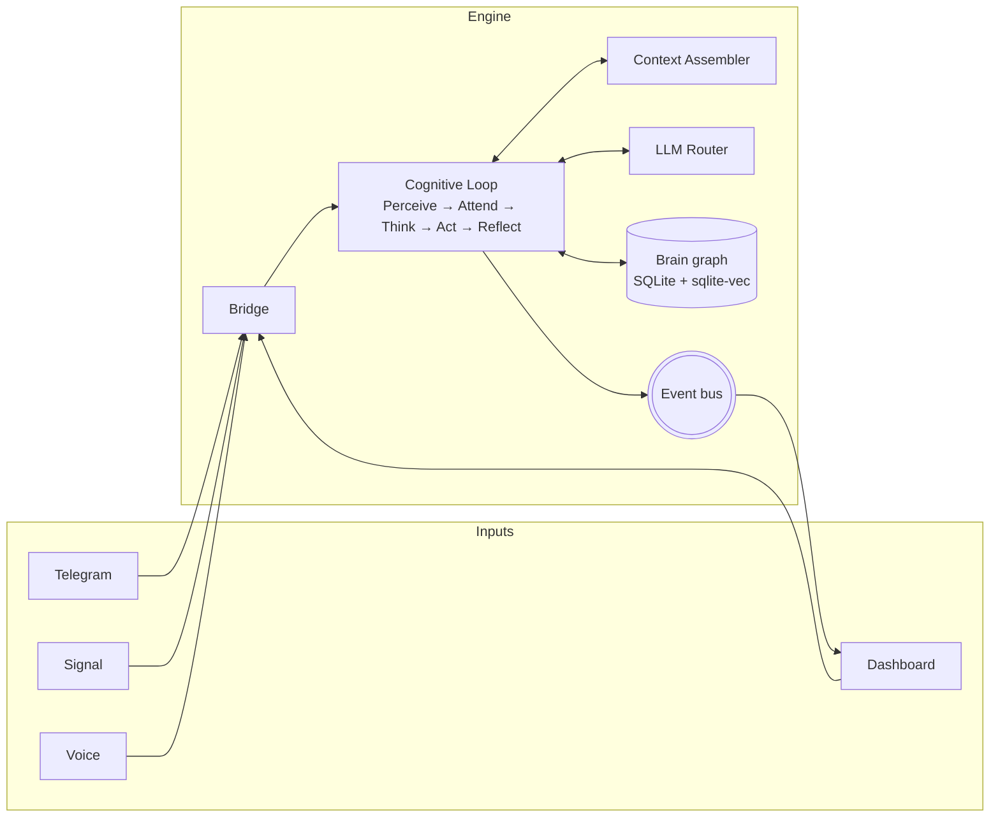

<h1 align="center">Sovyx</h1>

<p align="center">
  <em>Self-hosted AI companion with persistent memory.</em>
</p>

<p align="center">
  <a href="https://github.com/sovyx-ai/sovyx/actions/workflows/ci.yml">
    
  </a>
  <a href="https://pypi.org/project/sovyx/">
    
  </a>
  <a href="https://pypi.org/project/sovyx/">
    
  </a>
  <a href="https://github.com/sovyx-ai/sovyx/blob/main/LICENSE">
    
  </a>
  
</p>

---

## What it is

Sovyx is a Python daemon that runs a cognitive loop — Perceive → Attend → Think → Act → Reflect — against a local brain graph and any LLM provider you point it at. It's for developers and self-hosters who want an AI that remembers across sessions, runs on a Raspberry Pi 5, and keeps its memory in a SQLite file on their own disk.

It's an application, not a framework. Install it, point it at an API key, and talk to it — from Telegram, Signal, the dashboard, or the CLI.

## Demo

```
$ sovyx init my-mind
✓ Created ~/.sovyx/system.yaml
✓ Created ~/.sovyx/logs
✓ Created mind 'my-mind' at ~/.sovyx/my-mind/mind.yaml

Sovyx initialized!
Data directory: /home/you/.sovyx

Next: sovyx start to launch the daemon

$ sovyx start
[info  ] dashboard_listening       url=http://localhost:7777
[info  ] bridge_started            channels=3
[info  ] brain_loaded              concepts=1842 episodes=317
[info  ] cognitive_loop_ready      mind=my-mind
```

> Screenshot of the React dashboard goes here once we publish one.
> ``

## Quickstart

```bash
pip install sovyx
export ANTHROPIC_API_KEY=sk-ant-...   # or OPENAI_API_KEY / GOOGLE_API_KEY, or run Ollama locally
sovyx init my-mind
sovyx start
# open http://localhost:7777 — `sovyx token` prints the auth token
```

That's it. The daemon runs in the foreground by default; use `--foreground=false` to daemonize.

## Features

- **Cognitive loop** — Perceive → Attend → Think → Act → Reflect, serialized per mind.
- **Brain graph** — concepts, episodes, and relations in SQLite with WAL + `sqlite-vec`; hybrid FTS5 + vector retrieval.
- **LLM router** — complexity-aware routing across Anthropic, OpenAI, Google, and Ollama with budget caps and per-provider circuit breakers.
- **Voice pipeline** — wake word (openWakeWord), VAD (Silero), STT (Moonshine / Parakeet), TTS (Piper / Kokoro), Wyoming protocol.
- **React dashboard** — real-time WebSocket feed, brain graph viewer, conversation browser, log viewer, plugin manager, live chat.
- **Plugin system** — `ISovyxPlugin` ABC, `@tool` decorator, five-layer sandbox (AST scan, sandboxed HTTP, sandboxed FS, permission manifest, hot-reload).
- **Channels** — Telegram, Signal, and the dashboard chat, all wired to the same cognitive loop.
- **Runs on Raspberry Pi 5** — auto-detected hardware tier picks ONNX models that fit in 4 GB RAM.
- **Self-hostable** — one Python process, one SQLite file per mind, optional encrypted cloud backup (Argon2id + AES-256-GCM).

## Architecture



Every inbound message becomes an `InboundMessage`. The bridge normalizes it, the cognitive loop drives context assembly and LLM calls, and the brain graph records the outcome. The event bus broadcasts state changes to the dashboard over WebSocket in real time. See [`docs/architecture.md`](docs/architecture.md) for the full data flow.

## LLM Router

Sovyx routes every LLM call through a single component that classifies the request, picks a model, and enforces a cost budget.

- **Tiered routing** — `SIMPLE` (short / no code) → cheap fast models; `MODERATE` → mind's default; `COMPLEX` (long context / code / tool use) → flagship models.
- **Cost caps** — per-conversation and per-day USD budgets; requests exceeding budget fall back or fail closed.
- **Circuit breaker** — per-provider failure count with exponential backoff; healthy providers absorb traffic while a failing one cools down.
- **Fallback chain** — provider order defined in config, automatic retry on the next healthy provider.

```yaml
# ~/.sovyx/my-mind/mind.yaml
llm:
  default_provider: anthropic
  default_model: claude-sonnet-4-20250514
  fast_model: claude-3-5-haiku-20241022
  budget_daily_usd: 2.0
  budget_per_conversation_usd: 0.25
  fallback_providers:
    - openai
    - ollama
```

Full router design in [`docs/llm-router.md`](docs/llm-router.md).

## Dashboard

```bash
sovyx start        # starts the FastAPI server on :7777
sovyx token        # prints the bearer token for the web UI
```

React 19 + TypeScript + Zustand. Real-time WebSocket feed (brain updates, messages, health). Virtualized lists for logs and chat. Zod runtime validation on every response. Built-in token auth, dark mode, and i18n.

> Screenshot goes here: `docs/_assets/dashboard.png`

## Plugin System

A plugin is an `ISovyxPlugin` subclass with `@tool`-decorated methods. The LLM calls the tools by name during `THINK` when the conversation needs them.

```python
from sovyx.plugins.sdk import ISovyxPlugin, tool


class WeatherPlugin(ISovyxPlugin):
    @property
    def name(self) -> str:
        return "weather"

    @property
    def version(self) -> str:
        return "1.0.0"

    @property
    def description(self) -> str:
        return "Current weather and forecasts via Open-Meteo."

    @tool(description="Get current weather for a city.")
    async def get_weather(self, city: str) -> str:
        # HTTP calls must go through the sandboxed client.
        from sovyx.plugins.sandbox_http import SandboxedHttpClient
        async with SandboxedHttpClient(
            plugin_name="weather",
            allowed_domains=["api.open-meteo.com"],
        ) as client:
            resp = await client.get("https://api.open-meteo.com/v1/forecast", params={"...": "..."})
        ...
```

Built-in plugins: `calculator`, `financial-math`, `knowledge`, `weather`, `web-intelligence`. All live under [`src/sovyx/plugins/official/`](src/sovyx/plugins/official/).

```bash
sovyx plugin list                 # installed plugins
sovyx plugin create my-plugin     # scaffold a new plugin
sovyx plugin validate ./my-plugin # run quality gates (manifest, AST, permissions)
sovyx plugin install ./my-plugin  # install into the running daemon
```

## Configuration

Three sources, in priority order: environment variables (`SOVYX_*`, `__` for nesting), YAML files (`system.yaml` for the engine, `mind.yaml` per mind), built-in defaults.

Minimal `mind.yaml`:

```yaml
name: my-mind
language: en
timezone: UTC

personality:
  tone: warm
  humor: 0.4
  empathy: 0.8
  verbosity: 0.5

safety:
  content_filter: standard
  child_safe_mode: false
  financial_confirmation: true

llm:
  budget_daily_usd: 2.0

channels:
  telegram:
    enabled: true
    token_env: SOVYX_TELEGRAM_TOKEN
```

Every knob documented in [`docs/configuration.md`](docs/configuration.md).

## CLI

```bash
sovyx init [name]          # create ~/.sovyx/<name>/ with mind.yaml
sovyx start [--foreground] # launch daemon + dashboard (:7777)
sovyx stop                 # stop the daemon
sovyx status               # daemon health
sovyx doctor               # full readiness check
sovyx token                # print dashboard bearer token
sovyx brain search <q>     # query the brain graph from the CLI
sovyx brain stats          # concept / episode / relation counts
sovyx plugin list|info|install|enable|disable|remove|validate|create
sovyx logs [--level]       # tail daemon logs
```

## Documentation

- [Getting Started](docs/getting-started.md) — install, configure, first run.
- [Architecture](docs/architecture.md) — data flow, cognitive loop, brain graph.
- [LLM Router](docs/llm-router.md) — routing tiers, budgets, fallback.
- [Configuration](docs/configuration.md) — all config keys and env vars.
- [API Reference](docs/api-reference.md) — REST + WebSocket endpoints.
- [Security](docs/security.md) — sandbox, auth, data handling.
- [FAQ](docs/faq.md) — how Sovyx compares to LangChain, Siri, Home Assistant, etc.
- [Per-module docs](docs/modules/) — brain, cognitive, bridge, cloud, dashboard.

## Development

```bash
git clone https://github.com/sovyx-ai/sovyx.git
cd sovyx
uv sync --dev
uv run python -m pytest tests/ --ignore=tests/smoke --timeout=30   # ~7 800 backend tests
```

Before the first PR, read [`CLAUDE.md`](CLAUDE.md) — it's the development guide: stack, conventions, anti-patterns, testing patterns, and the quality gates CI enforces (`ruff`, `mypy --strict`, `bandit`, pytest on 3.11 + 3.12, vitest, `tsc`).

## Roadmap

Next in the pipeline (see [`docs/roadmap.md`](docs/roadmap.md) for the full plan):

- **Speaker recognition** — ECAPA-TDNN biometrics for multi-user voice.
- **Conversation importers** — ChatGPT, Claude, Gemini, and Obsidian vaults into the brain graph.
- **Relay client** — WebSocket + Opus audio streaming for a mobile companion.
- **Home Assistant bridge** — ten-domain entity registry with graduated action safety.
- **Plugin marketplace** — Stripe-Connect-powered distribution once the sandbox clears its v2 review.

## License

[AGPL-3.0-or-later](LICENSE).

## Star history

> Added once we have meaningful stars: `https://api.star-history.com/svg?repos=sovyx-ai/sovyx&type=Date`
