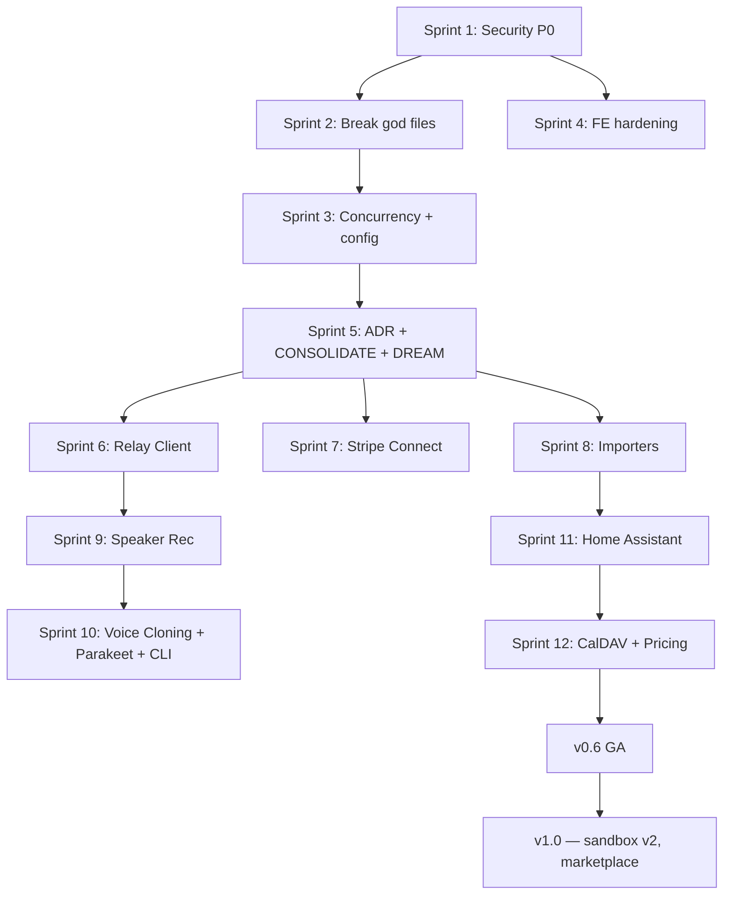

# Enterprise-Grade Audit — Relatório Consolidado Sovyx

**Gerado em**: 2026-04-14 (FASE 3 de 4)
**Escopo**: 258 arquivos (165 BE + 93 FE) auditados em 10 critérios cada, + features não desenvolvidas + roadmap
**Fontes**: `enterprise-audit-backend.md`, `enterprise-audit-frontend.md`, `gap-analysis.md`, `docs/roadmap.md`

---

## 1. Resumo executivo

**Sovyx é 76.7% enterprise-grade em média (8.42/10)**, sem nenhum arquivo abaixo de 5/10. Backend ligeiramente mais forte (78.2% ENT / 8.5) que frontend (74.2% / 8.28). O drag concentra-se em:
- 1 grupo FE único — `components/dashboard/` (7.2 avg, 14/23 DEVELOPED)
- 8 god files com múltiplas responsabilidades misturadas
- ~40 `except Exception` silenciosos
- 9 security blockers com fix barato (S) — nenhum foi shippado por falta de tempo, não por dificuldade

**O codebase é shippável hoje**, mas carrega 3 riscos estratégicos: (1) Wyoming unauthenticated LAN, (2) plugins oficiais bypassam o sandbox que shippam, (3) runtime type validation ausente no FE.

**13 features ausentes bloqueiam revenue** (Relay mobile, Stripe Connect, Importers, Speaker Rec, Pricing experiments, Home Assistant, CalDAV). Total de 3-4 semanas pra v0.6 GA conservadoramente.

**Caminho pra 90% enterprise**: ~15 dias-dev sênior full-time concentrado em P0 security + quebrar 4 god files + fechar tests em FE dashboard group + adicionar zod runtime validation.

### Score combinado

| Métrica | Backend | Frontend | Combinado |
|---|---:|---:|---:|
| Arquivos auditados | 165 | 93 | 258 |
| ENTERPRISE (8-10) | 129 (78.2%) | 69 (74.2%) | **198 (76.7%)** |
| DEVELOPED (5-7) | 36 (21.8%) | 24 (25.8%) | 60 (23.3%) |
| NOT-ENTERPRISE (<5) | 0 | 0 | **0** |
| Score médio | 8.5/10 | 8.28/10 | **8.42/10** |

### Top 5 security blockers (P0)

1. **Wyoming server LAN exposed sem auth** — `voice/wyoming.py` escuta `0.0.0.0:10700` sem token. Qualquer peer LAN queima créditos LLM do dono. [S]
2. **Official plugins bypassam sandbox** — `weather.py` e `web_intelligence.py` importam `httpx.AsyncClient` direto, nunca `SandboxedHttpClient`. Arquitetura de sandbox vira teatro. [S]
3. **AST scanner incompleto** — escape clássico `().__class__.__base__.__subclasses__()` não bloqueado. Faltam `builtins`, `tempfile`, `gc`, `inspect`, `mmap`, `pty`. [S]
4. **Path traversal em `sovyx init --name`** — `name.lower()` concatenado a path sem validação. `../../etc` escapa `~/.sovyx/`. [S]
5. **Dashboard import endpoint sem size cap** — 10GB POST = OOM daemon crash. [S]

### Top 5 quality gaps

1. **`dashboard/server.py` 2134 LOC god file** — `create_app()` inlines ~40 endpoints; deve ser `APIRouter` per domain. [M]
2. **~40 `except Exception` silenciosos** — com `# noqa: BLE001` + `logger.debug`. Mascara bugs reais em produção. [M]
3. **Sync ONNX inference em `async def`** — voice todo (Piper, Kokoro, Silero, Moonshine, OpenWakeWord) trava event loop. [M]
4. **Runtime type validation ausente no FE** — `types/api.ts` compile-time only; backend drift quebra silencioso. [M]
5. **Zero `React.memo` em hot paths FE** — log-row (virtualized), chat-bubble, plugin-card, cognitive-timeline, plugin-detail. [S]

### Features não desenvolvidas

**Total catalogadas: 21** (13 features + 8 divergências/refinamentos)
**Críticas pra revenue: 7** (Relay, Stripe Connect, Importers, Speaker Rec, Pricing experiments, HA bridge, CalDAV)

### Estimativa pra 90% enterprise-grade

**~15 dias-dev sênior** concentrados em:
- 5 dias: todos os 9 security blockers P0 (maior parte S, BE + FE)
- 4 dias: 4 god files quebrados (server.py + safety_patterns + voice/pipeline + plugins/manager)
- 3 dias: BLE001 sweep + hardcoded constants → `EngineConfig` + private attr encapsulation
- 3 dias: FE — `React.memo` hot paths, virtualização chat-thread, tests críticos (plugins.tsx, permission-dialog, command-palette), zod runtime validation

Restante 10% (sandbox v2, consolidate/dream, 3 god files menores) fica pra v1.0.

---

## 2. Features não desenvolvidas (PARTE A)

### Critical — bloqueiam revenue / commercial launch

| Feature | Módulo | Fonte | Esforço | Impacto comercial | Dependência |
|---|---|---|---|---|---|
| **Relay Client** (WebSocket+Opus audio streaming) | bridge | IMPL-007 | **L** | Bloqueia mobile app + cloud relay | — |
| **Stripe Connect completo** (Express, destination charges, refunds, disputes, payouts, Tax) | cloud | IMPL-011 | **L** | Bloqueia plugin marketplace | — |
| **ChatGPTImporter** (conversations.json tree) | upgrade | IMPL-SUP-015 | **M** | Bloqueia onboarding de ex-ChatGPT users | — |
| **ClaudeImporter** | upgrade | IMPL-SUP-015 | **M** | Bloqueia onboarding de ex-Claude users | — |
| **GeminiImporter** | upgrade | IMPL-SUP-015 | **M** | Bloqueia onboarding de ex-Gemini users | — |
| **ObsidianImporter** (markdown + wikilinks) | upgrade | IMPL-SUP-015 | **M** | Bloqueia power users | — |
| **Speaker Recognition** (ECAPA-TDNN biometrics, enrollment, verification) | voice | IMPL-005 | **L** | Bloqueia voice multi-user auth | — |
| **Pricing Experiments** (Van Westendorp, Gabor-Granger, PQLScorer, FunnelTracker) | cloud | IMPL-SUP-006 | **M** | Bloqueia revenue optimization | — |
| **Home Assistant bridge** (entity registry, ActionSafety, mDNS) | bridge | IMPL-008 | **L** | Bloqueia smart home positioning | — |
| **CalDAV sync** (CalendarAdapter, ctag+etag, RRULE, timezones) | bridge | IMPL-009 | **L** | Bloqueia calendar feature | — |
| **SMFExporter completo** (GDPR Art. 20 compliance) | upgrade | IMPL-SUP-015 | **M** | Bloqueia GDPR compliance | — |
| **InterMindBridge** (multi-instance sync) | upgrade | IMPL-SUP-015 | **L** | Feature v1.0 | Speaker Rec |
| **CursorPagination** (REST API) | dashboard | IMPL-SUP-015 | **S** | Bloqueia scale pra conversas grandes | — |

### Architectural refinements

| Feature | Módulo | Fonte | Esforço | Impacto | Dependência |
|---|---|---|---|---|---|
| **Emotional model 2D → 3D PAD migration** | brain + mind | ADR-001 | **M** | Fixa divergência arquitetural | Schema migration |
| **Emotional baseline config em MindConfig** | mind | ADR-001 | **S** | Completa ADR-001 | PAD 3D migration |
| **CONSOLIDATE phase in cognitive loop** | cognitive | SPE-003 | **S** | Memória não degrada sem intervenção | — |
| **DREAM phase** (nightly pattern discovery) | cognitive | SPE-003 | **M** | Auto-discovery de padrões | CONSOLIDATE |
| **BatchSpanProcessor** (trocar SimpleSpanProcessor) | observability | IMPL-015 | **S** | Reduz overhead OTel em produção | — |
| **Streaming LLM → speculative TTS** | llm + voice | SPE-007 | **M** | Reduz first-audio latency | — |
| **BYOK token isolation per user** | llm | SPE-007 | **M** | Segurança multi-tenant | — |

### Voice features (premium)

| Feature | Módulo | Fonte | Esforço | Impacto | Dependência |
|---|---|---|---|---|---|
| **Voice Cloning** (speaker adaptation) | voice | IMPL-SUP-002 | **M** | Feature premium | Speaker Rec |
| **Parakeet TDT** (multilingual fallback) | voice | IMPL-SUP-004 | **M** | Suporte multilingual | — |

### CLI completeness

| Feature | Módulo | Fonte | Esforço | Impacto | Dependência |
|---|---|---|---|---|---|
| **REPL interativo** (multi-line, auto-complete, history) | cli | SPE-015 | **M** | Developer UX | — |
| **Admin utilities** (db inspection, config reset, user/mind mgmt) | cli | SPE-015 | **M** | Ops ergonomics | — |

### Plugin sandbox v2

| Feature | Módulo | Fonte | Esforço | Impacto | Dependência |
|---|---|---|---|---|---|
| **seccomp-BPF** (Linux syscall filtering) | plugins | IMPL-012 layer 5 | **XL** | Required pra plugin marketplace | — |
| **Namespace isolation** (mount/PID/user) | plugins | IMPL-012 layer 6 | **XL** | Required pra marketplace | seccomp-BPF |
| **macOS Seatbelt profiles** | plugins | IMPL-012 layer 7 | **XL** | Required pra marketplace | seccomp-BPF |
| **Subprocess IPC protocol** | plugins | SPE-008 | **XL** | Required pra v2 | namespaces |
| **Zero-downtime plugin update/rollback** | plugins | SPE-008 | **M** | Ops UX | — |

### Infra opcional

| Feature | Módulo | Fonte | Esforço | Impacto | Dependência |
|---|---|---|---|---|---|
| **Redis caching layer** (opcional) | persistence | ADR-004 | **M** | Perf em alto throughput | — |
| **License key runtime rotation** | cloud | IMPL-011 | **S** | Sem restart em renovação | — |

**Total: 26 features/refinamentos catalogados.**

---

## 3. Matriz de prioridade (PARTE B.2)

Dimensões: **Impacto** (bloqueia revenue, security, ou degrada UX) × **Esforço** (S/M/L/XL).

### URGENT (alto impacto + baixo esforço — fazer AGORA)

| Item | Categoria | Esforço |
|---|---|---|
| Wyoming token auth + rate limit | Security P0 | S |
| Official plugins → SandboxedHttpClient | Security P0 | S |
| AST scanner gaps (builtins, __class__, etc.) | Security P0 | S |
| Path traversal fix em `sovyx init` | Security P0 | S |
| Dashboard import size cap | Security P0 | S |
| Dashboard chat max length | Security P0 | S |
| Google provider API key → header | Security P0 | S |
| `window.prompt()` → modal em settings.tsx | Security P0 | S |
| WS URL protocol detection | Security P0 | S |
| `use-auth.ts` fail-closed | Security P0 | S |
| JSON.stringify render clamp + redaction | Security P0 | S |
| Token localStorage → sessionStorage+memory | Security P0 | S |
| WS token via subprotocol | Security P1 | M |
| CONSOLIDATE phase in loop | Feature | S |
| License key runtime rotation | Feature | S |
| BatchSpanProcessor | Quality | S |
| Emotional baseline config | Arch | S |
| CursorPagination | Feature | S |
| React.memo em 5 hot paths | Quality | S |
| Raw fetch() → api.ts (3 arquivos) | Quality | S |
| Pricing table → `llm/pricing.py` único | Quality | S |

**21 itens — ~6-8 dias-dev. Onde a maior parte do ganho acontece.**

### STRATEGIC (alto impacto + alto esforço — sprint próximo)

| Item | Categoria | Esforço |
|---|---|---|
| Relay Client (mobile) | Feature | L |
| Stripe Connect completo | Feature | L |
| ChatGPT/Claude/Gemini/Obsidian importers | Feature | L (4×M) |
| Speaker Recognition ECAPA-TDNN | Feature | L |
| Home Assistant bridge | Feature | L |
| CalDAV sync | Feature | L |
| Pricing experiments (Van Westendorp, Gabor-Granger, PQL) | Feature | M |
| DNS rebinding fix em sandbox_http | Security | M |
| Plugin install checksum/allowlist | Security | M |
| Quebrar `dashboard/server.py` em APIRouters | Quality | M |
| Quebrar `cognitive/safety_patterns.py` | Quality | M |
| Quebrar `voice/pipeline.py` | Quality | M |
| Quebrar `plugins/manager.py` | Quality | M |
| Sync ONNX → `asyncio.to_thread` (voice) | Quality | M |
| BLE001 sweep (consolidar em 3 patterns tipados) | Quality | M |
| Hardcoded constants → `EngineConfig` | Quality | M |
| `zod` runtime validation no FE | Quality | M |
| `api.ts` hardening (timeout/retry/PATCH) | Quality | M |
| Virtualização chat-thread + cognitive-timeline | Quality | M |
| Emotional 2D → 3D PAD migration | Arch | M |
| DREAM phase | Feature | M |
| Voice Cloning | Feature | M |
| Parakeet TDT | Feature | M |
| CLI REPL | Feature | M |
| CLI admin utilities | Feature | M |
| Redis caching (opcional) | Feature | M |

**26 itens — ~3-4 sprints (12-16 dias-dev).**

### QUICK WIN (baixo impacto + baixo esforço — quando sobrar tempo)

- i18n sweep em aria-labels hardcoded (FE, 5 arquivos)
- `nameToHue` consolidado em `lib/format.ts`
- `log-row.tsx`: adicionar role/tabIndex/onKeyDown
- ErrorBoundary telemetry hook
- Per-section error boundaries (settings, plugins, chat)
- Windows portability (`os.sysconf` → psutil, `AF_UNIX` fallback)
- Tests pra ui/sidebar, ui/chart, ui/command, command-palette
- Tooltip Radix em settings.tsx
- Cookie SameSite em sidebar

**~9 itens — fáceis de encaixar em qualquer semana.**

### DEPRIORITIZE (baixo impacto + alto esforço — não agora)

- Plugin sandbox v2 — seccomp-BPF, namespaces, macOS Seatbelt (XL cada × 3)
- Subprocess IPC protocol (XL)
- InterMindBridge (L — depende de Speaker Rec)
- Plugin marketplace (XL — depende de sandbox v2)
- Third-party security audit (external dependency)
- Foundation governance (not technical)

**Postergar pra v1.0. Fazer antes é over-engineering.**

---

## 4. Plano de ação — Sprint sequence (PARTE B.3)

**Unidade**: 1 dev sênior full-time, 5 dias úteis/sprint.

### Sprint 1 — Security P0 (5 dias)

**Objetivo**: zero security blockers. Não ser vergonha se alguém auditar.

| # | Task | Effort | Arquivo |
|---|---|---|---|
| 1 | Wyoming server: token auth + rate limit + payload cap + read timeout | S (0.5d) | `voice/wyoming.py` |
| 2 | Official plugins: `weather.py` + `web_intelligence.py` usam `SandboxedHttpClient` | S (0.5d) | `plugins/official/` |
| 3 | AST scanner: adicionar `builtins`, `tempfile`, `gc`, `inspect`, `mmap`, `pty`, `__class__`, `__mro__`, `__base__`, `f_back`, `gi_frame` | S (0.5d) | `plugins/security.py` |
| 4 | CLI init: validar mind-name via regex `^[a-z0-9_-]{1,64}$` | S (0.5d) | `cli/main.py` |
| 5 | Dashboard import: size cap 100MB + streaming parse | S (0.5d) | `dashboard/export_import.py` |
| 6 | Dashboard chat: max length 10k chars | S (0.5d) | `dashboard/chat.py` |
| 7 | Google provider: API key em header `x-goog-api-key` | S (0.5d) | `llm/providers/google.py` |
| 8 | FE: `window.prompt()` → Radix Dialog modal | S (0.5d) | `pages/settings.tsx` |
| 9 | FE: token `localStorage` → `sessionStorage` + memory fallback | S (0.5d) | `lib/api.ts`, `hooks/use-auth.ts` |
| 10 | FE: WS URL `ws://` → `location.protocol` branching | S (0.3d) | `hooks/use-websocket.ts` |
| 11 | FE: `use-auth.ts` fail-closed on network error | S (0.2d) | `hooks/use-auth.ts` |

**Resultado esperado**: 11 security blockers fechados. Projeto auditável sem sangrar.

### Sprint 2 — Quality foundations (5 dias)

**Objetivo**: quebrar 4 god files + BLE001 sweep. Projeto maintainable.

| # | Task | Effort | Arquivo |
|---|---|---|---|
| 1 | Quebrar `dashboard/server.py` (2134 LOC) em `APIRouter` per domain: `routes/brain.py`, `conversations.py`, `chat.py`, `logs.py`, `activity.py`, `settings.py`, `plugins.py`, `voice.py`, `channels.py`, `health.py`, `metrics.py`, `export_import.py` | M (1.5d) | `dashboard/` |
| 2 | Quebrar `cognitive/safety_patterns.py` (1165 LOC) em `patterns/{pii.py, financial.py, injection.py, custom.py}` + `dispatch.py` | M (1d) | `cognitive/safety/` |
| 3 | Quebrar `voice/pipeline.py` (840 LOC) em `state_machine.py` + `output_queue.py` + `barge_in.py` + `orchestrator.py` | M (1d) | `voice/` |
| 4 | Quebrar `plugins/manager.py` (819 LOC) em `discovery.py` + `loader.py` + `executor.py` + `health.py` (4 deduplicated emit helpers) | M (1d) | `plugins/` |
| 5 | BLE001 sweep: converter `except Exception: pass` e `except Exception: logger.debug` em `except SovyxError: logger.warning` + `except (TimeoutError, ConnectionError): logger.exception + retry` + `except Exception: logger.exception + reraise` | M (0.5d scan + automatable) | all modules |

**Resultado esperado**: 4 god files quebrados, ~40 bare excepts tipados. Diff-review dramaticamente mais rápido.

### Sprint 3 — Concurrency + config hardening (5 dias)

**Objetivo**: eliminar event-loop starvation e hardcode drift.

| # | Task | Effort | Arquivo |
|---|---|---|---|
| 1 | Voice: mover ONNX inference pra `asyncio.to_thread()` em Piper, Kokoro, Silero, Moonshine, OpenWakeWord | M (1d) | `voice/{stt,tts_*,vad,wake_word}.py` |
| 2 | Cloud: `boto3` → `aioboto3` em `cloud/backup.py` ou wrap em `to_thread` | M (0.5d) | `cloud/backup.py` |
| 3 | Voice: `asyncio.Queue/Event` em `__init__` → lazy init em primeiro uso async | M (0.5d) | `voice/pipeline.py`, `audio.py` |
| 4 | Cloud: `defaultdict(asyncio.Lock)` em `flex.py` + `usage.py` → LRU pattern do `bridge/manager.py` | M (0.5d) | `cloud/flex.py`, `usage.py` |
| 5 | `observability/alerts.py`: wrap mutações de `_metrics`/`_states` em `asyncio.Lock` | S (0.3d) | `observability/alerts.py` |
| 6 | `persistence/pool.py`: proteger `_read_index` com lock | S (0.3d) | `persistence/pool.py` |
| 7 | Mover hardcoded constants de cognitive/brain/voice pra `EngineConfig` (classifier budgets, regex catalogs, embedding URL+SHA, learning rates, consolidation thresholds) | M (1d) | `cognitive/`, `brain/`, `voice/` |
| 8 | Unificar pricing table em `llm/pricing.py` (1 fonte, 4 providers referenciam) | S (0.5d) | `llm/` |
| 9 | `BatchSpanProcessor` em `observability/tracing.py` | S (0.2d) | `observability/tracing.py` |

**Resultado esperado**: zero sync IO em async, zero unbounded state, zero hardcoded constants fora de config. 4 divergências fechadas.

### Sprint 4 — FE hardening (5 dias)

**Objetivo**: FE enterprise-grade em todos os grupos.

| # | Task | Effort | Arquivo |
|---|---|---|---|
| 1 | Raw `fetch()` → `api.ts` em `use-auth.ts`, `token-entry-modal.tsx`, `export-import.tsx` | S (0.5d) | `hooks/`, `components/` |
| 2 | `api.ts` hardening: default 30s timeout + AbortController, retry backoff (429/503), PATCH, query-string helper tipado | M (1d) | `lib/api.ts` |
| 3 | `zod` runtime validation: schemas em `types/api.ts`, validate em `lib/api.ts` antes de retornar | M (1d) | `types/`, `lib/` |
| 4 | `React.memo` em hot paths: log-row, chat-bubble, plugin-card, cognitive-timeline-event, plugin-detail | S (0.5d) | `components/dashboard/` |
| 5 | Virtualização `chat-thread.tsx` + `cognitive-timeline.tsx` (usar `@tanstack/react-virtual` já instalado) | M (1d) | `components/dashboard/` |
| 6 | Tests críticos: `plugins.tsx` page-level, `permission-dialog` interaction, `command-palette` Cmd+K, `router.tsx` lazy + boundary | M (1d) | `pages/`, `components/` |

**Resultado esperado**: FE `components/dashboard/` sai de 7.2 pra ~8.5. Total FE ~85% ENT.

### Sprint 5 — Arquitetural refinements (5 dias)

**Objetivo**: fechar divergências ADR + CONSOLIDATE + DREAM + streaming.

| # | Task | Effort | Dependência |
|---|---|---|---|
| 1 | Emotional model 2D → 3D PAD migration: `Concept`/`Episode` schema + `mind.yaml` baseline config + consolidation weighting | M (1.5d) | — |
| 2 | CONSOLIDATE phase: chamar `brain.ConsolidationCycle` periodicamente do `CognitiveLoop` | S (0.5d) | — |
| 3 | DREAM phase: novo `cognitive/dream.py` nightly job com pattern discovery via LLM | M (1d) | CONSOLIDATE |
| 4 | Streaming LLM → speculative TTS: novo `LLMRouter.stream()` + pipelinar chunks pro TTS | M (1d) | — |
| 5 | BYOK token isolation per user | M (1d) | — |

**Resultado esperado**: 5 divergências arquiteturais fechadas. Sistema completa spec SPE-003 7 fases.

### Sprint 6-8 — Features críticas pra revenue (3 semanas)

**Objetivo**: desbloquear v0.6 GA. Mobile + marketplace + onboarding.

#### Sprint 6: Relay Client (mobile)

- `bridge/channels/relay.py`: WebSocket + Opus 24kbps + ring buffer 60ms + resampling 16↔48kHz + offline queue + exp backoff
- Mobile app initial integration guide
- Effort: L (5 dias)

#### Sprint 7: Stripe Connect completo

- Express onboarding, destination charges, refund flow, dispute handling, payout management, Stripe Tax, 20+ webhook events
- Effort: L (5 dias)

#### Sprint 8: Conversation Importers

- `upgrade/importers/chatgpt.py` (conversations.json tree)
- `upgrade/importers/claude.py`
- `upgrade/importers/gemini.py`
- `upgrade/importers/obsidian.py` (markdown + wikilinks)
- `SMFExporter` complete (GDPR Art. 20)
- Effort: 5 dias (4×M importers paralelos em 1 sprint se modulares)

### Sprint 9-12 — Features secundárias (4 semanas)

| Sprint | Foco | Tasks |
|---|---|---|
| 9 | Voice premium | Speaker Recognition (L) |
| 10 | Voice extras + CLI | Voice Cloning (M), Parakeet TDT (M), CLI REPL (M), CLI admin (M) |
| 11 | Smart home | Home Assistant bridge (L) |
| 12 | Calendar + pricing | CalDAV sync (L), Pricing experiments (M) |

### Sprint 13+ — v1.0 (sandbox v2, marketplace)

Out of scope — planejar após v0.6 GA shippado e estável 4+ semanas.

### Quick wins (paralelizáveis, qualquer semana)

- i18n sweep em aria-labels (5 FE arquivos)
- `nameToHue` consolidado
- `log-row.tsx` keyboard support
- ErrorBoundary telemetry hook (Sentry)
- Per-section error boundaries
- Windows portability fixes
- Tests pra primitives UI sem coverage

---

## 5. Scorecard final (PARTE B.4)

### Backend

| Módulo | Arquivos | Score | ENT% | Top gap | Prioridade |
|---|---:|---:|---:|---|---|
| context | 4 | 9.5 | 100% | — | ✅ referência |
| benchmarks | 3 | 9.3 | 100% | — | ✅ |
| mind | 2 | 9.25 | 100% | Emotional baseline | S (Sprint 5) |
| cloud | 10 | 9.2 | — | defaultdict(Lock) sem LRU | S (Sprint 3) |
| persistence | 8 | 9.2 | 100% | `_read_index` race | S (Sprint 3) |
| observability | 7 | 9.1 | 87% | alerts.py sem lock | S (Sprint 3) |
| upgrade | 7 | 9.1 | — | Importers ausentes | L (Sprint 8) |
| bridge | 7 | 9.0 | — | Relay/HA/CalDAV ausentes | L (Sprint 6, 11, 12) |
| engine | 12 | 8.6 | — | rpc_server.py sem auth | M (Sprint 2) |
| dashboard (BE) | 17 | 8.6 | 82% | server.py 2134 LOC god | M (Sprint 2) |
| llm | 10 | 8.4 | — | Pricing duplicado 5x | S (Sprint 3) |
| plugins | 21 | 8.4 | 71% | Official bypass sandbox | S (Sprint 1) |
| voice | 10 | 8.09 | — | Wyoming LAN sem auth | S (Sprint 1) + M (Sprint 3) |
| cognitive | 23 | 8.0 | — | safety_patterns 1165 LOC + 20 BLE001 | M (Sprint 2) |
| brain | 13 | 7.8 | — | Hardcoded constants | M (Sprint 3) |
| cli | 7 | 7.5 | — | Path traversal + BLE001 pervasivo | S (Sprint 1) + M (Sprint 2) |

### Frontend

| Grupo | Arquivos | Score | ENT% | Top gap | Prioridade |
|---|---:|---:|---:|---|---|
| hooks | 4 | 9.5 | 100% | — | ✅ referência |
| stores | 13 | 9.5 | 77% | Sem runtime validation | M (Sprint 4) |
| components/common | 6 | 9.5 | 100% | — | ✅ |
| components/chat | 2 | 9.5 | 100% | — | ✅ XSS-hardened |
| components/layout | 4 | 9.25 | 100% | — | ✅ |
| root (App/main/router) | 3 | 9.3 | 67% | router.tsx sem test | S (Sprint 4) |
| lib | 5 | 9.0 | 100% | api.ts sem timeout/retry | M (Sprint 4) |
| types | 1 | 9.0 | 100% | Sem zod runtime | M (Sprint 4) |
| components/ui | 17 | 8.6 | 82% | 3 primitives sem test | M (Sprint 4) |
| pages | 12 | 8.0 | 83% | plugins.tsx 363 LOC sem test | M (Sprint 4) |
| components/settings | 2 | 8.0 | 100% | raw fetch() | S (Sprint 4) |
| components/auth | 1 | 8.0 | 100% | raw fetch() | S (Sprint 4) |
| **components/dashboard** | **23** | **7.2** | **39%** | **14 arquivos DEVELOPED** | **M (Sprint 4)** |

### Combined

| Camada | Arquivos | ENT% | Avg | Sprints críticos |
|---|---:|---:|---:|---|
| Backend | 165 | 78.2% | 8.5 | 1, 2, 3 |
| Frontend | 93 | 74.2% | 8.28 | 1 (partial), 4 |
| **Combinado** | **258** | **76.7%** | **8.42** | **Sprint 1-4 pra 90%** |

---

## Dependências e caminho crítico

**Caminho crítico**: Sprint 1 → 2 → 3 → 5 → 6/7/8 → v0.6 GA = **8 sprints (8 semanas)** com 1 dev sênior full-time.

**Atalho pra MVP shippable**: Sprints 1+2+4 = 3 semanas pra projeto 85%+ enterprise auditável, com features existentes sólidas. Features v0.6 ficam pra quando houver capacidade.

---

## Reconhecimento de forças

Sovyx **já é um dos projetos mais bem-engenheirados que muitos teams enterprise shippam**:
- 0% NOT-ENTERPRISE (nenhum arquivo abaixo de 5/10 em 258)
- `cloud/billing.py`: webhook HMAC textbook, idempotent event store
- `cloud/crypto.py`: Argon2id + AES-GCM + crypto-shredding
- `upgrade/blue_green.py`: 6-phase rollback
- `bridge/manager.py`: LRU-500 asyncio.Lock eviction
- `persistence/manager.py`: DB-per-Mind isolation
- `dashboard/events.py` ConnectionManager: slow-consumer-safe broadcast
- `hooks/use-websocket.ts`: exponential backoff + debounce + cleanup exemplar
- `components/chat/markdown-content.tsx`: XSS-hardened
- Test coverage 1.4:1 (16.4k tests / 12k prod)
- Zero `any` em todo FE
- i18n estruturado
- Quality gates mandatórios (ruff + mypy strict + bandit + pytest ≥95% + vitest + tsc)

O trabalho de hardening é **refinar o fino**, não reescrever o grosso.

---

## Output files

- `docs-internal/_meta/enterprise-audit-final.md` — este (consolidado)
- `docs-internal/_meta/enterprise-audit-backend.md` — FASE 1
- `docs-internal/_meta/enterprise-audit-frontend.md` — FASE 2
- `docs-internal/_meta/enterprise-audit-part-{A,B,C,D,E}.md` — BE detail
- `docs-internal/_meta/enterprise-audit-fe-part-{A,B,C,D}.md` — FE detail
