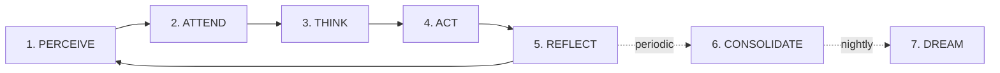
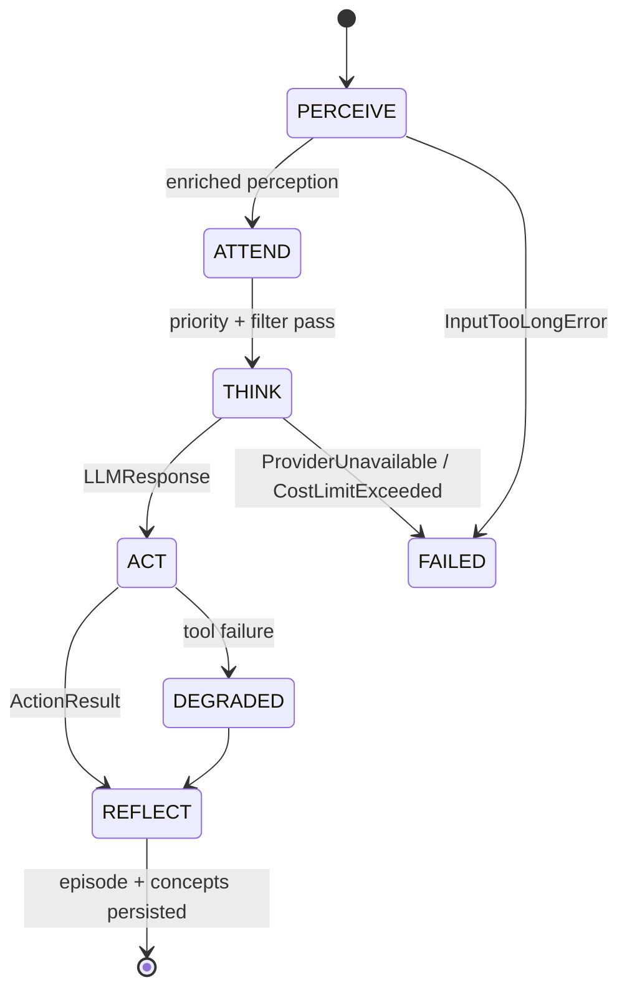

# Cognitive Loop

## Objetivo

O Cognitive Loop é o **motor de pensamento** de uma Mind. Não é um handler request-response: é um **processo cognitivo contínuo** que recebe percepções (fala, texto, timer, evento de plugin, trigger proativo), recupera memórias relevantes, monta contexto rico, raciocina com LLM, decide se fala/age/permanece silencioso, executa, e atualiza estado emocional.

Fonte: `vps-brain-dump/memory/confidential/sovyx-bible/backend/specs/SOVYX-BKD-SPE-003-COGNITIVE-LOOP.md`, `.../SOVYX-BKD-IMPL-006-COGNITIVE-LOOP.md`.

## Inspiração

| Fonte | Contribuição |
|---|---|
| **OODA Loop** (Boyd, 1987) | Observe → Orient → Decide → Act. Sovyx adapta: Perceive (Observe), Attend (Observe filter), Think (Orient + Decide), Act (Act), Reflect (meta). |
| **ReAct pattern** (Yao et al., 2023) | Reason + Act intercalado. O `ThinkPhase` pode encadear LLM → tool call → LLM com contexto atualizado. |
| **Inner Monologue** (Huang et al., Google 2023) | Context assembly inclui memória emocional, working memory, reasoning chain visível. |
| **Schneier OODA critique** (Harvard, Oct 2025) | Alerta sobre AI "compressing reality". Sovyx mitiga mantendo Orient/Context rico e transparente — a Mind vê suas próprias memórias, emoções e cadeia de raciocínio. **Nada de black-box compression.** |
| **ChatGPT Pulse** (OpenAI, Sep 2025) | Percepções proativas (timers, consolidação emocional) entram no loop como PerceptionType próprio. |

## Fases planejadas (7) — SPE-003 §1.1



| # | Fase | OODA | Frequência | Módulo |
|---|---|---|---|---|
| 1 | PERCEIVE | Observe | per-interaction | `cognitive/perceive.py` |
| 2 | ATTEND | Observe | per-interaction | `cognitive/attend.py` |
| 3 | THINK | Orient + Decide | per-interaction | `cognitive/think.py` |
| 4 | ACT | Act | per-interaction | `cognitive/act.py` |
| 5 | REFLECT | — | per-interaction | `cognitive/reflect.py` |
| 6 | CONSOLIDATE | — | periodic (minutes/hours) | `cognitive/consolidate.py` *(planejado)* |
| 7 | DREAM | — | nightly | `cognitive/dream.py` *(planejado)* |

## Fases implementadas (5)

### State machine



### 1. PERCEIVE (`cognitive/perceive.py`)

Valida input (NaN guards, `MAX_INPUT_CHARS=10000`), classifica complexidade por heurística (sem LLM), cria turn na conversa. Emite `PerceptionReceived`.

```python
@dataclasses.dataclass
class Perception:
    id: str
    type: PerceptionType  # SPEECH, TEXT, TIMER, PROACTIVE, ...
    source: str
    content: str
    person_id: str | None = None
    channel_id: str | None = None
    priority: int = 10
    metadata: dict[str, object] = dataclasses.field(default_factory=dict)
```

Heurística de complexidade usa marcadores: `_COMPLEX_MARKERS = {"why", "how does", "explain", "compare", "analyze", "what if", ...}` e `_SIMPLE_MARKERS = {"set timer", "weather", "reminder", "what time"}`.

### 2. ATTEND (`cognitive/attend.py`)

Resolve identidade da pessoa, aplica filtros de priority, desduplica perceptions duplicadas, consulta `safety_*` (PII guard, injection detection). Pode descartar perception ou downgrade priority.

### 3. THINK (`cognitive/think.py`)

Ordem crítica:

1. **Model selection primeiro** (via `LLMRouter` com `ComplexityLevel`) — só precisa de `complexity` do metadata.
2. **Get `context_window`** do modelo selecionado.
3. **Context assembly** com `context_window` real (`ContextAssembler.assemble(...)` → `AssembledContext` com 6 slots).
4. **LLM generate** com modelo selecionado.
5. **Parse response** → tool calls ou texto direto.

```python
class ThinkPhase:
    """Assemble context + call LLM with complexity-based model routing."""
    async def process(self, perception, mind_id, conversation_history) -> LLMResponse:
        model = self._router.select_model(perception.metadata["complexity"])
        context_window = self._router.get_context_window(model)
        context = await self._assembler.assemble(
            mind_id=mind_id,
            current_message=perception.content,
            conversation_history=conversation_history,
            complexity=perception.metadata["complexity"],
            context_window=context_window,
        )
        return await self._router.complete(context.messages, model=model)
```

### 4. ACT (`cognitive/act.py`)

Executa a decisão do `THINK`: resposta textual, invocação de tool (plugin), ou silêncio. Tool calls passam pelo `PluginManager` (sandbox). Devolve `ActionResult`.

### 5. REFLECT (`cognitive/reflect.py`)

Encoding do episódio + extração de conceitos (LLM-based, com fallback regex) + Hebbian learning (co-occurrence strengthening). Emite `EpisodeEncoded`, `ConceptCreated`.

```python
@dataclass(frozen=True, slots=True)
class ExtractedConcept:
    name: str
    content: str
    category: str
    sentiment: float = 0.0  # -1.0 to 1.0
    importance: float
    confidence: float
    explicit: bool
    source_quality: float
```

Scoring multi-signal (`brain/scoring.py`): `ImportanceWeights(category_base=0.15, llm_assessment=0.35, emotional=0.10, novelty=0.15, explicit_signal=0.25)` deve somar 1.0 (validado em `__post_init__`).

## [NOT IMPLEMENTED]

### CONSOLIDATE (orphaned)

SPE-003 §1.1 diz: "Periodic: prune, strengthen". O código **tem** `brain/consolidation.py` com `ConsolidationCycle` (Ebbinghaus decay + merge + prune) e `ConsolidationScheduler`, mas **o cognitive loop não chama**. Memória degrada sem prune/strengthen automático integrado.

Fix planejado (roadmap v0.6): chamar `ConsolidationCycle.run()` via `ConsolidationScheduler` a partir do loop principal ou background task registrada no `LifecycleManager`.

### DREAM (absent)

SPE-003 §1.1 diz: "Nightly: discover patterns". **Sem `cognitive/dream.py`.** Sem auto-discovery de padrões entre episódios (ex: "usuário X sempre pergunta sobre Y depois de Z").

Fix planejado (roadmap v0.6): implementar `DreamPhase` que roda 1x/dia (low-activity window), faz clustering de episódios recentes, gera abstract concepts e relations implícitas.

## Safety stack (`cognitive/safety_*.py`)

Detectado no código, documentação esparsa em specs. 14 arquivos compõem a camada de segurança:

| Arquivo | Função |
|---|---|
| `safety_gate.py` | Central gate (call/decline/escalate) |
| `safety_injection.py` | Prompt injection tracking |
| `safety_pii.py` | PII detection/redaction |
| `safety_financial.py` | Financial transaction gate (confirmation flow) |
| `safety_shadow.py` | Shadow mode (log only, don't act) |
| `safety_escalation.py` | Escalation to human (via bridge) |
| `safety_audit.py` + `audit_store.py` | Audit log persistente |
| `safety_rate.py` | Rate limiting per-person |
| ... (mais 6) | Heuristicas auxiliares |

### CogLoopGate

`cognitive/gate.py` serializa requests concorrentes por Mind. Implementação não detalhada em SPE-003, mas existe no código com comportamento "Gate calls Loop; Loop never calls Gate" (ver docstring em `CognitiveLoop`).

```python
class CognitiveLoop:
    """Complete cognitive loop: Perceive -> Attend -> Think -> Act -> Reflect.

    Orchestrates all phases. Manages state machine.
    Gate -> calls -> Loop.process_request(). Loop never calls Gate.
    """
```

Error handling via `_categorize_error(exc)` mapeia por **class name** (não `isinstance` — xdist-safe per Anti-Pattern #8 em CLAUDE.md):

```python
name = type(exc).__name__
if name == "CostLimitExceededError":
    return "I've reached my conversation budget limit. Please try again later."
if name == "ProviderUnavailableError":
    return "No AI provider is available right now. ..."
return "I encountered an unexpected error. Please try again."
```

## Perception Types

`engine/types.py::PerceptionType` (StrEnum):

| Categoria | Tipos |
|---|---|
| User-initiated | `SPEECH`, `TEXT`, `TOUCH` |
| System-initiated | `TIMER`, `SCHEDULE`, `PLUGIN_EVENT`, `SENSOR` |
| Internal | `PROACTIVE`, `CONSOLIDATION`, `EMOTIONAL_SHIFT` |

## Eventos emitidos pelo loop

- `PerceptionReceived(mind_id, perception_id, type, complexity)` — após PERCEIVE
- `ThinkCompleted(mind_id, turn_id, model, tokens_in, tokens_out, cost_usd)` — após THINK
- `ResponseSent(mind_id, turn_id, channel, length_chars)` — após ACT
- `EpisodeEncoded(mind_id, episode_id, importance)` — após REFLECT
- `ConceptCreated(mind_id, concept_id, name, category)` — após REFLECT (se concept novo)

Ver `docs/architecture/data-flow.md` para fluxo completo.

## Métricas e tracing

- Structured logs via `sovyx.observability.logging.get_logger(__name__)`
- OTel spans por fase: `cognitive.perceive`, `cognitive.attend`, `cognitive.think`, `cognitive.act`, `cognitive.reflect`
- Prometheus counters: `sovyx_cognitive_turns_total{phase}`, `sovyx_cognitive_errors_total{category}`
- SLO: p99 latency `think` < 3s (local), < 8s (cloud LLM)

## Referências

### Docs originais
- `vps-brain-dump/memory/confidential/sovyx-bible/backend/specs/SOVYX-BKD-SPE-003-COGNITIVE-LOOP.md` (55KB, 1408 linhas)
- `.../specs/SOVYX-BKD-IMPL-006-COGNITIVE-LOOP.md` (56KB)
- `.../adrs/SOVYX-BKD-ADR-001-EMOTIONAL-MODEL.md` (contexto emocional no loop)
- `.../adrs/SOVYX-BKD-ADR-007-EVENT-ARCHITECTURE.md` (eventos emitidos)

### Código-fonte
- `src/sovyx/cognitive/loop.py` — `CognitiveLoop` orquestrador
- `src/sovyx/cognitive/perceive.py` — `PerceivePhase` + `Perception` dataclass
- `src/sovyx/cognitive/attend.py` — `AttendPhase`
- `src/sovyx/cognitive/think.py` — `ThinkPhase`
- `src/sovyx/cognitive/act.py` — `ActPhase` + `ActionResult`
- `src/sovyx/cognitive/reflect.py` — `ReflectPhase` + `ExtractedConcept`
- `src/sovyx/cognitive/state.py` — `CognitiveStateMachine`
- `src/sovyx/cognitive/gate.py` — `CogLoopGate`
- `src/sovyx/cognitive/safety_*.py` — 14 arquivos (PII, injection, financial, shadow, escalation, audit, rate)
- `src/sovyx/cognitive/audit_store.py`

### Gap analysis
- `docs/_meta/gap-inputs/analysis-A-core.md` §cognitive
- `docs/_meta/gap-analysis.md` — Top 10 gaps #8 (CONSOLIDATE orphaned), #9 (DREAM)
