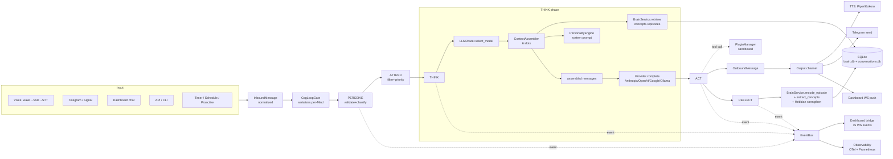
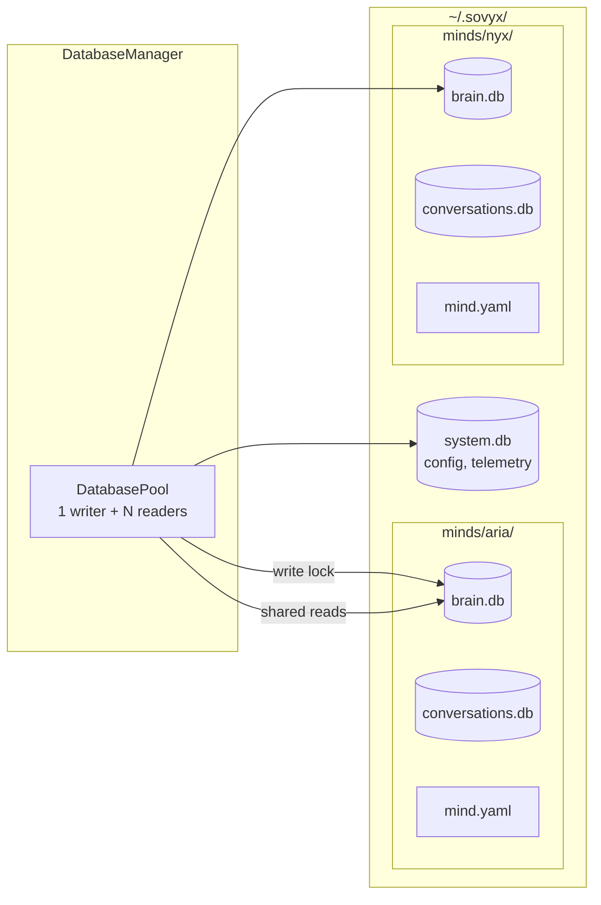
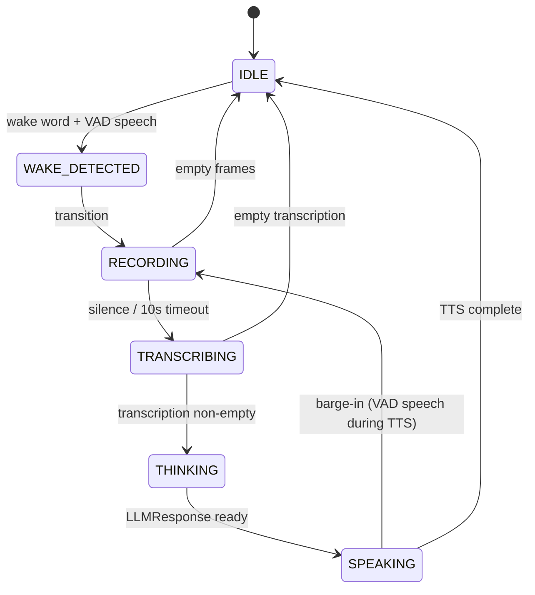

# Data Flow

## Fluxo end-to-end

Uma interação completa passa por: **bridge (entrada)** → **CogLoopGate** → **cognitive loop (5 fases)** → **brain (memória)** → **llm (inferência)** → **context (assembly)** → **act (saída)** → **bridge/TTS (output)** → **persistência + eventos (observabilidade + dashboard)**.



## Sequence: conversação simples (texto via dashboard)

```mermaid
sequenceDiagram
    participant FE as Dashboard FE
    participant API as Dashboard API
    participant Gate as CogLoopGate
    participant Loop as CognitiveLoop
    participant CTX as ContextAssembler
    participant Brain as BrainService
    participant LLM as LLMRouter
    participant DB as SQLite
    participant WS as WebSocket

    FE->>API: POST /api/chat {content}
    API->>Gate: submit(InboundMessage)
    Gate->>Loop: process_request(perception)

    Loop->>Loop: PERCEIVE (validate, classify)
    Note over Loop,WS: emit PerceptionReceived

    Loop->>Loop: ATTEND (priority, safety)

    Loop->>LLM: select_model(complexity=MODERATE)
    LLM-->>Loop: "claude-sonnet-4"
    Loop->>CTX: assemble(mind_id, msg, history, complexity, ctx_window=200k)
    CTX->>Brain: search_concepts(query=msg, k=10)
    Brain->>DB: KNN + FTS5 + RRF
    DB-->>Brain: top-10 concepts
    CTX->>Brain: recent_episodes(k=5)
    Brain->>DB: SELECT ORDER BY created_at
    DB-->>Brain: 5 episodes
    CTX-->>Loop: AssembledContext(6 slots, tokens_used=4200)

    Loop->>LLM: complete(messages, model)
    LLM->>LLM: CostGuard + CircuitBreaker
    LLM-->>Loop: LLMResponse(content, tokens_in=4200, tokens_out=180)
    Note over Loop,WS: emit ThinkCompleted(cost_usd=0.0084)

    Loop->>Loop: ACT (direct response, no tools)
    Loop-->>API: ActionResult
    API-->>FE: 200 {response}
    Note over Loop,WS: emit ResponseSent

    par reflection
        Loop->>Brain: encode_episode(user_input, response, emotional_*)
        Brain->>DB: INSERT episode
        Loop->>Brain: extract_concepts (LLM call)
        Brain->>DB: INSERT concept + relations (Hebbian)
        Note over Loop,WS: emit EpisodeEncoded, ConceptCreated
    end

    WS->>FE: event.stream (15 types broadcast)
```

## Sequence: com tool call (plugin)

```mermaid
sequenceDiagram
    participant Loop as CognitiveLoop
    participant LLM as LLMRouter
    participant Plg as PluginManager
    participant CTX as ContextAssembler

    Loop->>LLM: complete(messages) [first turn]
    LLM-->>Loop: LLMResponse(tool_calls=[{name:"weather", args:{city:"SP"}}])

    Loop->>Plg: invoke("weather", {city:"SP"})
    Plg->>Plg: check permissions (http_get allowed?)
    Plg->>Plg: sandbox_http.get(rate-limited)
    Plg-->>Loop: ToolResult(content="21°C, cloudy")

    Loop->>CTX: re-assemble with tool_result injected
    Loop->>LLM: complete(messages) [second turn, has_tool_use=true → COMPLEX]
    LLM-->>Loop: LLMResponse("In São Paulo it's 21°C and cloudy.")

    Loop->>Loop: ACT (send response)
```

## Sequence: com recuperação de memória (spreading activation)

```mermaid
sequenceDiagram
    participant Loop as CognitiveLoop
    participant CTX as ContextAssembler
    participant Brain as BrainService
    participant WM as WorkingMemory
    participant SA as SpreadingActivation
    participant HR as HybridRetrieval
    participant DB as SQLite

    Loop->>CTX: assemble(msg="do you remember my Pi project?")
    CTX->>Brain: retrieve_relevant(msg)

    Brain->>HR: search_concepts(query=msg, k=10)
    HR->>DB: KNN via sqlite-vec (embedding)
    HR->>DB: FTS5 keyword match
    HR->>HR: RRF fusion k=60
    HR-->>Brain: top-10 seed concepts

    Brain->>WM: load(seeds with initial activation)
    Brain->>SA: spread(max_iter=3, decay=0.7, min_activ=0.01)
    loop 3 iterations
        SA->>DB: get_relations(concept_id)
        SA->>WM: update activation on neighbors
    end
    SA-->>Brain: ranked concepts by activation

    Brain->>HR: search_episodes(query, k=5)
    HR-->>Brain: recent relevant episodes

    Brain-->>CTX: (concepts, episodes)
    CTX-->>Loop: AssembledContext (memory slots populated)
```

## Event bus — 11 event types

Implementação: `src/sovyx/engine/events.py`. Frozen dataclasses. Async dispatch com error isolation e correlation ID.

### Categorias (IntEnum)
`ENGINE`, `COGNITIVE`, `BRAIN`, `VOICE`, `BRIDGE`, `PLUGIN`, `SECURITY`.

### Eventos

| Categoria | Evento | Trigger | Payload principal |
|---|---|---|---|
| ENGINE | `EngineStarted` | após bootstrap | `version`, `mind_count` |
| ENGINE | `EngineStopping` | SIGTERM/SIGINT | `reason` |
| ENGINE | `ServiceHealthChanged` | `HealthChecker` status diff | `service`, `status`, `details` |
| COGNITIVE | `PerceptionReceived` | PERCEIVE phase fim | `mind_id`, `perception_id`, `type`, `complexity` |
| COGNITIVE | `ThinkCompleted` | THINK phase fim | `model`, `tokens_in/out`, `cost_usd` |
| COGNITIVE | `ResponseSent` | ACT phase fim | `turn_id`, `channel`, `length_chars` |
| BRAIN | `ConceptCreated` | REFLECT concept new | `concept_id`, `name`, `category` |
| BRAIN | `EpisodeEncoded` | REFLECT episode persisted | `episode_id`, `importance` |
| BRAIN | `ConceptContradicted` | contradiction detected | `concept_id`, `new_content`, `resolution` |
| BRAIN | `ConceptForgotten` | consolidation prune | `concept_id`, `reason` |
| BRAIN | `ConsolidationCompleted` | `ConsolidationCycle.run()` fim | `concepts_merged`, `concepts_pruned`, `duration_s` |
| BRIDGE | `ChannelConnected` | Telegram/Signal online | `channel`, `channel_id` |
| BRIDGE | `ChannelDisconnected` | channel drop | `channel`, `reason` |

Anti-pattern prevenido: todos `Event` subclasses usam `@dataclasses.dataclass(frozen=True)`; `EventBus` despacha com **error isolation** (um handler falho não derruba os outros).

## Persistence layer

### Arquitetura (ADR-004)



### Pragmas non-negotiable

```python
SQLITE_PRAGMAS = {
    "journal_mode": "WAL",
    "synchronous": "NORMAL",
    "temp_store": "MEMORY",
    "mmap_size": 268435456,      # 256MB (tier-adjusted)
    "cache_size": -64000,        # 64MB
    "foreign_keys": "ON",
    "busy_timeout": 5000,
    "wal_autocheckpoint": 1000,
    "auto_vacuum": "INCREMENTAL",
}
```

Extensions: **FTS5** (nativo) + **sqlite-vec** (via `load_extension`).

### Migrations

`src/sovyx/persistence/migrations.py` — SemVer-based. Cada Mind mantém schema version em tabela `_schema_version`. Upgrade doctor detecta drift.

## Dashboard flow (WebSocket)

Backend: `src/sovyx/dashboard/server.py` (2070 LOC) + `src/sovyx/dashboard/events.py` (`DashboardEventBridge`). Frontend: `dashboard/src/hooks/useWebSocket.ts` (debounced 300ms).

### Eventos backend → frontend (15 tipos)

| Evento WS | Backend source | Frontend handler |
|---|---|---|
| `status` | `StatusCollector` polling | `connection` slice |
| `health` | `ServiceHealthChanged` | `HealthGrid` component |
| `perception` | `PerceptionReceived` | `ActivityFeed` |
| `think` | `ThinkCompleted` | `CognitiveTimeline`, cost chart |
| `response` | `ResponseSent` | chat page |
| `concept` | `ConceptCreated` | `BrainGraph` (re-fetch) |
| `episode` | `EpisodeEncoded` | activity timeline |
| `consolidation` | `ConsolidationCompleted` | notifications |
| `channel` | `ChannelConnected/Disconnected` | `/settings` channels |
| `plugin` | plugin lifecycle | `/plugins` page |
| `voice` | voice state machine | `/voice` page |
| `safety` | safety gate events | `/safety` dashboard |
| `log` | log tail | `/logs` virtualized |
| `error` | error channel | Sonner toast |
| `ping` | heartbeat | keepalive |

Trigger pattern: eventos backend disparam **refresh de API**, não atualização direta de state (by design — simplifica reconciliation).

### Auth dashboard

Token via `Authorization: Bearer <token>` (REST) ou query param `?token=<token>` (WS). Helper de testes: `create_app(token="test-token-fixo")` — **nunca monkeypatch de `_ensure_token`** (anti-pattern #10 em CLAUDE.md).

### Endpoints REST (25)

- Health/Status: `/api/status`, `/api/health`, `/api/stats/history`
- Conversations: `/api/conversations`, `/api/conversations/{id}`
- Brain: `/api/brain/graph`, `/api/brain/search`
- Logs: `/api/logs`
- Activity: `/api/activity/timeline`
- Settings/Config: `/api/settings`, `/api/config`
- Voice: `/api/voice/status`, `/api/voice/models`
- Plugins: `/api/plugins`, `/api/plugins/{name}`, `/api/plugins/tools`, `/api/plugins/{name}/{enable|disable|reload}`
- Channels: `/api/channels`, `/api/channels/telegram/setup`
- Chat: `/api/chat`
- Data: `/api/export`, `/api/import`
- Safety: `/api/safety/{stats|status|history|rules}`
- Providers: `/api/providers`
- Infra: `/metrics` (Prometheus), `/{path:path}` (SPA fallback)

## Voice pipeline

`src/sovyx/voice/pipeline.py::VoicePipelineState` (enum):



Componentes por estado:

| Estado | Componente | Modelo |
|---|---|---|
| `IDLE` | `wake_word.py` (OpenWakeWord ONNX) + `vad.py` (SileroVAD v5) | local |
| `WAKE_DETECTED` | transition (trigger filler "Jarvis") | — |
| `RECORDING` | `audio.py` ring buffer, max 312 frames (~10s) | — |
| `TRANSCRIBING` | `stt.py` (Moonshine ONNX) | local |
| `THINKING` | feeds `CognitiveLoop.process_request()` | cloud/local LLM |
| `SPEAKING` | `tts_piper.py` / `tts_kokoro.py` | local |

Barge-in: se VAD detecta fala durante `SPEAKING`, interrompe TTS e vai direto pra `RECORDING` (sem re-trigger de wake word).

Hardware tier auto-select (`voice/hardware.py`): escolhe modelos/qualidade conforme Pi 5 / N100 / GPU.

Wyoming protocol (`voice/wyoming.py::WyomingServer`): JSONL+PCM events, Zeroconf/mDNS discovery — integra com Home Assistant voice pipeline futuro.

## Rastreabilidade

### Docs originais
- `vps-brain-dump/.../specs/SOVYX-BKD-SPE-001-ENGINE-CORE.md` — ServiceRegistry, EventBus bootstrap
- `.../adrs/SOVYX-BKD-ADR-007-EVENT-ARCHITECTURE.md` — event bus tiered, domain vs integration events, 42 event catalog
- `.../adrs/SOVYX-BKD-ADR-004-DATABASE-STACK.md` — SQLite WAL, pragmas, DB-per-Mind
- `.../specs/SOVYX-BKD-SPE-005-PERSISTENCE-LAYER.md` — transactions, migrations
- `.../specs/SOVYX-BKD-SPE-009-DASHBOARD-API.md` — API endpoints + WS events
- `.../specs/SOVYX-BKD-SPE-010-VOICE-PIPELINE.md` — voice state machine
- `.../specs/SOVYX-BKD-IMPL-004-VOICE-ONNX.md` — Moonshine/Piper/Kokoro
- `.../specs/SOVYX-BKD-IMPL-015-OBSERVABILITY.md` — OTel, BatchSpanProcessor, SLO
- `.../specs/SOVYX-BKD-IMPL-SUP-003-WYOMING-PROTOCOL.md` — Wyoming spec

### Código-fonte
- `src/sovyx/engine/events.py` — `EventBus`, 11 event types
- `src/sovyx/engine/bootstrap.py` — Layer 0-2 init
- `src/sovyx/persistence/pool.py` — `DatabasePool` (1W+NR)
- `src/sovyx/persistence/manager.py` — `DatabaseManager`
- `src/sovyx/persistence/migrations.py`
- `src/sovyx/dashboard/server.py` — 25 endpoints, WS manager
- `src/sovyx/dashboard/events.py` — `DashboardEventBridge` (EventBus → WS)
- `dashboard/src/hooks/useWebSocket.ts` — client debounced 300ms
- `dashboard/src/stores/dashboard.ts` — Zustand slices
- `dashboard/src/types/api.ts` — 355 LOC, 20+ schemas
- `src/sovyx/voice/pipeline.py` — `VoicePipelineState`, state machine
- `src/sovyx/voice/wyoming.py`, `stt.py`, `tts_piper.py`, `tts_kokoro.py`, `vad.py`, `wake_word.py`

### Gap analysis
- `docs/_meta/gap-inputs/analysis-D-dashboard.md` — 100% type alignment, 0 critical gaps
- `docs/_meta/gap-inputs/analysis-B-services.md` — persistence partial (vector queries), observability aligned
- `docs/_meta/gap-analysis.md` — overall
