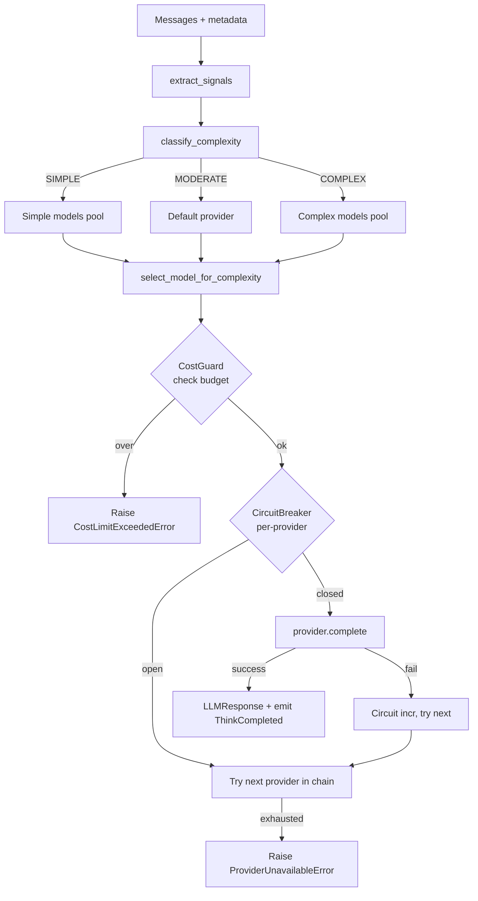

# LLM Router

## Objetivo

O `LLMRouter` despacha chamadas de LLM para o provider + modelo apropriado com base na **complexidade da mensagem**, aplicando failover, cost guard e circuit breaker. Reduz custo em ~85% em workloads mistos ao rotear queries simples para modelos baratos/locais (Flash, Haiku, Ollama) e reservar modelos poderosos (Sonnet, Pro, GPT-4o) para queries complexas.

Fonte: `vps-brain-dump/memory/confidential/sovyx-bible/backend/specs/SOVYX-BKD-SPE-007-LLM-ROUTER.md` (35KB, 1062 linhas), `.../SOVYX-BKD-VR-085-CLOUD-LLM-PROXY.md`.

## Complexity tiers

`src/sovyx/llm/router.py::ComplexityLevel` — **StrEnum** (imune a xdist namespace duplication):

```python
class ComplexityLevel(StrEnum):
    SIMPLE = "simple"
    MODERATE = "moderate"
    COMPLEX = "complex"
```

| Tier | Características | Modelos alvo |
|---|---|---|
| **SIMPLE** | Mensagem curta (≤500 chars), poucos turns (≤3), sem tools, sem code | `gemini-2.0-flash`, `claude-3-5-haiku-20241022`, `gpt-4o-mini` |
| **MODERATE** | Entre tiers, ou explicit model request | Default provider, next-cheapest |
| **COMPLEX** | Longa (≥2000 chars), muitos turns (≥8), tool use, ou code detection | `claude-sonnet-4-20250514`, `gemini-2.5-pro-preview-03-25`, `gpt-4o` |

## Classificação — `ComplexitySignals`

```python
@dataclasses.dataclass(frozen=True, slots=True)
class ComplexitySignals:
    """Signals used to estimate message complexity."""
    message_length: int = 0
    turn_count: int = 0
    has_tool_use: bool = False
    has_code: bool = False
    explicit_model: bool = False
```

Thresholds (module constants):

```python
_SIMPLE_MAX_LENGTH = 500
_SIMPLE_MAX_TURNS = 3
_COMPLEX_MIN_LENGTH = 2000
_COMPLEX_MIN_TURNS = 8
```

Algoritmo de classificação real (código — `router.py:84-125`):

```python
def classify_complexity(signals: ComplexitySignals) -> ComplexityLevel:
    # Explicit model request bypasses classification
    if signals.explicit_model:
        return ComplexityLevel.MODERATE

    # Tool use or code always complex
    if signals.has_tool_use or signals.has_code:
        return ComplexityLevel.COMPLEX

    # Score-based
    score = 0.0
    if signals.message_length <= _SIMPLE_MAX_LENGTH:
        score -= 1.0
    elif signals.message_length >= _COMPLEX_MIN_LENGTH:
        score += 1.0
    if signals.turn_count <= _SIMPLE_MAX_TURNS:
        score -= 0.5
    elif signals.turn_count >= _COMPLEX_MIN_TURNS:
        score += 1.0

    if score <= -1.0:
        return ComplexityLevel.SIMPLE
    if score >= 1.0:
        return ComplexityLevel.COMPLEX
    return ComplexityLevel.MODERATE
```

`extract_signals(messages)` é um helper que computa signals a partir de `list[dict[role, content]]`, detectando code por marcadores (` ``` `, `def `) e contando turns user+assistant.

`select_model_for_complexity(complexity, available_models)` intersecciona com os sets `_SIMPLE_MODELS`/`_COMPLEX_MODELS` e cai no primeiro disponível quando MODERATE.

## Providers

Abstração unificada via `sovyx.engine.protocols.LLMProvider` ABC. Implementações em `src/sovyx/llm/providers/`:

| Provider | Arquivo | SDK | Modelos default |
|---|---|---|---|
| Anthropic | `providers/anthropic.py` | `anthropic` | Sonnet 4, Haiku 3.5 |
| OpenAI | `providers/openai.py` | `openai` | GPT-4o, GPT-4o-mini |
| Google | `providers/google.py` | `google-genai` | Gemini 2.5 Pro, 2.0 Flash |
| Ollama | `providers/ollama.py` | HTTP local | Qualquer modelo pulled |

Todos implementam `complete(messages, model, **kwargs) -> LLMResponse` async.

## Routing flow



## Cost tracking

`sovyx.llm.cost::CostGuard` verifica budget antes de cada chamada e registra usage após. Evento `ThinkCompleted` carrega `tokens_in`, `tokens_out`, `cost_usd`. Prometheus counter `sovyx_llm_cost_usd_total{provider,model,tier}`.

Budget por Mind (configurável em `MindConfig.llm.budget_daily_usd`). Violation → `CostLimitExceededError` (user-facing: "I've reached my conversation budget limit").

## Circuit Breaker

`sovyx.llm.circuit::CircuitBreaker` per-provider. Default:

```python
circuit_breaker_failures: int = 3       # abre após 3 falhas consecutivas
circuit_breaker_reset_s: int = 60       # tenta reabrir após 60s (half-open)
```

Estados: CLOSED → OPEN (após threshold) → HALF_OPEN (após timeout) → CLOSED (se success) / OPEN (se fail).

## Fallback chain

`LLMRouter.__init__(providers: Sequence[LLMProvider], ...)` recebe providers em ordem de preferência. Chain típica: **Anthropic → OpenAI → Google → Ollama**. Primeiro provider com circuit CLOSED e modelo compatível com o tier pega a chamada. Se todos falham: `ProviderUnavailableError`.

```python
class LLMRouter:
    """Route LLM calls across providers with failover.

    Failover chain: tries providers in order (Anthropic -> OpenAI -> Ollama).
    CostGuard: checks budget before each call.
    CircuitBreaker: per-provider, avoids hammering down services.
    """
```

## [NOT IMPLEMENTED]

### Streaming para speculative TTS
SPE-007 + IMPL-SUP-001 (Speculative Response) preveem `provider.stream(messages, model) -> AsyncIterator[str]` exposto pro `ThinkPhase`, permitindo TTS começar a falar antes do LLM terminar. **Providers possivelmente têm stream interno**, mas **não está exposto pro CogLoop**. Integração unclear.

Impacto: latência voice perceptível (~1-2s a mais).

### BYOK token isolation per user
Para multi-tenant/cloud relay, cada user deveria ter sua própria API key criptografada e roteada. **Não implementado** — atualmente keys são globais por Mind (config).

Citação: VR-085-CLOUD-LLM-PROXY.

### Outros gaps menores
- Speculative decoding (parallel model invocation)
- Cache semântico de respostas similares
- Dynamic tier adjustment (feedback loop: se MODERATE frequentemente falha, promover pra COMPLEX)

## Exemplo end-to-end

```python
# Em ThinkPhase.process(...)
signals = extract_signals(conversation_history + [{"role": "user", "content": perception.content}])
complexity = classify_complexity(signals)  # → ComplexityLevel.MODERATE

model = select_model_for_complexity(complexity, available_models=router.available_models())
context_window = router.get_context_window(model)  # e.g. 200_000 pra Claude Sonnet 4

context = await context_assembler.assemble(..., complexity=complexity, context_window=context_window)

response: LLMResponse = await router.complete(
    messages=context.messages,
    model=model,
    mind_id=mind_id,
    correlation_id=correlation_id,
)
# router emite ThinkCompleted automaticamente
```

## Configuração

`MindConfig.llm` (`src/sovyx/mind/config.py::LLMConfig`):

- `providers: list[str]` — ordem de preferência
- `default_model: str | None` — override opcional
- `budget_daily_usd: float`
- `circuit_breaker: {failures: int, reset_s: int}`
- `temperature: float`
- `max_tokens_out: int`

Provider configs em `~/.sovyx/minds/{name}/mind.yaml` + env vars `SOVYX_LLM__ANTHROPIC_API_KEY=...` (BYOK).

## Métricas

- `sovyx_llm_calls_total{provider, model, tier, status}` counter
- `sovyx_llm_latency_seconds{provider, model, tier}` histogram
- `sovyx_llm_tokens_total{provider, model, direction}` counter (in/out)
- `sovyx_llm_cost_usd_total{provider, model, tier}` counter
- `sovyx_llm_circuit_state{provider}` gauge (0=closed, 1=half-open, 2=open)

## Referências

### Docs originais
- `vps-brain-dump/memory/confidential/sovyx-bible/backend/specs/SOVYX-BKD-SPE-007-LLM-ROUTER.md` (1062 linhas — complexity classification, fallback chain, streaming spec)
- `vps-brain-dump/.../specs/SOVYX-BKD-IMPL-SUP-001-SPECULATIVE-RESPONSE.md` — speculative TTS (gap)
- `vps-brain-dump/.../VR-085-CLOUD-LLM-PROXY.md` — BYOK multi-tenant proxy (gap)
- `vps-brain-dump/.../adrs/SOVYX-BKD-ADR-008-LOCAL-FIRST.md` — Ollama fallback obrigatório

### Código-fonte
- `src/sovyx/llm/router.py` — `LLMRouter`, `ComplexityLevel`, `ComplexitySignals`, `classify_complexity`, `extract_signals`, `select_model_for_complexity`
- `src/sovyx/llm/circuit.py` — `CircuitBreaker`
- `src/sovyx/llm/cost.py` — `CostGuard`
- `src/sovyx/llm/models.py` — `LLMResponse` dataclass
- `src/sovyx/llm/providers/anthropic.py`
- `src/sovyx/llm/providers/openai.py`
- `src/sovyx/llm/providers/google.py`
- `src/sovyx/llm/providers/ollama.py`
- `src/sovyx/engine/protocols.py` — `LLMProvider` ABC

### Gap analysis
- `docs/_meta/gap-inputs/analysis-B-services.md` §llm
- `docs/_meta/gap-analysis.md` — llm: 2 NOT IMPLEMENTED (streaming, BYOK isolation)
