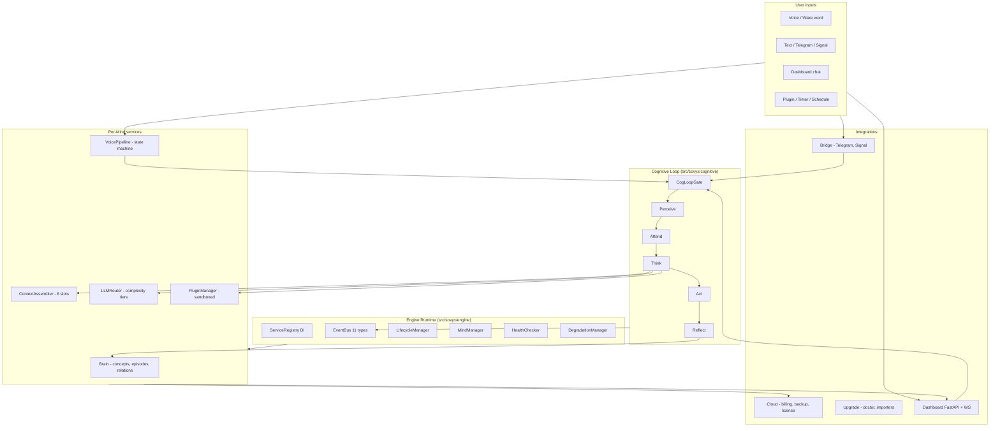

# Architecture Overview

## Objetivo

Sovyx (Sovereign Minds Engine) é um companion AI persistente com **memória real**, **loop cognitivo contínuo** e **brain graph** persistido em SQLite. Opera *local-first*: toda a inferência de modelos leves, memória e cognição rodam sem internet; BYOK LLMs (Anthropic, OpenAI, Google, Ollama) são enhancers opcionais. Entregue como biblioteca Python + CLI daemon + dashboard React.

## Stack

| Camada | Tecnologia | Observação |
|---|---|---|
| Runtime | Python 3.12, asyncio | Strict typing, `from __future__ import annotations` em todo arquivo |
| Config | Pydantic v2 + pydantic-settings | `SOVYX_*` env vars, `__` pra nesting |
| HTTP / WS | FastAPI + Uvicorn | Dashboard API + WebSocket bridge |
| Persistência | SQLite (aiosqlite) + sqlite-vec + FTS5 | WAL, 1 writer + N readers, DB-per-Mind |
| Embeddings / STT / TTS | ONNX Runtime | E5-small-v2 (384d), Moonshine, Piper, Kokoro, SileroVAD v5 |
| LLM Providers | anthropic, openai, google-genai, ollama | Router por complexidade |
| Observability | structlog, OpenTelemetry, Prometheus | 10 health checks, SLO burn rate |
| CLI | Typer + Rich, JSON-RPC 2.0 (Unix socket) | `sovyx start/stop/init/logs/brain/mind/plugin` |
| Dashboard FE | React 19 + TypeScript + Vite + Tailwind | Zustand v5, TanStack Virtual, i18next, shadcn/ui v4, react-force-graph-2d |
| Build / CI | uv, Hatch, npm, GitHub Actions | ruff + mypy (strict) + bandit + pytest (4900+) + vitest (400+) |

## Diagrama geral



## Camadas

### 1. Engine / Runtime (`src/sovyx/engine/`)
Infraestrutura pura. **Zero decisões cognitivas.** Bootstrap em camadas, DI via `ServiceRegistry` (~150 LOC, singleton/transient), event bus assíncrono, lifecycle com shutdown em ordem reversa, graceful degradation com cascading fallback.

Classes principais: `MindManager`, `ServiceRegistry`, `LifecycleManager`, `EventBus`, `HealthChecker`, `DegradationManager`, `DaemonRPCServer`.

Fonte: `vps-brain-dump/memory/confidential/sovyx-bible/backend/specs/SOVYX-BKD-SPE-001-ENGINE-CORE.md`.

### 2. Cognitive Loop (`src/sovyx/cognitive/`)
O "pensamento" do Sovyx. 5 fases por interação: `perceive → attend → think → act → reflect`. OODA adaptado (Boyd 1987) + ReAct (Yao et al. 2023), com Orient/Context rico para evitar "compressão de realidade" (crítica Schneier, Harvard 2025).

`CogLoopGate` serializa requests concorrentes. Safety stack completa (`safety_*.py`, 14 arquivos): PII guard, injection tracking, financial gate, shadow mode, escalation.

[NOT IMPLEMENTED] `CONSOLIDATE` (orphaned — `brain/consolidation.py` existe mas não é chamado pelo loop) e `DREAM` (inexistente). Planejado em SPE-003 §1.1.

Ver `docs/architecture/cognitive-loop.md`.

### 3. Brain Graph (`src/sovyx/brain/`)
Memória persistente como grafo: `Concept`, `Episode`, `Relation`. Cinco regiões neurológicas simuladas (Hippocampus = episodic, Neocortex = semantic, Prefrontal = working memory, Amygdala = emotional, Cerebellum = procedural).

Algoritmos: Spreading Activation (Collins & Loftus 1975), Hybrid Retrieval (KNN sqlite-vec + FTS5 + Reciprocal Rank Fusion k=60), Hebbian Learning, Ebbinghaus Decay, Consolidation (prune + merge).

Ver `docs/architecture/brain-graph.md`.

### 4. Integration layer
- **`context/`**: `ContextAssembler` com 6 slots (system, temporal, memory-concepts, memory-episodes, conversation, current). Token budget adaptativo. Lost-in-Middle ordering (Liu et al. 2023).
- **`mind/`**: `MindConfig` (OCEAN Big Five + behavioral traits + LLM + Brain + Safety). `PersonalityEngine` gera system prompt.
- **`llm/`**: `LLMRouter` com `ComplexityLevel` (SIMPLE/MODERATE/COMPLEX), 4 providers (Anthropic, OpenAI, Google, Ollama), circuit breaker, cost guard. Ver `docs/architecture/llm-router.md`.
- **`persistence/`**: `DatabasePool` (1 writer + N readers), 9 pragmas non-negotiable, DB-per-Mind.
- **`observability/`**: structlog JSON, OTel tracing com BatchSpanProcessor, 10 health checks, SLO burn rate, Prometheus exporter.
- **`plugins/`**: sandbox in-process (layers 0-4): AST scanner, ImportGuard runtime, sandbox_fs (50MB/file, 500MB total), sandbox_http (rate limit), 18 permissions. Plugins oficiais: calculator, financial_math, knowledge, weather, web_intelligence.
- **`voice/`**: `VoicePipeline` state machine (IDLE → WAKE_DETECTED → RECORDING → TRANSCRIBING → THINKING → SPEAKING). Wyoming protocol, Moonshine STT, Piper/Kokoro TTS, SileroVAD v5, wake-word, barge-in, Jarvis filler, hardware tier auto-select.

### 5. Outer loops
- **`bridge/`**: canais externos — Telegram (aiogram), Signal (signal-cli-rest-api), BridgeManager, `InboundMessage`/`OutboundMessage`, financial confirmation, person resolver.
- **`cloud/`**: billing (6 tiers Stripe), license JWT Ed25519, backup R2+AES, scheduler GFS, dunning, flex pay-as-you-go, api_keys.
- **`upgrade/`**: Doctor (10+ checks), migrations SemVer, Mind import/export (SMF/ZIP), backup_manager, blue-green upgrade.
- **`dashboard/`**: 17 módulos backend (25 endpoints, 15 WS events), 14 páginas React (11 full + 3 stubs), 100% type alignment BE↔FE.
- **`cli/`**: Typer app, DaemonClient Unix socket JSON-RPC 2.0, comandos init/start/stop/status/token/doctor/brain/mind/plugin/dashboard/logs.

## Padrões arquiteturais

### Dependency Injection (ServiceRegistry)
Cada componente depende de abstrações (ABCs), não implementações. Container custom (~150 LOC) registra factories + singletons em ordem. Evita `dependency-injector` (Cython complica cross-compilation ARM64/Pi 5). Exemplo:

```python
registry = ServiceRegistry()
registry.register_singleton(EventBus, lambda: AsyncioEventBus())
registry.register_singleton(DatabaseManager, lambda: DatabaseManager(config))
registry.register_instance(EngineConfig, config)
event_bus = await registry.resolve(EventBus)
```

### Event bus assíncrono
11 event types typed (frozen dataclasses) em `engine/events.py`: `EngineStarted`, `EngineStopping`, `ServiceHealthChanged`, `PerceptionReceived`, `ThinkCompleted`, `ResponseSent`, `ConceptCreated`, `EpisodeEncoded`, `ConceptContradicted`, `ConceptForgotten`, `ConsolidationCompleted`, `ChannelConnected`, `ChannelDisconnected`. Correlation ID propagado para tracing distribuído.

Domain events (in-process) vs Integration events (cross-process, serializados). Ver ADR-007.

### Local-first
**Regra absoluta**: toda capability tem de funcionar sem internet, com a única exceção de LLM inference quando não há modelo local. SQLite é o store canônico; LLM cloud é enhancer (BYOK). Satisfaz os 7 ideais de Kleppmann (Local-First Software, Ink & Switch 2019). Ver ADR-008.

### Async everywhere
Todo IO/DB é async. Testes usam `pytest-asyncio` com `asyncio_mode=auto`.

### StrEnum para enums string-valued
Todos os enums com valores string herdam de `StrEnum` (imune à duplicação de namespaces sob pytest-xdist). Nunca `Enum` plain.

## Decisões-chave (ADRs)

| ADR | Decisão | Impacto |
|---|---|---|
| ADR-001 | Emotional model: PAD 3D (Pleasure/Arousal/Dominance) — Option D | Distingue fear/anger, awe/excitement, contempt/disgust. **[DIVERGENCE]** código implementa 2D (valence+arousal). Migration necessária pra v1.0. |
| ADR-004 | SQLite (WAL) + sqlite-vec + FTS5, zero server, single-file portable | Max ~500MB RAM, 80K inserts/s headroom. 9 pragmas non-negotiable. DB-per-Mind isolation. |
| ADR-006 | Cloud Relay (E2E encrypted) para multi-device sem servidor cognitivo central | Voice/mobile via relay, brain permanece local |
| ADR-007 | Event bus tiered: `AsyncioEventBus` (Pi 5) vs `RedisEventBus` (multi-process) | Interface única, troca por tier |
| ADR-008 | Local-first como arquitetura, não feature | Cascading fallback chains; engine roda com 0 internet; BYOK LLM único external call |
| ADR-003 | Licença AGPL + commercial tiers | Nyx/Founder-friendly |

## Rastreabilidade

### Docs originais (vps-brain-dump/memory/confidential/sovyx-bible/backend/)
- `specs/SOVYX-BKD-SPE-001-ENGINE-CORE.md` — Engine Core
- `specs/SOVYX-BKD-SPE-002-MIND-DEFINITION.md` — MindConfig, OCEAN
- `specs/SOVYX-BKD-SPE-003-COGNITIVE-LOOP.md` — 7 fases planejadas
- `specs/SOVYX-BKD-SPE-004-BRAIN-MEMORY.md` — Brain models + consolidation
- `specs/SOVYX-BKD-SPE-005-PERSISTENCE-LAYER.md` — WAL, migrations
- `specs/SOVYX-BKD-SPE-006-CONTEXT-ASSEMBLY.md` — 6 slots, Lost-in-Middle
- `specs/SOVYX-BKD-SPE-007-LLM-ROUTER.md` — Router, complexity, fallback
- `specs/SOVYX-BKD-SPE-009-DASHBOARD-API.md` — API + WS events
- `specs/SOVYX-BKD-SPE-010-VOICE-PIPELINE.md` — Voice state machine
- `specs/SOVYX-BKD-IMPL-002-BRAIN-ALGORITHMS.md` — Spreading, Hebbian, RRF
- `specs/SOVYX-BKD-IMPL-004-VOICE-ONNX.md` — Moonshine/Piper/Kokoro
- `specs/SOVYX-BKD-IMPL-006-COGNITIVE-LOOP.md` — Impl detalhada
- `specs/SOVYX-BKD-IMPL-012-PLUGIN-SANDBOX.md` — Sandbox 7-layer
- `specs/SOVYX-BKD-IMPL-015-OBSERVABILITY.md` — OTel, SLO, Prometheus
- `adrs/SOVYX-BKD-ADR-001-EMOTIONAL-MODEL.md` — PAD 3D
- `adrs/SOVYX-BKD-ADR-004-DATABASE-STACK.md` — SQLite+WAL+sqlite-vec
- `adrs/SOVYX-BKD-ADR-007-EVENT-ARCHITECTURE.md` — Event bus, catalog
- `adrs/SOVYX-BKD-ADR-008-LOCAL-FIRST.md` — Kleppmann 7 ideals

### Gap analysis
- `docs/_meta/gap-analysis.md` — consolidated (258 linhas)
- `docs/_meta/gap-inputs/analysis-A-core.md` — engine/cognitive/brain/context/mind
- `docs/_meta/gap-inputs/analysis-B-services.md` — llm/voice/persistence/observability/plugins
- `docs/_meta/gap-inputs/analysis-C-integration.md` — bridge/cloud/upgrade/cli
- `docs/_meta/gap-inputs/analysis-D-dashboard.md` — dashboard BE+FE

### Documentos específicos neste diretório
- `cognitive-loop.md` — 5 fases implementadas + safety stack
- `brain-graph.md` — Concept/Episode/Relation + regiões + algoritmos
- `llm-router.md` — Complexity tiers + providers
- `data-flow.md` — Fluxo end-to-end + event bus + dashboard + voice

## Referências

### Docs originais
Diretório: `vps-brain-dump/memory/confidential/sovyx-bible/backend/`
Ver lista em "Rastreabilidade" acima.

### Código-fonte
- `src/sovyx/engine/` — bootstrap, registry, lifecycle, events, health, degradation, rpc_server
- `src/sovyx/cognitive/` — loop + 5 fases + gate + safety_*
- `src/sovyx/brain/` — models, service, scoring, spreading, retrieval, consolidation, learning
- `src/sovyx/context/`, `src/sovyx/mind/`, `src/sovyx/llm/`
- `src/sovyx/dashboard/server.py` — 25 endpoints
- `dashboard/src/` — React 19 SPA

### Estado atual
- ~46k LOC Python, ~23k LOC TypeScript
- 4900+ Python tests (coverage ≥95%), 400+ vitest tests
- ~75-80% feature-complete (gaps concentrados em relay, marketplace, importers)
