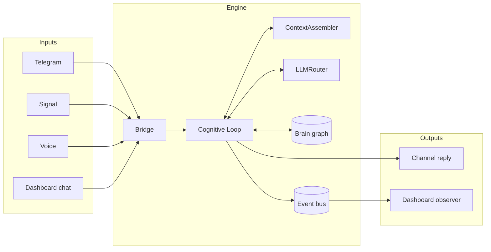
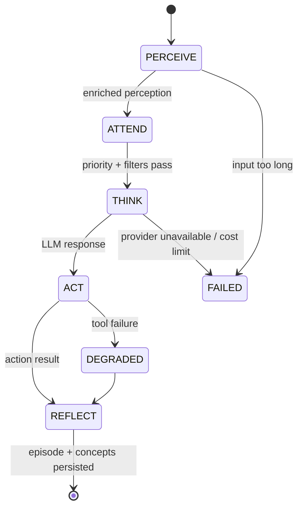
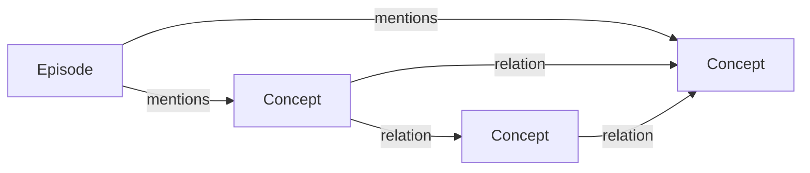

# Architecture

Sovyx is a persistent AI companion. Each message flows through a five-phase
cognitive loop that reads from and writes to a local brain graph, calls one of
several LLM providers based on the message complexity, and streams everything
to a dashboard. The whole stack is local-first — SQLite is the source of
truth, and LLM inference is the only step that can go over the network.

## Stack

| Layer | Technology |
|---|---|
| Runtime | Python 3.12, asyncio |
| Config | Pydantic v2 + pydantic-settings |
| HTTP / WebSocket | FastAPI + Uvicorn |
| Persistence | SQLite with WAL, `aiosqlite`, `sqlite-vec`, FTS5 |
| Embeddings, STT, TTS | ONNX Runtime (E5-small-v2, Moonshine, Piper, Kokoro, Silero VAD) |
| LLM providers | `anthropic`, `openai`, `google-genai`, `ollama` |
| Observability | structlog (JSON), OpenTelemetry, Prometheus |
| CLI | Typer + Rich over JSON-RPC on a Unix socket |
| Dashboard | React 19 + TypeScript + Vite + Tailwind + Zustand |

## High-Level Data Flow



Every channel produces an `InboundMessage`. The bridge normalizes it and
hands it to the cognitive loop, which drives context assembly, LLM calls, and
brain updates. The event bus broadcasts state changes to the dashboard over
WebSocket.

## Cognitive Loop

Each interaction runs five phases. The loop is serialized per Mind by a gate
so concurrent requests don't step on each other.



| Phase | Responsibility |
|---|---|
| **Perceive** | Validate input, classify initial complexity, create a conversation turn, emit `PerceptionReceived`. |
| **Attend** | Resolve the person, apply priority filters, run safety checks (PII guard, injection detection), deduplicate. |
| **Think** | Select a model by complexity, assemble context, call the LLM, parse text or tool calls. |
| **Act** | Execute tool calls (plugins), send the reply to the originating channel. |
| **Reflect** | Extract new concepts and relations, score importance and confidence, persist the episode, update working memory. |

The architecture is inspired by OODA (observe, orient, decide, act) and the
ReAct pattern — the Think phase can loop through LLM → tool call → LLM with
updated context.

## Brain Graph

The Brain is a cognitive graph persisted in SQLite. Three core models:

| Model | Region analogue | What it stores |
|---|---|---|
| `Concept` | Neocortex (semantic) | A fact, preference, entity, skill, or belief — name, content, category, importance, confidence, 384-d embedding. |
| `Episode` | Hippocampus (episodic) | A conversation turn — user input, assistant response, emotional valence and arousal, mentioned concepts. |
| `Relation` | Synaptic edge | A weighted link between two concepts, strengthened by co-occurrence. |



Retrieval combines three algorithms:

- **Hybrid search** — `sqlite-vec` KNN plus FTS5 full-text, fused with
  Reciprocal Rank Fusion (`k = 60`).
- **Spreading activation** — starting from seed concepts, activation flows
  along relations weighted by `weight × recency`.
- **Hebbian learning** — relations co-activated together strengthen; unused
  ones decay via an Ebbinghaus curve.

A consolidation cycle runs periodically (default every 6 hours) to prune low-
value concepts, merge duplicates, and archive old episodes.

## LLM Routing

The `LLMRouter` picks a model for each request based on estimated complexity
(message length, turn count, presence of code or tool calls) and dispatches
through an ordered provider chain with circuit breakers and a cost guard.

- **Simple** queries → fast/cheap models (Haiku, Flash, GPT-4o mini, local).
- **Moderate** queries → the Mind's default provider.
- **Complex** queries → flagship models (Sonnet, Pro, GPT-4o).

If a provider is over its circuit-breaker threshold or returns an error, the
router falls back to the next one. If all providers are out, it raises
`ProviderUnavailableError` and the engine degrades gracefully with a
pre-configured fallback message.

See [LLM Router](llm-router.md) for the full design.

## Event-Driven Core

An in-process event bus decouples subsystems. Core event types are frozen
dataclasses in `sovyx.engine.events`:

```
EngineStarted         PerceptionReceived     ConceptCreated
EngineStopping        ThinkCompleted         ConceptContradicted
ServiceHealthChanged  ResponseSent           ConceptForgotten
ChannelConnected      EpisodeEncoded         ConsolidationCompleted
ChannelDisconnected
```

Each event carries a correlation ID for distributed tracing. The dashboard
subscribes over WebSocket and re-renders live.

## Dependency Injection

Services are wired through a small `ServiceRegistry` (around 150 lines). It
supports singletons, transients, and eager instances, and resolves
dependencies lazily. No heavy DI framework — the registry is Python-only so
it works on ARM64 without a C toolchain.

```python
registry = ServiceRegistry()
registry.register_instance(EngineConfig, config)
registry.register_singleton(EventBus, lambda: AsyncioEventBus())
registry.register_singleton(DatabaseManager, lambda: DatabaseManager(config))

event_bus = await registry.resolve(EventBus)
```

Bootstrap initializes services in dependency order: `EventBus →
DatabaseManager → per-Mind (Brain → Personality → Context → LLM →
Cognitive) → PersonResolver → Bridge`. On partial failure, resources are
cleaned up in reverse order.

## Local-First

SQLite is the source of truth. Every feature has to work without internet;
the only exception is LLM inference when a local model isn't available.

- **Single writer, N readers** — one connection for writes, a pool for reads.
- **Nine non-negotiable pragmas** — WAL mode, synchronous=NORMAL, mmap,
  foreign keys, temp_store=memory, ~64 MB cache.
- **Database per Mind** — each Mind gets its own SQLite file, fully
  isolated.
- **Runs anywhere** — a Raspberry Pi 5, an N100 mini-PC, or a GPU
  workstation.

## Observability

- **Logging** — structlog writes JSON to `~/.sovyx/logs/sovyx.log` and
  colored text (or JSON) to the console.
- **Tracing** — OpenTelemetry spans around DB, LLM, brain, and cognitive
  phases, exported via OTLP.
- **Metrics** — Prometheus counters and histograms for LLM calls, tokens,
  cost, cognitive phase latency, and SQLite pool stats.
- **Health** — ten registered checks plus SLO burn-rate tracking. The CLI
  (`sovyx doctor`) and the dashboard both read them.

## Safety

Sovyx ships a built-in safety stack:

- **Default guardrails** — honesty, privacy, and safety rules injected into
  every system prompt.
- **PII protection** — patterns scrub sensitive data before logging and
  before any cross-process transmission.
- **Prompt-injection detection** — incoming messages are scored for known
  injection patterns.
- **Financial gate** — any transaction-like action requires an explicit
  user confirmation step.
- **Content filter tiers** — `standard`, `strict`, and `child_safe`.
- **Shadow mode** — try new rules in log-only mode before promoting.

Guardrails, custom regex rules, and banned topics are all configured in
`mind.yaml` under `safety:`.

## Repo Layout

```
src/sovyx/
├── engine/          # Config, bootstrap, lifecycle, events, registry, RPC
├── cognitive/       # Perceive → Attend → Think → Act → Reflect
├── brain/           # Concepts, episodes, relations, embedding, scoring
├── bridge/          # Inbound/outbound messaging, channels
├── persistence/     # SQLite pool, migrations, schemas
├── observability/   # Logging, health, tracing, metrics
├── llm/             # Router + 4 providers
├── mind/            # MindConfig, personality
├── context/         # Context assembly
├── dashboard/       # FastAPI server + WebSocket bridge
├── plugins/         # Plugin SDK + sandbox
├── voice/           # TTS/STT/VAD/wake word
└── cli/             # Typer commands

dashboard/           # React 19 SPA (Vite + Tailwind + Zustand)
```

Ready to run it? Start with [Getting Started](getting-started.md).
