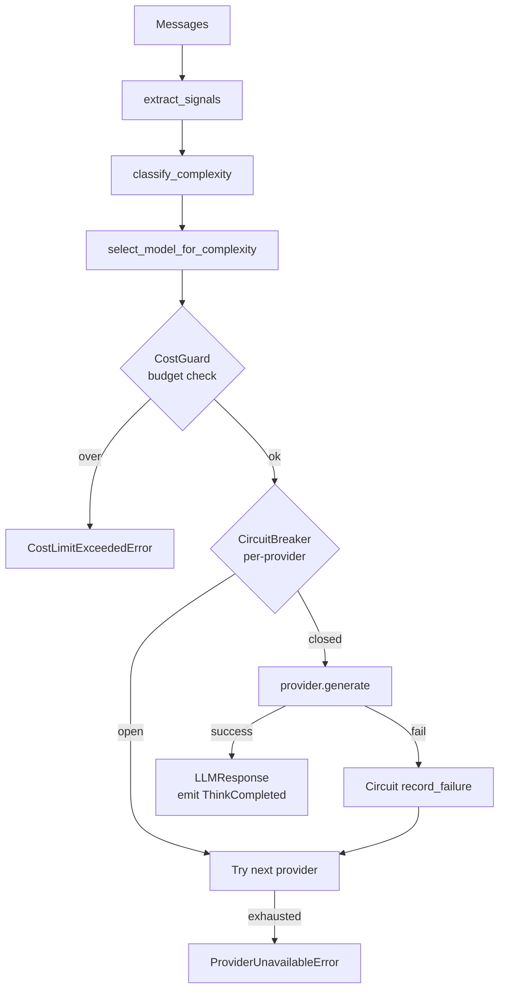

# LLM Router

Sovyx routes every LLM call through a single component — the `LLMRouter` —
that picks a model based on estimated message complexity, tries providers in
order, enforces a cost budget, and wraps each provider in a circuit breaker.

The net effect: simple queries go to cheap/fast models, complex queries go to
flagship models, and the daemon keeps working even when one provider is
down.

## Why Route

Running every message through the same model is expensive and slow. "What
time is it?" doesn't need a frontier model, and "Refactor this 400-line
function and explain the trade-offs" doesn't want a small one. The router
lets you use both, automatically, per request.

Three concerns are colocated:

- **Cost** — a per-conversation and per-day USD budget.
- **Latency** — fast-tier models answer short prompts in under a second.
- **Capability** — long context, tool use, and code reasoning go to the
  flagship tier.

## Complexity Tiers

The router classifies each request into one of three tiers.

| Tier | Triggers | Target models |
|---|---|---|
| **SIMPLE** | message length ≤ 500 chars **and** ≤ 3 turns, no code, no tool use | `gemini-2.0-flash`, `claude-3-5-haiku-20241022`, `gpt-4o-mini`, `deepseek-chat`, `mistral-small-latest`, `mixtral-8x7b-32768`, `llama-3.1-8b-instant` |
| **MODERATE** | everything else, or a user-requested model | Mind's default provider |
| **COMPLEX** | message length ≥ 2000 chars, or ≥ 8 turns, or code detected, or tool use requested | `claude-sonnet-4-20250514`, `gemini-2.5-pro-preview-03-25`, `gpt-4o`, `grok-3`, `deepseek-reasoner`, `mistral-large-latest`, `llama-3.1-70b-versatile` |

`ComplexityLevel` is a `StrEnum`:

```python
class ComplexityLevel(StrEnum):
    SIMPLE = "simple"
    MODERATE = "moderate"
    COMPLEX = "complex"
```

## Complexity Signals

Each request is reduced to a signal bundle:

```python
@dataclasses.dataclass(frozen=True, slots=True)
class ComplexitySignals:
    """Signals used to estimate message complexity."""

    message_length: int = 0
    turn_count: int = 0
    has_tool_use: bool = False
    has_code: bool = False
    explicit_model: bool = False
```

`extract_signals(messages)` walks the conversation, summing content length,
counting user+assistant turns, and flagging code blocks (` ``` ` or `def `).

The classifier is pure and deterministic:

```python
def classify_complexity(signals: ComplexitySignals) -> ComplexityLevel:
    if signals.explicit_model:
        return ComplexityLevel.MODERATE
    if signals.has_tool_use or signals.has_code:
        return ComplexityLevel.COMPLEX

    score = 0.0
    if signals.message_length <= 500:
        score -= 1.0
    elif signals.message_length >= 2000:
        score += 1.0
    if signals.turn_count <= 3:
        score -= 0.5
    elif signals.turn_count >= 8:
        score += 1.0

    if score <= -1.0:
        return ComplexityLevel.SIMPLE
    if score >= 1.0:
        return ComplexityLevel.COMPLEX
    return ComplexityLevel.MODERATE
```

## Providers

Ten providers ship in-box. All implement the `LLMProvider` Protocol
(`generate`, `stream`, `supports_model`, `get_context_window`, `is_available`,
`close`). The six OpenAI-compatible providers share a base class
(`OpenAICompatibleProvider`) — each is ~30 LOC of configuration.

| Provider | Auth | Models | Notes |
|---|---|---|---|
| **Anthropic** | `ANTHROPIC_API_KEY` | Claude Sonnet 4, Haiku 3.5, Opus 4 | BYOK — preferred default when present |
| **OpenAI** | `OPENAI_API_KEY` | GPT-4o, GPT-4o-mini, o1, o3-mini | BYOK |
| **Google** | `GOOGLE_API_KEY` | Gemini 2.5 Pro, 2.0 Flash | BYOK |
| **xAI** | `XGROK_API_KEY` | Grok-2, Grok-3 | BYOK |
| **DeepSeek** | `DEEPSEEK_API_KEY` | deepseek-chat, deepseek-reasoner | BYOK |
| **Mistral** | `MISTRAL_API_KEY` | mistral-large-latest, mistral-small-latest | BYOK |
| **Together AI** | `TOGETHER_API_KEY` | Llama 3.1 70B, 8B | BYOK — open-source models |
| **Groq** | `GROQ_API_KEY` | Llama 3.1 70B, Mixtral 8x7B | BYOK — fast inference |
| **Fireworks AI** | `FIREWORKS_API_KEY` | Llama 3.1 70B, 8B | BYOK — fast inference |
| **Ollama** | none | Any pulled model | Local, auto-detected on `http://localhost:11434` |

## Routing and Fallback



The router tries the requested model first, then equivalent-tier models from
other providers. Example equivalence groups:

| Tier | Equivalent models |
|---|---|
| Flagship | `claude-sonnet-4-20250514` ↔ `gpt-4o` ↔ `gemini-2.5-pro-preview-03-25` ↔ `grok-3` ↔ `mistral-large-latest` |
| Fast | `claude-3-5-haiku-20241022` ↔ `gpt-4o-mini` ↔ `gemini-2.0-flash` ↔ `deepseek-chat` ↔ `mistral-small-latest` |
| Reasoning | `claude-opus-4-20250514` ↔ `o1` ↔ `deepseek-reasoner` |

## Circuit Breaker

Each provider gets its own `CircuitBreaker`. Defaults:

```python
circuit_breaker_failures = 3        # open after 3 consecutive failures
circuit_breaker_reset_s  = 60       # try again after 60 seconds
```

States: `CLOSED → OPEN → HALF_OPEN → CLOSED`. While a circuit is `OPEN`, the
router skips that provider entirely and tries the next one in the chain.

## Cost Tracking

`CostGuard` checks each call against the budget before it runs, and records
actual spend after the response comes back. Two budget scopes:

| Budget | Config key | Default |
|---|---|---|
| Per-conversation | `llm.budget_per_conversation_usd` | `0.5` |
| Per-day | `llm.budget_daily_usd` | `2.0` |

If either is exhausted, the router raises `CostLimitExceededError`.
Prometheus metric: `sovyx_llm_cost_usd_total{provider, model}`.

Pricing is built in for the common models (per 1M tokens, input/output):

| Model | Input | Output |
|---|---|---|
| `claude-sonnet-4-20250514` | 3.00 | 15.00 |
| `claude-3-5-haiku-20241022` | 1.00 | 5.00 |
| `claude-opus-4-20250514` | 15.00 | 75.00 |
| `gpt-4o` | 5.00 | 15.00 |
| `gpt-4o-mini` | 0.15 | 0.60 |
| `o1` | 15.00 | 60.00 |
| `gemini-2.0-flash` | 0.10 | 0.40 |
| `gemini-2.5-pro-preview-03-25` | 1.25 | 10.00 |
| `grok-2` | 2.00 | 10.00 |
| `grok-3` | 3.00 | 15.00 |
| `deepseek-chat` | 0.14 | 0.28 |
| `deepseek-reasoner` | 0.55 | 2.19 |
| `mistral-large-latest` | 2.00 | 6.00 |
| `mistral-small-latest` | 0.10 | 0.30 |

See `src/sovyx/llm/pricing.py` for Together AI, Groq, and Fireworks rates.

Unknown models fall back to a conservative Sonnet-class rate so you never
under-count.

## Configuration

Router settings live under `llm:` in `mind.yaml`. Minimal config:

```yaml
llm:
  default_provider: anthropic
  default_model: claude-sonnet-4-20250514
  fast_model: claude-3-5-haiku-20241022
  local_model: llama3.2:1b
  temperature: 0.7
  streaming: true
  budget_daily_usd: 2.0
  budget_per_conversation_usd: 0.5
```

Leave any of `default_provider`, `default_model`, or `fast_model` empty and
the router auto-detects them from available API keys at start-up:

| Present key | Resolves `default_model` to |
|---|---|
| `ANTHROPIC_API_KEY` | `claude-sonnet-4-20250514` |
| `OPENAI_API_KEY` | `gpt-4o` |
| `GOOGLE_API_KEY` | `gemini-2.5-pro-preview-03-25` |
| `XGROK_API_KEY` | `grok-2` |
| `DEEPSEEK_API_KEY` | `deepseek-chat` |
| `MISTRAL_API_KEY` | `mistral-large-latest` |
| `GROQ_API_KEY` | `llama-3.1-70b-versatile` |

Fast-tier fallback (`fast_model`) resolves the same way to
`claude-3-5-haiku-20241022`, `gpt-4o-mini`, or `gemini-2.0-flash`.

## Graceful Degradation

When every provider is exhausted, the router raises
`ProviderUnavailableError` and the engine returns a pre-configured message
from `EngineConfig.llm.degradation_message`. Default:

> "I'm having trouble thinking clearly right now — my language models are
> unavailable. I can still remember things and listen to you."

The Mind keeps perceiving, storing episodes, and serving memory queries —
only text generation is blocked.

## Events and Metrics

Every successful call emits a `ThinkCompleted` event:

```python
ThinkCompleted(
    model="claude-sonnet-4-20250514",
    tokens_in=1247,
    tokens_out=312,
    cost_usd=0.00842,
    latency_ms=1823,
    streamed=True,      # True when using stream() path
    ttft_ms=287,        # time-to-first-token (streaming only)
)
```

Streaming calls also emit `ThinkStreamStarted(model, provider, ttft_ms)` when the first token arrives. The dashboard subscribes over WebSocket and updates its LLM counters live.

Prometheus metrics exported by the router:

| Metric | Labels |
|---|---|
| `sovyx_llm_calls_total` | `provider`, `model` |
| `sovyx_llm_tokens_total` | `direction` (`in`/`out`), `provider` |
| `sovyx_llm_cost_usd_total` | `provider` |
| `sovyx_llm_response_latency` (histogram) | `provider` |

## Overriding the Router

To force a specific model for a call, pass `model=` to `router.generate(...)`:

```python
response = await router.generate(
    messages=[{"role": "user", "content": "..."}],
    model="claude-opus-4-20250514",
    temperature=0.2,
    max_tokens=2048,
)
```

Passing `model=None` triggers complexity-based routing. Passing an explicit
model bypasses tier classification but still runs through the cost guard,
circuit breaker, and cross-provider fallback chain.
