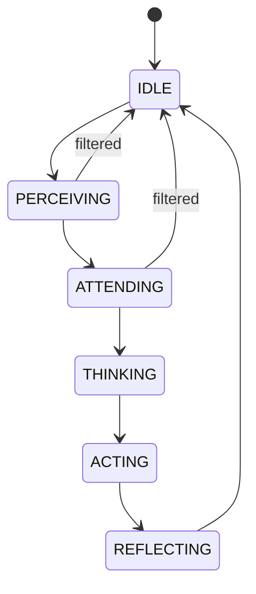

# Module: cognitive

## What it does

The `sovyx.cognitive` package turns an incoming message (a perception) into an executed response and a memory update. It runs five synchronous phases per request — Perceive, Attend, Think, Act, Reflect — and hosts the safety stack that guards both input and output.

## Key classes

| Name | Responsibility |
|---|---|
| `CognitiveLoop` | Runs the five phases. Never raises: always returns `ActionResult`. |
| `CognitiveStateMachine` | Enforces valid phase transitions; `reset()` returns to `IDLE`. |
| `CogLoopGate` | Single entrypoint from bridges. Priority queue + single worker + future per request. |
| `CognitiveRequest` | Bundle submitted to the loop (perception, mind_id, conversation_id, history). |
| `PerceivePhase` | Validates and normalizes input, classifies complexity. |
| `AttendPhase` | Filters by priority and normalization; decides `should_process`. |
| `ThinkPhase` | Selects a model by complexity, assembles context, calls `LLMRouter`. |
| `ActPhase` | Formats the response, executes tool calls via `ToolExecutor`. |
| `ReflectPhase` | Encodes the episode, extracts concepts, updates the brain. |

## State machine



Transitions are enforced by `CognitiveStateMachine.transition()`. The loop always calls `reset()` in a `finally` block so a crashed phase cannot lock the state machine.

## Request contract

```python
# src/sovyx/cognitive/loop.py
async def process_request(self, request: CognitiveRequest) -> ActionResult:
    """Process a CognitiveRequest through the full loop.

    NEVER raises an exception — always returns ActionResult.
    State machine always resets to IDLE via finally block.
    """
    tracer = get_tracer()
    metrics = get_metrics()
    with (
        tracer.start_span("cognitive.loop",
                          mind_id=str(request.mind_id),
                          conversation_id=str(request.conversation_id)),
        metrics.measure_latency(metrics.cognitive_loop_latency),
    ):
        return await self._execute_loop(request, tracer, metrics)
```

Known errors (`CostLimitExceededError`, `ProviderUnavailableError`) are turned into user-facing messages by `_categorize_error()`. Unknown errors collapse to a generic message without leaking internals.

## Complexity classification

`PerceivePhase` scores the message to drive model routing in `ThinkPhase`:

```python
# src/sovyx/cognitive/perceive.py
@staticmethod
def classify_complexity(content: str) -> float:
    """Result determines model routing:
       complexity < 0.3 -> fast_model
       complexity >= 0.3 -> default_model
    """
```

## Serialization gate

`CogLoopGate` is the only entry point from bridges. It creates a `CognitiveRequest`, puts it on a `PriorityQueue(maxsize=10)`, and waits on a per-request `Future`. The gate also binds structured logging context so every log line emitted during processing carries `mind_id` and `conversation_id`.

```python
# src/sovyx/cognitive/gate.py
async def submit(
    self,
    request: CognitiveRequest,
    timeout: float = 30.0,
) -> ActionResult:
    future: asyncio.Future[ActionResult] = asyncio.get_running_loop().create_future()
    item = (request.perception.priority, next(self._counter), request, future)
    try:
        self._queue.put_nowait(item)
    except asyncio.QueueFull:
        raise CognitiveError("Cognitive loop queue full (backpressure)") from None
    try:
        return await asyncio.wait_for(future, timeout=timeout)
    except TimeoutError:
        raise CognitiveError(f"Cognitive loop timed out after {timeout}s") from None
```

## Safety stack

The safety stack is independent of the loop — each guard is invoked in the relevant phase:

- `CogLoopGate` — request serialization and logging context.
- `InjectionContextTracker` — multi-turn prompt-injection detection.
- `PIIGuard` — detects and redacts PII in input and output.
- `FinancialGate` — intercepts financial tool calls and requires user confirmation.
- `OutputGuard` — post-LLM filter on generated responses.
- `SafetyClassifier` — multi-tier content classifier with cache and hourly LLM budget.
- `SafetyEscalationTracker` — per-source escalation state.
- `ShadowMode` — dry-runs new rules without blocking.
- `SafetyAuditTrail` — records safety events without storing original content.

## Events

| Event | Emitted when |
|---|---|
| `PerceptionReceived` | A perception enters the loop. |
| `ThinkCompleted` | `ThinkPhase` finishes an LLM call (model, tokens, cost, latency). |
| `ResponseSent` | A response is delivered by a channel. |

## Configuration

```yaml
cognitive:
  gate:
    queue_max: 10
    submit_timeout_s: 30.0
  perceive:
    max_input_chars: 10000
```

Safety rules and thresholds live under `cognitive.safety` in the mind config.

## Testing notes

- Use `pytest.raises(Exception) as exc_info` and assert on `type(exc_info.value).__name__`. Exception class identity is not stable under pytest-xdist.
- Avoid `isinstance` dispatch in production code; use `type(exc).__name__` like `_categorize_error` does.

## Periodic and nightly phases

- **CONSOLIDATE** (every 6 h by default) is implemented in
  `brain/consolidation.py` as `ConsolidationCycle` + `ConsolidationScheduler`,
  wired in `engine/bootstrap.py` and started/stopped by
  `engine/lifecycle.py`. Decay → score recalc → centroid refresh →
  merge similar (FTS5 + Levenshtein) → prune → emit
  `ConsolidationCompleted`. SPE-003 §1.1 specifies this as periodic
  (dotted arrow), not per-turn.
- **DREAM** (nightly, default `02:00` in the mind's timezone) ships in
  `brain/dream.py` as `DreamCycle` + `DreamScheduler` (v0.11.6). One
  LLM call per run extracts up to `dream_max_patterns` recurring themes
  from the last `dream_lookback_hours` of episodes; each pattern becomes
  a `Concept` (`source="dream:pattern"`, `category=BELIEF`,
  `confidence=0.4`). Concepts that appear in two or more distinct
  episodes get fed to `HebbianLearning.strengthen` with attenuated
  activation. Kill-switch: `dream_max_patterns: 0` skips registration
  entirely.

## Roadmap

- **Streaming Think/Act** — cooperate with the LLM router's streaming
  path for faster first-token latency.
- **PAD 3D emotional model** (ADR-001) — `Episode` is 2D today,
  `Concept` is 1D; migrate both to PAD 3D with a backfill pass.

## See also

- `engine.md` — the `EventBus` and DI that wire the loop
- `brain.md` — the memory updated by `ReflectPhase`
- `llm.md` — router invoked by `ThinkPhase`
- `../architecture.md` — end-to-end request flow
