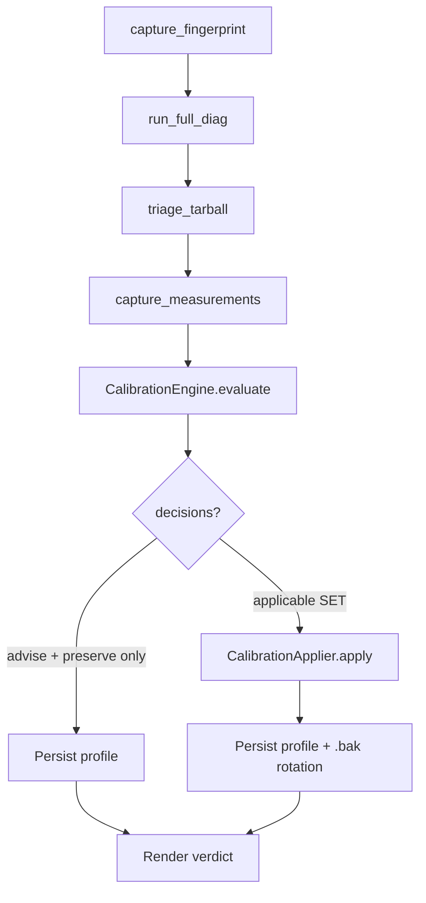

# Module: voice.calibration

## What it does

The `sovyx.voice.calibration` package turns the forensic diagnostic toolkit (`sovyx doctor voice --full-diag`) into a deterministic, rule-based decision engine. Given a hardware fingerprint, a measurement snapshot, and a triage verdict, it produces a `CalibrationProfile` recording every applicable decision (set, advise, or preserve) along with full provenance — which rule fired, what conditions matched, what it produced. By default the profile is **unsigned** (LENIENT-loadable; STRICT mode rejects); pass `--signing-key <pem-path>` to sign with an Ed25519 private key. The applier persists the profile to `<data_dir>/<mind_id>/calibration.json` and exposes single-step rollback.

This is Layer 2 of `MISSION-voice-self-calibrating-system-2026-05-05.md`. Layer 1 (the diag toolkit) provides the input; Layer 3 (the dashboard wizard) wraps Layer 2 in a tiered UX; Layer 4 (community KB) is deferred.

## Key components

| Name | Responsibility |
|---|---|
| `CalibrationEngine` | Forward-chaining rule engine: priority-ordered + conflict-resolved + deterministic. |
| `CalibrationProfile` | Frozen dataclass — fingerprint + measurements + decisions + provenance + signature. |
| `CalibrationApplier` | Atomic applier with snapshot + rollback (per `_linux_mixer_apply.apply_mixer_preset` precedent). |
| `HardwareFingerprint` | Stable identity over distro + kernel + audio-stack + codec + driver + system vendor/product. |
| `MeasurementSnapshot` | Targeted diag output — mixer state + RMS + VAD + latency + jitter. |
| `TriageResult` | Layer 1 forensic verdict (one winning hypothesis or none). |
| `ProvenanceTrace` | Per-firing audit record — matched conditions + produced decisions + confidence band. |
| `CalibrationRule` (Protocol) | `applies(ctx) -> bool` + `evaluate(ctx) -> RuleEvaluation`. Pure function over context. |

## Operator-facing CLI

```text
sovyx doctor voice --calibrate                       # Full pipeline + apply
sovyx doctor voice --calibrate --dry-run             # Show plan, no persistence
sovyx doctor voice --calibrate --explain             # Render rule trace alongside verdict
sovyx doctor voice --calibrate --show                # Read-only inspect last profile
sovyx doctor voice --calibrate --rollback            # Restore prior profile (walks .bak.{1,2,3} chain)
sovyx doctor voice --calibrate --evaluate-rules      # Preview which rules WOULD fire (no diag, no apply)
sovyx doctor voice --calibrate --inspect-migration   # Print the migrated profile dict (post-schema-walk)
sovyx doctor voice --calibrate --mind-id <id>        # Calibrate a specific mind (auto-detected when one mind exists)
sovyx doctor voice --calibrate --non-interactive     # Skip the interactive speech-prompt windows
```

The `--calibrate` flow runs the Linux bash diag toolkit internally, so it is Linux-only and requires `bash >= 4`. (`--full-diag` on its own is cross-platform since W3.2: Linux runs the bash toolkit; Windows dispatches to a native WASAPI/APO/mic-consent producer; macOS is not yet supported.) Use `sovyx doctor voice --full-diag` first to audit the forensic verdict, then `--calibrate` once you trust the input.

## Mind resolution (Phase 1 of MISSION-voice-config-calibrate-enterprise-2026-05-13)

`--mind-id` defaults to **None** (auto-detect single mind), NOT the literal string `"default"`. Resolution semantics:

* Explicit `--mind-id <X>` with `<data_dir>/<X>/mind.yaml` present → use that mind.
* `--mind-id` omitted + exactly one mind on disk → auto-detect, log `cli.mind_auto_detected`.
* `--mind-id` omitted + 0 minds → error pointing at `sovyx init`.
* `--mind-id` omitted + 2+ minds → error listing the available minds, requires explicit flag.
* Any explicit name that doesn't match a real mind → error listing the available minds.

This replaces the pre-v0.39.0 literal-`"default"` sentinel (anti-pattern #35 closure).

## Mic prereq (Phase 4 of the same mission)

The calibrate pipeline reads `voice_input_device_name` from the target mind's `mind.yaml` so it knows which physical capture device to tune. The prereq gate runs immediately after the TTY check:

| Shell mode | `voice_input_device_name` empty | `voice_input_device_name` set |
|---|---|---|
| **Interactive** | Inline `sovyx voice setup` picker runs; persisted choice is re-loaded; pipeline continues. Operator can abort with `q`. | Skip prereq, run pipeline directly. |
| **Non-interactive** | Hard error with `EXIT_DOCTOR_VOICE_NOT_CONFIGURED` (exit code 6) + structured ERROR `voice.calibrate.prereq_strict`. Operator pre-configures via `sovyx voice setup --input-device 'NAME' --non-interactive` OR passes an inline `--input-device 'NAME'` flag to the calibrate command itself (Phase 5.T5.2 escape hatch). | Skip prereq, run pipeline directly. |

The STRICT error message lists THREE remediation paths (interactive setup / scripted setup / inline `--input-device`) so operators with different constraints (dev shell, CI, systemd) can pick the right one without re-reading docs.

> **History:** Pre-v0.40.0 versions emitted a LENIENT WARN (`voice.calibrate.prereq_lenient`) + yellow operator banner and continued with a first-attenuated-ALSA-card heuristic fallback. The LENIENT mode was the one-minor-cycle staged-adoption deprecation window (v0.39.x); v0.40.0 closed the window with the STRICT flip per `feedback_staged_adoption`. No `--legacy-heuristic-fallback` back-compat flag exists by design (band-aid posture rejected per `feedback_enterprise_only`).

Persistence path for the inline picker is `voice/calibration/_persist_device.persist_voice_input_device`, the same atomic helper the dashboard voice-enable endpoint uses — both writers commit through `ConfigEditor.set_scalar` (lock-per-path, temp-file + rename).

`--show`, `--rollback`, `--evaluate-rules`, and `--inspect-migration` all require `--calibrate` and form a closed-enum mutex set (each is a distinct read-only inspection mode; pick one per invocation):

| Flag | Mutates? | Purpose |
|---|---|---|
| `--show` | No | Render the LAST persisted profile (decisions + advised actions). |
| `--rollback` | Yes — consumes one generation | Walk the `.bak.{1,2,3}` multi-generation chain; restore the most-recent prior profile. Up to 3 prior calibrations retained; `--calibrate` repopulates after exhaustion. |
| `--evaluate-rules` | No | Capture fingerprint + run the engine in dry-eval mode; show which rules WOULD fire WITHOUT running the 8-12 min full diag or applying anything. |
| `--inspect-migration` | No | Read the on-disk JSON, walk the schema-migration chain to the runtime's current `CALIBRATION_PROFILE_SCHEMA_VERSION`, emit the result to stdout (pipeable into `jq` or `diff`). Useful at schema-bump time to preview the post-migration shape before relying on auto-load. Skips the signature gate; the dict is NOT a fully-validated profile. |

## Pipeline (slow path)



Decisions are partitioned at apply time:

* `operation == "set"` AND `confidence != EXPERIMENTAL` → `applied_decisions` (mutates state).
* `operation == "advise"` → `advised_actions` (rendered as copy-paste shell commands).
* `operation == "preserve"` → recorded but no-op.
* `operation == "set"` AND `confidence == EXPERIMENTAL` → `skipped_decisions` (deferred until promotion).

## Determinism + atomicity contracts

* **Determinism**: `engine.evaluate(...)` with pinned `profile_id` + `generated_at_utc` + `now_factory` returns byte-identical output across re-runs. Verified by `tests/property/test_calibration_engine.py`.
* **Idempotency**: applying the same profile twice produces byte-identical persisted JSON.
* **Conflict resolution**: two rules SETting the same target → higher-priority wins; the loser fires `voice.calibration.engine.rule_conflict` telemetry but does not override.
* **Atomicity**: `save_calibration_profile` writes to `.tmp` then `os.replace` to the canonical path; the prior canonical (if any) rotates to `.bak` via the same atomic primitive.
* **Single-step rollback**: `rollback_calibration_profile` validates the `.bak` is loadable BEFORE the swap, refusing to restore corrupt state.

## Profile schema (v1)

`<data_dir>/<mind_id>/calibration.json`:

```json
{
  "schema_version": 1,
  "profile_id": "11111111-2222-3333-4444-555555555555",
  "mind_id": "default",
  "fingerprint": { "audio_stack": "pipewire", "codec_id": "10ec:0257", ... },
  "measurements": { "mixer_attenuation_regime": "attenuated", ... },
  "decisions": [
    {
      "target": "advice.action",
      "target_class": "TuningAdvice",
      "operation": "advise",
      "value": "sovyx doctor voice --fix --yes",
      "rationale": "...",
      "rule_id": "R10_mic_attenuated",
      "rule_version": 1,
      "confidence": "high"
    }
  ],
  "provenance": [...],
  "generated_by_engine_version": "0.30.19",
  "generated_by_rule_set_version": 1,
  "generated_at_utc": "2026-05-05T18:02:00.000000+00:00",
  "signature": null
}
```

Schema versioning is explicit: a profile written under `schema_version=1` only loads on a Sovyx that supports `schema_version=1`. Incompatible versions raise `CalibrationProfileLoadError`; operators regenerate via `--calibrate` rather than relying on silent migration.

## Profile signing mode (axis 2 — distinct from the prereq gate above)

> **Two STRICT axes — do not conflate.** The
> [§Mic prereq](#mic-prereq-phase-4-of-the-same-mission) section
> above documents the prereq gate, which flipped STRICT in
> **v0.40.0** (exit code `EXIT_DOCTOR_VOICE_NOT_CONFIGURED=6`) and
> gates the `--calibrate` invocation on a configured input device. The *profile signing mode* documented
> here is a different axis: it governs how the loader handles
> calibration profiles that were generated previously and may carry
> an Ed25519 signature. It still defaults LENIENT at the current
> HEAD; flip status is tracked separately.

| Mode | Status | Missing signature | Invalid signature |
|---|---|---|---|
| LENIENT | **default** (verified at HEAD: load-site default in `voice/calibration/_persistence.py`) | warn + accept | warn + accept |
| STRICT | opt-in (`mode=Mode.STRICT` argument) | raise `CalibrationProfileLoadError` | raise |

**Why signing-mode STRICT is not yet the default:** flipping
signing-mode STRICT-by-default would break every Sovyx install whose
existing calibration profile was generated before the operator
opted into the wizard-driven key-gen flow. The dashboard wizard
ships an operator-driven Ed25519 key-gen + persistence flow; fresh
installs that complete the wizard get a signed profile and can run
STRICT cleanly. Existing installs continue under LENIENT until the
operator opts in (env override + key gen) or regenerates via
`--calibrate --signing-key <path>` post-upgrade. See `_signing.py`
module docstring for the canonical narrative.

**Operators wanting signing-mode STRICT today:** generate a key
via the wizard or `scripts/dev/generate_calibration_signing_key.py`,
pass `--signing-key <path>` at calibrate time, and load with
`mode=Mode.STRICT` in any custom integration code. Production
deployments wanting fleet-wide STRICT operation should follow the
staged rotation procedure in
[contributing/voice-kb-rotation.md](../contributing/voice-kb-rotation.md)
(per CLAUDE.md anti-pattern #26).

**Flip tracking:** the signing-mode LENIENT→STRICT flip is gated
on telemetry-validated LENIENT operation across the fleet (per
`feedback_staged_adoption`). Status at HEAD: LENIENT. The flip
itself is being planned in a follow-up mission; this doc updates
when the flip lands.

## Telemetry

All events live under the `voice.calibration.*` namespace with closed-enum cardinality (per spec §8.3 + master mission anti-pattern #25 on telemetry semantics):

```text
voice.calibration.engine.run_started      {mode, mind_id_hash, rule_set_version, engine_version}
voice.calibration.engine.run_completed    {mode, mind_id_hash, profile_id_hash, duration_ms,
                                           decisions_count, rules_fired, rules_total}
voice.calibration.engine.rule_fired       {rule_id, rule_version, confidence, decisions_count}
voice.calibration.engine.rule_conflict    {rule_winner_id, rule_loser_id, target_field}

voice.calibration.applier.apply_started   {profile_id_hash, mind_id_hash, decisions_total, ...}
voice.calibration.applier.apply_succeeded {profile_id_hash, mind_id_hash, applicable_count, ...}
voice.calibration.applier.apply_failed    {profile_id_hash, mind_id_hash, target,
                                           target_class, operation, failure_reason}
voice.calibration.applier.rolled_back     {mind_id_hash, path, rollback_reason}
voice.calibration.applier.dry_run         {profile_id_hash, mind_id_hash, applicable_count, ...}

voice.calibration.profile.persisted       {mind_id_hash, profile_id_hash, path, signed,
                                           backup_present}
voice.calibration.profile.loaded          {mind_id_hash, profile_id_hash, signature_status,
                                           mode, schema_version}
voice.calibration.profile.signature_missing {mind_id_hash, profile_id_hash, mode, path}
```

`mind_id_hash` and `profile_id_hash` are the 16-hex-char SHA256 prefix of the raw value. Operators correlate across the engine → applier → persistence pipeline without telemetry leaking the operator-set mind name.

### Retention contract

Calibration telemetry events flow through Sovyx's standard observability pipeline (`sovyx.observability.logging.setup_logging`). Retention is governed by the same daemon-wide policy that handles all other `voice.*` / `engine.*` / `dashboard.*` events — there is **no** separate calibration-only retention horizon.

Effective retention defaults:

| Surface | Retention | Source |
|---|---|---|
| Console handler (stderr) | None — emitted-then-dropped | structlog default |
| File handler (`<data_dir>/logs/sovyx.log`) | 50 MB × 11 rotated files (≈ 550 MB total capacity) | `EngineConfig.observability.file_max_bytes` (default `50 * 1024 * 1024`) + `file_backup_count` (default `10`) |
| OTel export (when `[otel]` extra installed) | Per upstream collector retention | OTLP exporter |

**Rotation is by size, not by time.** Each handler emits to `sovyx.log` until it reaches `file_max_bytes`, at which point it rotates to `sovyx.log.1` (and so on up to `file_backup_count` numbered backups). To override, set `SOVYX_OBSERVABILITY__FILE_MAX_BYTES` / `SOVYX_OBSERVABILITY__FILE_BACKUP_COUNT` in your env or `system.yaml`. Calibration events carry no PII (mind_id is hashed; profile_id is a UUID; never the raw operator-set mind name) so the policy can be relaxed for telemetry-driven KB development without GDPR / LGPD impact.

### rc.12 additions

| Event | Fields |
|---|---|
| `voice.calibration.mind_id_resolved` | `requested`, `resolved_hash`, `source` (`request_body`/`app_state`/`mind_manager`/`fallback_default`) |
| `voice.calibration.rollback.mind_id_resolved` | same as above (mirrors anti-pattern #35 contract) |
| `voice.calibration.rollback.chain_exhausted` | `mind_id_hash` (operator clicked Rollback past .bak.1) |
| `voice.calibration.rollback.backup_corrupt` | `mind_id_hash`, `reason` (truncated) — backup file unreadable |
| `voice.calibration.profile.legacy_backup_migrated` | `mind_id_hash`, `from_path_suffix`, `to_generation` — one-time rc.11→rc.12 upgrade event |
| `voice.calibration.wizard.no_capture_device` | `job_id_hash`, `mind_id_hash` — early-bail before slow-path |
| `voice.diagnostics.full_diag_watchdog_fired` | `mode`, `deadline_s`, `elapsed_s` — slow-path watchdog killed a hung diag |

## Rules registry

As of v0.31.x, the calibration engine ships **10 rules** (R10..R95) covering Linux mic attenuation, Windows APO interference, Linux destructive-filter detection, macOS TCC denials, hardware-gap surfacing, VAD threshold tuning, exclusive capture mode, AEC engine selection, STT locality preference, and wake-word model recommendation.

| Rule | Priority | Trigger | Confidence | Operation | Decision |
|---|---|---|---|---|---|
| `R10_mic_attenuated` | 95 | triage winner H10 + regime == attenuated | HIGH | **set** | LinuxMixerApply: `boost_up` (auto-applies) |
| `R20_windows_apo_active` | — | fingerprint.apo_active + Windows | HIGH | advise | Run Voice Clarity APO autofix |
| `R30_linux_destructive_filter` | — | pulse_modules_destructive non-empty | MEDIUM | advise | Disable RNNoise / module-echo-cancel |
| `R40_macos_tcc_denied` | — | macOS TCC permission denied | HIGH | advise | Grant mic permission in System Preferences |
| `R50_hardware_gap` | — | no triage winner + low VAD | LOW | advise | Hardware diagnostic walkthrough |
| `R60_vad_threshold_tuning` | — | borderline VAD probability range | MEDIUM | advise | Adjust `voice.vad.speech_threshold` |
| `R70_capture_mode_exclusive` | — | Windows + APO present | MEDIUM | advise | Enable WASAPI exclusive mode |
| `R80_aec_engine` | — | echo_correlation_db elevated | MEDIUM | advise | Switch AEC engine to Speex |
| `R90_stt_locality` | — | network-latency / privacy preference | LOW | advise | Switch STT to Moonshine local |
| `R95_wake_word_model` | — | wake-word miss rate elevated | LOW | advise | Train custom wake-word model |

**Operation column legend:** `set` decisions auto-apply via the `CalibrationApplier` (currently only `R10`). `advise` decisions surface as copy-paste shell commands for the operator to run; the applier records them but never mutates state.

### Rule promotion roadmap

The `set` ↔ `advise` distinction is **deliberate enterprise discipline**, not an oversight. Every rule ships in `advise` mode first; promotion to `set` is a code change soaked across one minor version cycle. The rationale:

1. **Operator-in-the-loop for security-sensitive changes.** TCC permission grants (R40), Voice Clarity APO bypass (R20), and pulse-module disabling (R30) all touch operator-trust boundaries. Auto-applying them would surprise operators who run Sovyx alongside other voice software.
2. **Soak data drives promotion.** A rule firing on 1000+ canonical hardware combinations tells us its precision before we promote it to mutating-by-default. Premature promotion risks fleet-wide false positives.
3. **One rule per minor version maximum.** R10 was promoted in v0.30.28 (post-soak from v0.30.15); the next promotion lands no earlier than v0.32.0 with R20 (Windows APO autofix) once the dashboard wizard surface is mature.

Each rule is a pure `(fingerprint, measurements, triage_result, prior_decisions) -> RuleEvaluation` function — no side effects, no I/O, no cross-rule mutation. Promotion to `set` is contained: only the rule's `evaluate()` body changes; the engine + applier registries are unchanged.

## Failure modes + recovery

| Failure | Detection | Recovery |
|---|---|---|
| Engine produces empty decision set | `len(profile.decisions) == 0` | Profile persisted with note "no actionable issues detected"; voice continues to use defaults. |
| Apply fails mid-flight | `ApplyError` raised | Rollback to snapshot; profile NOT persisted; `apply_failed` event emitted. |
| Persist fails (disk full, perm denied) | `IOError` | Rollback in-memory; operator sees clear error. |
| Operator disagrees with verdict | observed at `--show` review | `--rollback` restores prior profile (or click Rollback in dashboard Settings → Voice). |
| Backup is corrupt | `--rollback` validates pre-swap | Refuses; operator re-runs `--calibrate` to regenerate. |
| Operator rolls back multiple bad calibrations | `--rollback` walks the multi-generation chain (rc.12) | Up to 3 prior profiles restorable from `.bak.{1,2,3}`; once exhausted, `--calibrate` repopulates. |
| No microphone connected | Orchestrator early-bails after fingerprint (rc.12) | FALLBACK with `reason="no_capture_device"` — operator sees actionable message instead of waiting 8-12 min for a useless diag. |
| Bash diag hangs (driver bug, blocked syscall) | Watchdog timer (rc.12, default 30 min; tunable via `SOVYX_TUNING__VOICE__FULL_DIAG_WATCHDOG_DEADLINE_S`, `0` disables) | SIGTERM → 10s grace → SIGKILL via existing cancellation path; operator sees `DiagRunError` naming the tuning knob. |

## Example: surgical measurer mode (~30s vs ~10min)

The bash diag toolkit accepts `--only LIST` (added in v0.30.19) to restrict the run to a comma-separated whitelist of layers (`A,C,D,E,J` is the calibration measurer's surgical mode). When the calibration wizard's fast-path replay validates a cached profile, it can call:

```python
from sovyx.voice.diagnostics import run_full_diag

result = run_full_diag(
    extra_args=("--only", "A,C,D,E,J", "--non-interactive", "--skip-captures",
                "--skip-guardian", "--skip-operator-prompts"),
)
```

Cuts the run to ~30s (vs ~10min default). The CLI `--calibrate` path stays on the full diag for thoroughness; surgical mode is reserved for cache-hit revalidation in the wizard's fast path.

## Reference map

* Engine + rules: `src/sovyx/voice/calibration/engine.py`, `src/sovyx/voice/calibration/rules/`
* Persistence + rollback: `src/sovyx/voice/calibration/_persistence.py`
* Applier: `src/sovyx/voice/calibration/_applier.py`
* CLI: `src/sovyx/cli/commands/doctor.py` (`_run_voice_calibrate*`)
* Wizard orchestrator (Layer 3): `src/sovyx/voice/calibration/_wizard_orchestrator.py`
* Mission spec: `docs-internal/missions/MISSION-voice-self-calibrating-system-2026-05-05.md`
* Tests: `tests/unit/voice/calibration/`, `tests/property/test_calibration_engine.py`, `tests/integration/test_voice_calibration_e2e.py`
