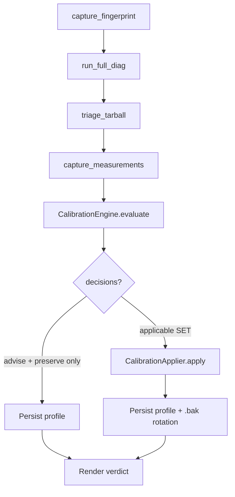

# Module: voice.calibration

## What it does

The `sovyx.voice.calibration` package turns the forensic diagnostic toolkit (`sovyx doctor voice --full-diag`) into a deterministic, rule-based decision engine. Given a hardware fingerprint, a measurement snapshot, and a triage verdict, it produces a `CalibrationProfile` recording every applicable decision (set, advise, or preserve) along with full provenance — which rule fired, what conditions matched, what it produced. By default the profile is **unsigned** (LENIENT-loadable; STRICT mode rejects); pass `--signing-key <pem-path>` to sign with an Ed25519 private key. The applier persists the profile to `<data_dir>/<mind_id>/calibration.json` and exposes single-step rollback.

This is Layer 2 of `MISSION-voice-self-calibrating-system-2026-05-05.md`. Layer 1 (the diag toolkit) provides the input; Layer 3 (the dashboard wizard) wraps Layer 2 in a tiered UX; Layer 4 (community KB) is deferred.

## Key components

| Name | Responsibility |
|---|---|
| `CalibrationEngine` | Forward-chaining rule engine: priority-ordered + conflict-resolved + deterministic. |
| `CalibrationProfile` | Frozen dataclass — fingerprint + measurements + decisions + provenance + signature. |
| `CalibrationApplier` | Atomic applier with snapshot + rollback (per `_linux_mixer_apply.apply_mixer_preset` precedent). |
| `HardwareFingerprint` | Stable identity over distro + kernel + audio-stack + codec + driver + system vendor/product. |
| `MeasurementSnapshot` | Targeted diag output — mixer state + RMS + VAD + latency + jitter. |
| `TriageResult` | Layer 1 forensic verdict (one winning hypothesis or none). |
| `ProvenanceTrace` | Per-firing audit record — matched conditions + produced decisions + confidence band. |
| `CalibrationRule` (Protocol) | `applies(ctx) -> bool` + `evaluate(ctx) -> RuleEvaluation`. Pure function over context. |

## Operator-facing CLI

```text
sovyx doctor voice --calibrate                   # Full pipeline + apply
sovyx doctor voice --calibrate --dry-run         # Show plan, no persistence
sovyx doctor voice --calibrate --explain         # Render rule trace alongside verdict
sovyx doctor voice --calibrate --show            # Read-only inspect last profile
sovyx doctor voice --calibrate --rollback        # Restore prior profile from .bak slot
sovyx doctor voice --calibrate --mind-id <id>    # Calibrate a specific mind (default: 'default')
sovyx doctor voice --calibrate --non-interactive # Skip the interactive speech-prompt windows
```

The `--calibrate` flow runs `--full-diag` internally, so it is Linux-only and requires `bash >= 4`. Use `sovyx doctor voice --full-diag` first to audit the forensic verdict, then `--calibrate` once you trust the input.

`--show` and `--rollback` both require `--calibrate`. `--show` does not mutate state; `--rollback` consumes the .bak slot (single-step only — re-run `--calibrate` to regenerate after a second consecutive rollback).

## Pipeline (slow path)



Decisions are partitioned at apply time:

* `operation == "set"` AND `confidence != EXPERIMENTAL` → `applied_decisions` (mutates state).
* `operation == "advise"` → `advised_actions` (rendered as copy-paste shell commands).
* `operation == "preserve"` → recorded but no-op.
* `operation == "set"` AND `confidence == EXPERIMENTAL` → `skipped_decisions` (deferred until promotion).

## Determinism + atomicity contracts

* **Determinism**: `engine.evaluate(...)` with pinned `profile_id` + `generated_at_utc` + `now_factory` returns byte-identical output across re-runs. Verified by `tests/property/test_calibration_engine.py`.
* **Idempotency**: applying the same profile twice produces byte-identical persisted JSON.
* **Conflict resolution**: two rules SETting the same target → higher-priority wins; the loser fires `voice.calibration.engine.rule_conflict` telemetry but does not override.
* **Atomicity**: `save_calibration_profile` writes to `.tmp` then `os.replace` to the canonical path; the prior canonical (if any) rotates to `.bak` via the same atomic primitive.
* **Single-step rollback**: `rollback_calibration_profile` validates the `.bak` is loadable BEFORE the swap, refusing to restore corrupt state.

## Profile schema (v1)

`<data_dir>/<mind_id>/calibration.json`:

```json
{
  "schema_version": 1,
  "profile_id": "11111111-2222-3333-4444-555555555555",
  "mind_id": "default",
  "fingerprint": { "audio_stack": "pipewire", "codec_id": "10ec:0257", ... },
  "measurements": { "mixer_attenuation_regime": "attenuated", ... },
  "decisions": [
    {
      "target": "advice.action",
      "target_class": "TuningAdvice",
      "operation": "advise",
      "value": "sovyx doctor voice --fix --yes",
      "rationale": "...",
      "rule_id": "R10_mic_attenuated",
      "rule_version": 1,
      "confidence": "high"
    }
  ],
  "provenance": [...],
  "generated_by_engine_version": "0.30.19",
  "generated_by_rule_set_version": 1,
  "generated_at_utc": "2026-05-05T18:02:00.000000+00:00",
  "signature": null
}
```

Schema versioning is explicit: a profile written under `schema_version=1` only loads on a Sovyx that supports `schema_version=1`. Incompatible versions raise `CalibrationProfileLoadError`; operators regenerate via `--calibrate` rather than relying on silent migration.

## Signing model (LENIENT → STRICT)

| Mode | Default in | Behaviour on missing signature | Behaviour on invalid signature |
|---|---|---|---|
| LENIENT | v0.30.15..v0.30.x (current) | warn + accept | warn + accept |
| STRICT | v0.31.0+ (planned, per soak) | raise `CalibrationProfileLoadError` | raise |

The default flip is gated on at least one minor cycle of telemetry-validated lenient operation per the master mission's staged-adoption discipline. The flip is automatic across new Sovyx installs once shipped; existing operators with `signature: null` profiles must regenerate via `--calibrate` after upgrade.

## Telemetry

All events live under the `voice.calibration.*` namespace with closed-enum cardinality (per spec §8.3 + master mission anti-pattern #25 on telemetry semantics):

```text
voice.calibration.engine.run_started      {mode, mind_id_hash, rule_set_version, engine_version}
voice.calibration.engine.run_completed    {mode, mind_id_hash, profile_id_hash, duration_ms,
                                           decisions_count, rules_fired, rules_total}
voice.calibration.engine.rule_fired       {rule_id, rule_version, confidence, decisions_count}
voice.calibration.engine.rule_conflict    {rule_winner_id, rule_loser_id, target_field}

voice.calibration.applier.apply_started   {profile_id_hash, mind_id_hash, decisions_total, ...}
voice.calibration.applier.apply_succeeded {profile_id_hash, mind_id_hash, applicable_count, ...}
voice.calibration.applier.apply_failed    {profile_id_hash, mind_id_hash, target,
                                           target_class, operation, failure_reason}
voice.calibration.applier.rolled_back     {mind_id_hash, path, rollback_reason}
voice.calibration.applier.dry_run         {profile_id_hash, mind_id_hash, applicable_count, ...}

voice.calibration.profile.persisted       {mind_id_hash, profile_id_hash, path, signed,
                                           backup_present}
voice.calibration.profile.loaded          {mind_id_hash, profile_id_hash, signature_status,
                                           mode, schema_version}
voice.calibration.profile.signature_missing {mind_id_hash, profile_id_hash, mode, path}
```

`mind_id_hash` and `profile_id_hash` are the 16-hex-char SHA256 prefix of the raw value. Operators correlate across the engine → applier → persistence pipeline without telemetry leaking the operator-set mind name.

### Retention contract

Calibration telemetry events flow through Sovyx's standard observability pipeline (`sovyx.observability.logging.setup_logging`). Retention is governed by the same daemon-wide policy that handles all other `voice.*` / `engine.*` / `dashboard.*` events — there is **no** separate calibration-only retention horizon.

Effective retention defaults:

| Surface | Retention | Source |
|---|---|---|
| Console handler (stderr) | None — emitted-then-dropped | structlog default |
| File handler (`<data_dir>/logs/sovyx.log`) | 14 days × 5MB rotated files | `EngineConfig.logging.file_max_bytes` + `file_backup_count` |
| OTel export (when `[otel]` extra installed) | Per upstream collector retention | OTLP exporter |

To override, set `SOVYX_LOG__FILE_MAX_BYTES` / `SOVYX_LOG__FILE_BACKUP_COUNT` in your env or system.yaml. Calibration events carry no PII (mind_id is hashed; profile_id is a UUID; never the raw operator-set mind name) so the policy can be relaxed for telemetry-driven KB development without GDPR / LGPD impact.

### rc.12 additions

| Event | Fields |
|---|---|
| `voice.calibration.mind_id_resolved` | `requested`, `resolved_hash`, `source` (`request_body`/`app_state`/`mind_manager`/`fallback_default`) |
| `voice.calibration.rollback.mind_id_resolved` | same as above (mirrors anti-pattern #35 contract) |
| `voice.calibration.rollback.chain_exhausted` | `mind_id_hash` (operator clicked Rollback past .bak.1) |
| `voice.calibration.rollback.backup_corrupt` | `mind_id_hash`, `reason` (truncated) — backup file unreadable |
| `voice.calibration.profile.legacy_backup_migrated` | `mind_id_hash`, `from_path_suffix`, `to_generation` — one-time rc.11→rc.12 upgrade event |
| `voice.calibration.wizard.no_capture_device` | `job_id_hash`, `mind_id_hash` — early-bail before slow-path |
| `voice.diagnostics.full_diag_watchdog_fired` | `mode`, `deadline_s`, `elapsed_s` — slow-path watchdog killed a hung diag |

## Rules registry

| Rule | Priority | Trigger | Confidence | Decision |
|---|---|---|---|---|
| `R10_mic_attenuated` | 95 | triage winner H10 + measurements regime == attenuated | HIGH | advise: `sovyx doctor voice --fix --yes` |

Additional rules (R20..R95) ship in v0.30.20+ per mission §5.8 staged adoption: one rule per commit, soaked between version bumps. Each rule is a pure `(fingerprint, measurements, triage_result, prior_decisions) -> RuleEvaluation` function — no side effects, no I/O, no cross-rule mutation.

## Failure modes + recovery

| Failure | Detection | Recovery |
|---|---|---|
| Engine produces empty decision set | `len(profile.decisions) == 0` | Profile persisted with note "no actionable issues detected"; voice continues to use defaults. |
| Apply fails mid-flight | `ApplyError` raised | Rollback to snapshot; profile NOT persisted; `apply_failed` event emitted. |
| Persist fails (disk full, perm denied) | `IOError` | Rollback in-memory; operator sees clear error. |
| Operator disagrees with verdict | observed at `--show` review | `--rollback` restores prior profile (or click Rollback in dashboard Settings → Voice). |
| Backup is corrupt | `--rollback` validates pre-swap | Refuses; operator re-runs `--calibrate` to regenerate. |
| Operator rolls back multiple bad calibrations | `--rollback` walks the multi-generation chain (rc.12) | Up to 3 prior profiles restorable from `.bak.{1,2,3}`; once exhausted, `--calibrate` repopulates. |
| No microphone connected | Orchestrator early-bails after fingerprint (rc.12) | FALLBACK with `reason="no_capture_device"` — operator sees actionable message instead of waiting 8-12 min for a useless diag. |
| Bash diag hangs (driver bug, blocked syscall) | Watchdog timer (rc.12, default 30 min) | SIGTERM → 10s grace → SIGKILL via existing cancellation path; operator sees `DiagRunError` with watchdog citation. |

## Example: surgical measurer mode (~30s vs ~10min)

The bash diag toolkit accepts `--only LIST` (added in v0.30.19) to restrict the run to a comma-separated whitelist of layers (`A,C,D,E,J` is the calibration measurer's surgical mode). When the calibration wizard's fast-path replay validates a cached profile, it can call:

```python
from sovyx.voice.diagnostics import run_full_diag

result = run_full_diag(
    extra_args=("--only", "A,C,D,E,J", "--non-interactive", "--skip-captures",
                "--skip-guardian", "--skip-operator-prompts"),
)
```

Cuts the run to ~30s (vs ~10min default). The CLI `--calibrate` path stays on the full diag for thoroughness; surgical mode is reserved for cache-hit revalidation in the wizard's fast path.

## Reference map

* Engine + rules: `src/sovyx/voice/calibration/engine.py`, `src/sovyx/voice/calibration/rules/`
* Persistence + rollback: `src/sovyx/voice/calibration/_persistence.py`
* Applier: `src/sovyx/voice/calibration/_applier.py`
* CLI: `src/sovyx/cli/commands/doctor.py` (`_run_voice_calibrate*`)
* Wizard orchestrator (Layer 3): `src/sovyx/voice/calibration/_wizard_orchestrator.py`
* Mission spec: `docs-internal/missions/MISSION-voice-self-calibrating-system-2026-05-05.md`
* Tests: `tests/unit/voice/calibration/`, `tests/property/test_calibration_engine.py`, `tests/integration/test_voice_calibration_e2e.py`
