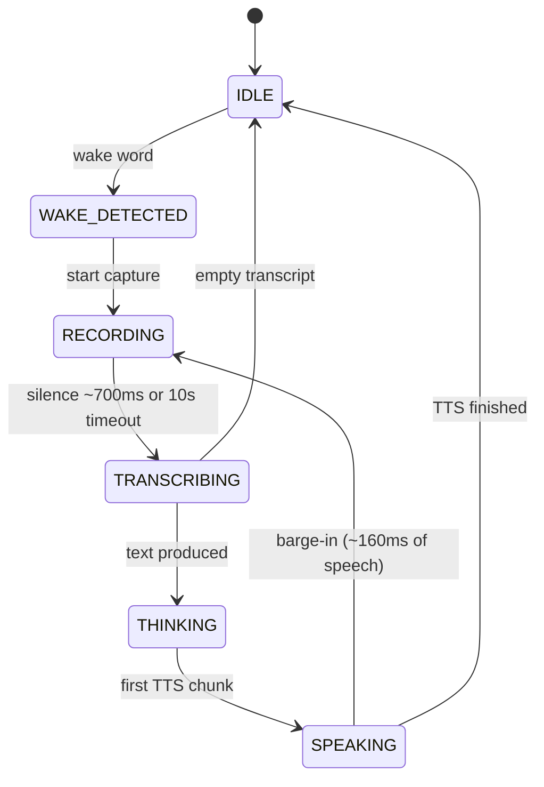

# Module: voice

## What it does

The `sovyx.voice` package is the local-first voice stack: wake word, VAD, speech-to-text, text-to-speech, and an orchestrator that turns them into a conversational loop. It runs ONNX models on the machine (Moonshine v2 for STT via `moonshine-voice`, Piper or Kokoro for TTS, Silero v5 for VAD) and can also speak the Wyoming protocol for Home Assistant integration. An auto-selector probes the hardware at startup and picks a model combination that fits the tier (Pi 5, N100 mini-PC, desktop CPU, desktop GPU, cloud).

## Key components

| Name | Responsibility |
|---|---|
| `VoicePipeline` | State-machine orchestrator — mic frames in, TTS out, with barge-in and filler injection. |
| `SileroVAD` | Voice activity detector running Silero v5 via ONNX Runtime. |
| `WakeWordDetector` | OpenWakeWord with a two-stage check (ONNX score + STT verification). |
| `MoonshineSTT` | Local STT via the `moonshine-voice` library (Moonshine v2 models). |
| `CloudSTT` | Fallback STT against OpenAI Whisper (BYOK). |
| `PiperTTS` | Fast local TTS (VITS ONNX), streaming synthesis. |
| `KokoroTTS` | Higher-quality TTS via `kokoro-onnx`. |
| `SovyxWyomingServer` | TCP server speaking the Wyoming JSONL + PCM protocol. |
| `VoiceModelAutoSelector` | Hardware probe + model selection + fallback chains. |
| `JarvisIllusion` | Filler phrases and confirmation beeps to mask latency. |
| `AudioCapture` / `AudioOutput` | Realtime capture and output via `sounddevice` with LUFS normalization. |

## Pipeline state machine



Frames are 512 int16 samples at 16 kHz (~32 ms). The pipeline does not own audio capture — callers push frames in via `feed_frame()`, which makes it testable without hardware.

## Example

```python
# src/sovyx/voice/pipeline/_orchestrator.py — constants and state
# (the legacy pipeline.py was split into a subpackage; constants live
# alongside the orchestrator class. Public re-exports keep
# ``from sovyx.voice.pipeline import VoicePipeline, VoicePipelineConfig``
# working unchanged.)
_SAMPLE_RATE = 16_000
_FRAME_SAMPLES = 512            # 32 ms at 16 kHz
_SILENCE_FRAMES_END = 22        # ~700 ms silence ends an utterance
_MAX_RECORDING_FRAMES = 312     # ~10 s max per utterance
_BARGE_IN_THRESHOLD_FRAMES = 5  # ~160 ms of sustained speech → barge-in
_FILLER_DELAY_MS = 800          # delay before playing a filler


class VoicePipelineState(IntEnum):
    IDLE = auto()
    WAKE_DETECTED = auto()
    RECORDING = auto()
    TRANSCRIBING = auto()
    THINKING = auto()
    SPEAKING = auto()
```

Wiring a pipeline:

```python
from sovyx.voice.pipeline import VoicePipeline, VoicePipelineConfig
from sovyx.voice.vad import SileroVAD
from sovyx.voice.wake_word import WakeWordDetector
from sovyx.voice.stt import MoonshineSTT
from sovyx.voice.tts_piper import PiperTTS

pipeline = VoicePipeline(
    config=VoicePipelineConfig(mind_id="default"),
    vad=SileroVAD(...),
    wake_word=WakeWordDetector(...),
    stt=MoonshineSTT(...),
    tts=PiperTTS(...),
    event_bus=event_bus,
    on_perception=cog_loop.submit,
)

await pipeline.start()
for frame in mic_frames():          # int16, 512 samples @ 16 kHz
    await pipeline.feed_frame(frame)
```

The cognitive loop calls `pipeline.speak(text)` for one-shot replies or `pipeline.stream_text(chunk)` while LLM tokens arrive so TTS starts at the first sentence boundary.

## Barge-in and fillers

- **Barge-in** — while `SPEAKING`, every incoming frame is still fed to the VAD. If five consecutive speech frames (~160 ms) arrive, the audio queue is interrupted, a `BargeInEvent` is emitted, and the pipeline jumps back to `RECORDING`.
- **Fillers** — when `start_thinking()` is called, a timer is armed. If no LLM token arrives within `filler_delay_ms` (800 ms default), `JarvisIllusion` plays a phrase like "Let me think…" through the output queue. The timer is cancelled as soon as the first token shows up.

## Wyoming protocol

`SovyxWyomingServer` listens on TCP `10700` and announces `_wyoming._tcp.local.` via Zeroconf. This lets Home Assistant Voice Assist use Sovyx directly for STT, TTS, wake word, and intent handling.

```python
# src/sovyx/voice/wyoming.py
_WYOMING_TCP_PORT = 10700
_MIC_RATE = 16_000      # 16 kHz mono PCM input
_MIC_WIDTH = 2          # 16-bit signed LE
_SND_RATE = 22_050      # Piper default output
_OUTPUT_CHUNK_BYTES = 4410
WYOMING_SERVICE_TYPE = "_wyoming._tcp.local."
```

The handshake returns an `info` payload describing the supported services (`asr`, `tts`, `wake`, `intent`) and then routes `transcribe`, `synthesize`, and `detect` events to the corresponding engines.

## Hardware auto-selection

`VoiceModelAutoSelector` (`src/sovyx/voice/auto_select.py`) reads CPU cores, total RAM, and checks for an NVIDIA GPU via `nvidia-smi`, then picks a hardware tier (`PI5` / `N100` / `DESKTOP_CPU` / `DESKTOP_GPU` / `CLOUD`) and a model set from an internal model matrix.

**What actually runs at HEAD:** the auto-selector is **not registered in the default daemon** — nothing in the boot path consumes its selection. The voice factory always builds the same engine set regardless of hardware tier:

- **STT:** Moonshine (`MoonshineSTT`)
- **TTS:** Piper or Kokoro, per `detect_tts_engine()` priority (Piper preferred) and the mind's `voice_tts_engine` preference
- **VAD:** Silero v5
- **Wake word:** OpenWakeWord

The tier matrix surfaces only as informational "recommended models" data in the dashboard's model listing. It is a **roadmap artifact, not active selection logic** — it also names engines (Parakeet TDT, Qwen3-TTS) that no shipped code can load yet (see Roadmap below).

## Hot-enable from dashboard

Since v0.14.0, voice can be enabled at runtime from the dashboard without restarting the daemon.

### Extras group

Voice dependencies are optional. Install them with:

```bash
pip install sovyx[voice]
# or with uv:
uv pip install sovyx[voice]
```

This pulls in `moonshine-voice`, `piper-tts`, `sounddevice`, and `kokoro-onnx`.

### Voice factory

`sovyx.voice.factory.create_voice_pipeline()` is the async factory that instantiates all five components (SileroVAD, MoonshineSTT, TTS, WakeWord, VoicePipeline). All ONNX model loads are wrapped in `asyncio.to_thread()` to avoid blocking the event loop. SileroVAD (2.3 MB) is auto-downloaded on first use; Moonshine auto-downloads via HuggingFace Hub.

```python
from sovyx.voice.factory import create_voice_pipeline

pipeline = await create_voice_pipeline(
    event_bus=event_bus,
    wake_word_enabled=False,
    mind_id="default",
)
```

### Model registry

`sovyx.voice.model_registry` provides:

- `check_voice_deps()` -- returns `(installed, missing)` package lists
- `detect_tts_engine()` -- returns `"piper"`, `"kokoro"`, or `"none"` (priority order)
- `ensure_silero_vad(model_dir)` -- auto-downloads SileroVAD ONNX if missing, atomic write with cleanup on failure

### Dashboard endpoints

| Endpoint | Method | Description |
|---|---|---|
| `/api/voice/hardware-detect` | GET | CPU, RAM, GPU, audio devices, tier, recommended models |
| `/api/voice/enable` | POST | Check deps, check audio, create pipeline, register, persist config |
| `/api/voice/disable` | POST | Graceful stop, unregister, persist config |

The enable endpoint validates in order: dependencies, TTS engine, audio hardware, idempotency. Each failure returns 400 with a structured error body that the dashboard renders as a specific panel (missing deps with install command, audio hardware warning, etc.).

### Setup wizard UI

The Voice page in the dashboard shows a "Set up Voice" button that opens a modal with:

1. Hardware detection (auto-fetches `/api/voice/hardware-detect`)
2. CPU, RAM, GPU, audio device summary
3. "Enable Voice" button (always visible after detection)
4. Error panels for missing deps (with copy-able install command) or missing audio hardware

At pipeline creation the factory falls back on its own: if the preferred TTS engine isn't importable it downgrades (Piper → Kokoro or vice versa) with a warning rather than failing the boot.

## Events

All events are frozen dataclasses emitted on the `EventBus`.

| Event | Emitted when |
|---|---|
| `WakeWordDetectedEvent` | Wake word score crosses the threshold. |
| `SpeechStartedEvent` | Recording starts (after wake word or barge-in). |
| `SpeechEndedEvent` | Silence threshold reached or 10 s timeout hit. |
| `TranscriptionCompletedEvent` | STT returns text — includes confidence and latency. |
| `TTSStartedEvent` / `TTSCompletedEvent` | Playback begins / ends. |
| `BargeInEvent` | User interrupted TTS. |
| `PipelineErrorEvent` | STT or TTS raised an unrecoverable error. |

## Configuration

Voice is configured across three real surfaces. There is **no** nested
`voice: pipeline:/wyoming:/stt:/tts:` YAML section — keys written under
such a shape are silently ignored (the system `voice:` section accepts
extra keys without error, and mind.yaml never reads nested voice keys).

**1. Per-mind settings — flat `voice_*` keys in `mind.yaml`** (read by
bootstrap at daemon start):

```yaml
name: Ada
voice_enabled: true                    # auto-create the voice pipeline at boot
voice_id: en_US-amy-medium             # TTS voice
voice_language: en                     # empty → falls back to the mind's `language`
voice_input_device_name: "Yeti Stereo Microphone"  # stable mic identity
voice_tts_engine: auto                 # auto | piper | kokoro
```

**2. System feature gates — `voice:` section in `system.yaml`**
(`VoiceFeaturesConfig`, env prefix `SOVYX_VOICE__`). Its only field:

```yaml
voice:
  calibration_wizard_enabled: true   # default true since v0.31.0 GA
```

**3. Tuning knobs** — low-level timeouts/thresholds/feature flags via
`SOVYX_TUNING__VOICE__*` env vars (or the `tuning.voice` YAML section);
see [`configuration.md`](../configuration.md).

Pipeline internals (silence frames, filler delay, confirmation tone) and
the Wyoming server (host/port/zeroconf) are **code-level constructor
arguments** (`VoicePipelineConfig`, `WyomingConfig`), not YAML settings.

## STT language support

Local speech recognition runs Moonshine v2, which only ships models
for a fixed language set (`MOONSHINE_SUPPORTED_LANGUAGES` in
`src/sovyx/voice/stt.py`):

| Language | Code | Local STT (Moonshine) |
|---|---|---|
| Arabic | `ar` | ✅ |
| English | `en` | ✅ |
| Spanish | `es` | ✅ |
| Japanese | `ja` | ✅ |
| Korean | `ko` | ✅ |
| Ukrainian | `uk` | ✅ |
| Vietnamese | `vi` | ✅ |
| Chinese | `zh` | ✅ |
| Everything else (incl. `pt` / `pt-BR`, `de`, `fr`, `it`, …) | — | ❌ coerced to English |

Region subtags are stripped before the lookup (`en-US` → `en`), but
region stripping does not rescue an absent base language: `pt-BR`
normalises to `pt`, which is still not a Moonshine model. When a
mind's configured language is outside the set, the voice factory
(`voice/factory/_validate.py`) coerces STT to English rather than
crashing the pipeline — it logs
`voice.factory.stt_language_unsupported` and records an
`stt_language_coerced` entry in the composite degraded store, so the
dashboard shows a truthful "STT language coerced" banner instead of
silently transcribing the wrong language.

Paths to speech recognition in other languages:

* **Cloud Whisper STT (BYOK)** — `CloudSTT` (`voice/stt_cloud.py`)
  transcribes via the OpenAI Whisper API, which covers far more
  languages. Two ways to engage it: (a) **opt-in automatic failover**
  — set `SOVYX_TUNING__VOICE__STT_FAILOVER_ENABLED=true` with an
  `OPENAI_API_KEY` configured and the daemon wraps the local Moonshine
  primary with a CloudSTT secondary via `FailoverSTTEngine`, engaging
  on sustained local-STT failure (raise / timeout — NOT on low
  confidence); or (b) import it from `sovyx.voice.stt_cloud`, provide
  your own API key, and pass it to the factory's STT slot explicitly.
* **Wyoming external STT** — point a Wyoming-protocol STT service of
  your choice at the pipeline (see the Wyoming protocol section
  above).

TTS is unaffected by this matrix — Piper and Kokoro voice catalogs
have their own per-language coverage (see `sovyx doctor
piper_locale_match`), and wake-word detection is acoustic (ONNX), so
a Portuguese wake word still fires correctly.

## Capture-chain integrity terminology (Mission H2 v0.49.6..v0.49.9)

Sovyx's capture-chain bypass coordinator runs on **every** supported
platform (Linux, Windows, macOS) — not just Windows. Mission H2 v0.49.6
renames the bypass-coordinator log-event family from the
Windows-platform-specific `audio.apo.bypassed` / `voice_apo_bypass_*`
namespace to the cross-platform-neutral `voice.capture_integrity.*`
namespace. Operators reading logs on Linux see correct platform
attribution at the log-line level (e.g. `voice.platform=linux`,
`voice.bypass_family=alsa_capture_chain`) instead of following a
Windows-APO playbook on a Linux capture-chain reset cascade.

Legacy `audio.apo.bypassed` / `voice_apo_bypass_*` event names continue
firing through v0.51.0 STRICT per ADR-D14 dual-emission discipline.
Operator playbooks pinning on the legacy names continue to resolve
during the calibration window.

| Linux capture-chain layer | `voice.bypass_family` value |
|---|---|
| ALSA mixer + capture chain | `alsa_capture_chain` |
| PulseAudio / PipeWire `module-echo-cancel` | `module_echo_cancel` |
| PipeWire filter chain | `pipewire_filter_chain` |
| WirePlumber session-manager default-source | `wireplumber_default_source` |

| Windows capture-chain layer | `voice.bypass_family` value |
|---|---|
| Voice Clarity APO + VocaEffectPack | `voice_clarity` |

| macOS capture-chain layer | `voice.bypass_family` value |
|---|---|
| Voice Isolation (system effect) | `voice_isolation` |
| CoreAudio VoiceProcessing AU | `coreaudio_voice_processing` |

For Linux operator remediation see `docs/modules/voice-troubleshooting-linux.md`;
the Windows-specific Voice Clarity playbook stays under the heading
below.

## Windows Voice Clarity / capture APO handling

Since early 2026, Windows Update ships the *Voice Clarity* package
(`VocaEffectPack` / `voiceclarityep`) as a per-endpoint capture APO.
On a significant fraction of hardware the post-APO signal keeps
plausible RMS but Silero v5 never crosses `0.01` speech probability —
the pipeline looks healthy yet silently stays in IDLE.

Sovyx handles this automatically:

1. At startup, `sovyx.voice._apo_detector.detect_capture_apos()` walks
   `HKLM\SOFTWARE\Microsoft\Windows\CurrentVersion\MMDevices\Audio\
   Capture\*\FxProperties` and classifies each active endpoint. The
   result lands in the structured log event `voice_apo_detected`.
2. The orchestrator tracks consecutive "deaf" heartbeats (VAD peak
   below `_DEAF_VAD_MAX_THRESHOLD`). After
   `tuning.voice.deaf_warnings_before_exclusive_retry` (default **2**)
   consecutive warnings *and* `voice_clarity_active=True` *and*
   `tuning.voice.voice_clarity_autofix=True` (default), Sovyx closes
   the stream and reopens it with `capture_wasapi_exclusive=true` —
   exclusive mode bypasses the entire APO chain. The decision is
   one-shot (latched) to avoid oscillation.
3. If the exclusive open fails (device busy, not granted), capture
   falls back to shared mode so the pipeline stays alive, and the
   dashboard banner guides the user through the manual fix
   ("Voice isolation" toggle in Windows Sound settings).

Operators can disable the autofix and pin exclusive mode permanently:

```bash
# Never auto-bypass; leave mic in shared mode
SOVYX_TUNING__VOICE__VOICE_CLARITY_AUTOFIX=false

# Always open in exclusive mode (no APO, ever)
SOVYX_TUNING__VOICE__CAPTURE_WASAPI_EXCLUSIVE=true

# Trigger earlier (after 1 deaf heartbeat instead of 2)
SOVYX_TUNING__VOICE__DEAF_WARNINGS_BEFORE_EXCLUSIVE_RETRY=1
```

Diagnostics surfaces:

- **CLI**: `sovyx doctor` runs the `voice_capture_apo` check and
  WARNs with the fix command when Voice Clarity is active on any
  endpoint.
- **Dashboard**: `GET /api/voice/capture-diagnostics` returns the
  full per-endpoint APO list + an `active_endpoint` summary +
  `voice_clarity_active` flag. The setup wizard renders a one-click
  "enable exclusive mode" card when the bit is set.

## Linux session-manager contention (VLX-002 / VLX-003)

On modern Linux distributions (Mint 22, Ubuntu 24.04+, Fedora 40+)
PipeWire runs as the default session manager and grabs every hardware
ALSA device (`hw:X,Y`) in shared mode at boot. When the user pins a
bare `hw:X,Y` PCM as the Sovyx capture device — either explicitly via
`mind.yaml::voice_input_device_name` or via the onboarding picker —
PortAudio's exclusive-mode open paths return `-9985 Device
unavailable` because PipeWire already holds the kernel ALSA handle.

### How Sovyx recovers

The cascade does **not** fail closed. `build_capture_candidates`
(`sovyx.voice.health._candidate_builder`) expands the resolved
`DeviceEntry` into an ordered candidate set on Linux:

1. The user-preferred device (rank 0).
2. Canonical-name siblings of the preferred device (rank 1..N) —
   empty on modern Linux where PortAudio only exposes the ALSA host
   API.
3. Session-manager virtuals — `pipewire`, `pulse` PCMs.
4. The `default` / `sysdefault` ALSA alias.
5. Any remaining enumerated input device (catch-all tail).

`run_cascade_for_candidates` iterates the list in order. The first
candidate that produces a HEALTHY probe wins. When `hw:X,Y` is
contended, the cascade transparently falls over to `pipewire` or
`default` — both are shared-mode and resolve cleanly.

### Observability

The dashboard renders the winning candidate's `kind` so the user can
see "running on `pipewire` (fallback from `hw:1,0`)" when the mic is
contested. Events emitted:

- `voice_cascade_probe_call` / `voice_cascade_probe_result` — per-probe
  telemetry across every candidate × combo pair.
- `voice_cascade_winner_selected` — carries `source`, `combo_host_api`,
  `device_index`, `device_friendly_name`.
- `voice_cascade_candidate_set_resolved` — cross-candidate summary with
  `winning_rank`, `winning_source`, `winning_kind`.

### User-facing cure (when every candidate fails)

When every candidate falls with the session-manager contention
pattern, `/api/voice/enable` returns HTTP 503 with
`error: "capture_device_contended"` + a list of
`alternative_devices`. The onboarding UI renders clickable chips so
the user can retry against `pipewire` / `default` with one click
without re-opening settings.

Proactive diagnosis is available via:

- `sovyx doctor linux_session_manager_grab` — probes `pactl list
  source-outputs` + a bounded `/proc/*/fd/*` scan to identify the
  process holding the mic.
- `GET /api/voice/capture-diagnostics` — same report, JSON payload for
  the dashboard.

### Runtime escape

`LinuxSessionManagerEscapeBypass` covers the dynamic case — the
pipeline booted healthy on `hw:X,Y`, then a later event (user opens
Zoom, Bluetooth handset connects) grabs the hardware. The coordinator
invokes the strategy on deaf-heartbeat and the stream reopens
against the preferred session-manager virtual without recreating the
pipeline. Complementary inverse of `LinuxPipeWireDirectBypass`
(opt-in; covers `filter-chain` APO-degraded sources going in the
opposite direction).

### `mind.yaml` invariant

The user's `voice_input_device_name` preference is **never overwritten** by
fallback. A subsequent boot where the preferred device is free will
naturally pick it as rank-0 candidate and win the cascade. This
decouples "what the user configured" from "what's actually capturing
right now" — both are observable, neither corrupts the other.

## Roadmap

- **Speaker recognition** (ECAPA-TDNN) — enrollment, verification, multi-user voice auth.
- **Voice cloning** — few-shot speaker adaptation on top of the existing TTS.
- **Multilingual text detection** — Parakeet TDT for language-agnostic pipelines.
- **Per-chunk output guard** — regex pass per streaming delta (currently output guard runs on the final assembled text only).

## See also

- Source: `src/sovyx/voice/pipeline/` (orchestrator + state machine + barge-in + output queue, split into the subpackage in v0.21.x), `src/sovyx/voice/wyoming.py`, `src/sovyx/voice/stt.py`, `src/sovyx/voice/tts_piper.py`, `src/sovyx/voice/tts_kokoro.py`, `src/sovyx/voice/vad.py`, `src/sovyx/voice/wake_word.py`, `src/sovyx/voice/auto_select.py`, `src/sovyx/voice/jarvis.py`.
- Tests: `tests/unit/voice/`, `tests/integration/voice/`.
- Related modules: [`cognitive`](./engine.md) for the loop that consumes perceptions, [`dashboard`](./dashboard.md) for `/api/voice/status`.
